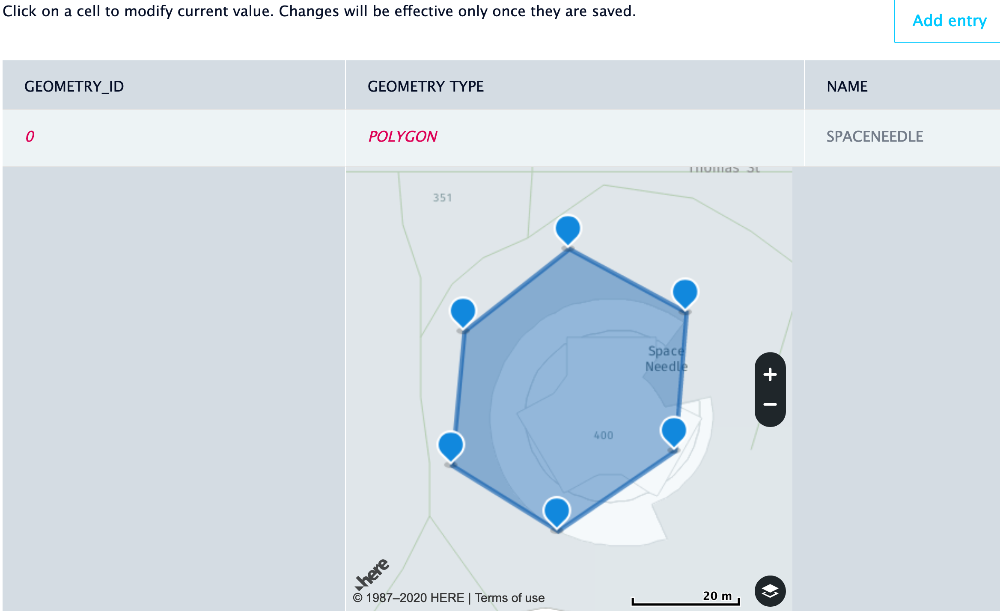

# Uploading Your Layer

To upload your layer you can go to our [layers portal](https://enterprise.here.com/#/login). You can log in using the credentials you created for your application on developer portal.

You'll want to then go to Import Layer from file and select your wkt file.

When you have uploaded your layer, you click on your layer and the geometry type in order to verify it on the map. 

