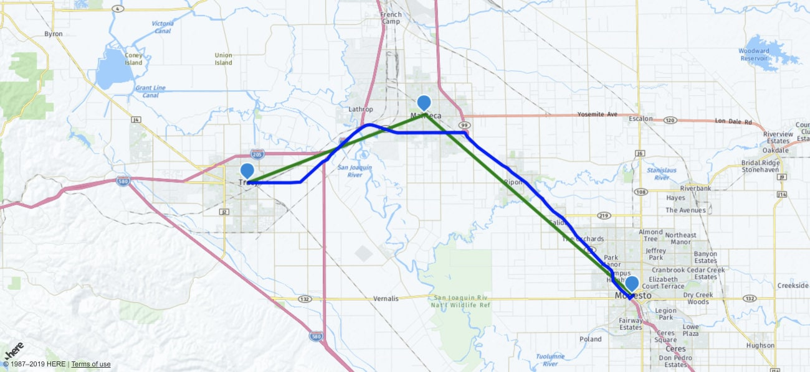
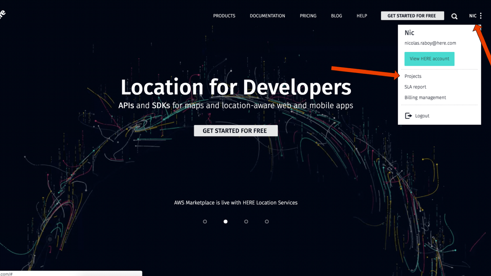

# Workshop: Maps and Location Services with Angular

This workshop was designed to get you familiar with displaying and interacting with HERE maps in your client facing Angular web application.



As seen in the above image, map objects such as markers and polylines, as well as routing calculations will be included in the workshop.

## Prerequisites

There are a few requirements that must be met in order to be successful with this workshop:

1. Must have at least a basic familiarity of Angular and web development.
2. Must have the Angular CLI installed and configured.
3. Must have created a FREE developer account with HERE.

A developer account with HERE can be created for FREE with no credit card required. Project tokens found within your account are required to be able to display and interact with the map and location services.

## Instructions

The workshop will consist of several steps that will get progressively more difficult. Since Angular changes frequently, a version locked incomplete (initial) and completed version of the workshop project is provided. The **completed** directory will contain a fully functional project while the **initial** directory will have pieces missing. The **initial** project may not build correctly until the various steps are completed.

To build and run the completed project, first change the app id and app code values found in the **completed/src/app/app.component.html** file, then execute the following with **completed** as the active directory:

```bash
npm install
ng serve
```

The above commands will install the various version locked Angular dependencies and serve the application at http://localhost:4200.

To get the most out of this workshop, the completed project should only be viewed if you are stuck on any of the steps. Give each of the steps a thorough try and feel free to ask any of the workshop proctors for help if this is an in-person session.

### Creating a New Project in the HERE Developer Portal

To use any of the HERE components, which include maps and location APIs, a developer account must be created. It is free to create an account and there is a free tier to use.

On the [HERE](https://developer.here.com) developer website, choose to create a new account.


When prompted, enter your information and accept the terms and conditions. You'll notice that your credit card information is not required to use the HERE APIs and SDKs.


After creating your account, you may or may not be brought directly into your projects list. If you haven't been taken directly into the project's list, click on your name and then the projects tab.



To start, you'll have one project, but that list may grow as time progresses. You can have projects on a per application basis or whatever makes the most sense to you.


Select the project that you wish to use to be brought into the dashboard for that project. In the dashboard you can view metrics around your project or create new tokens for development.

For this project you'll need to create a JavaScript / REST token set.


Hold onto the app id and app code because both will be used within the Angular application. Without these two tokens, the map will not show and the APIs will fail with errors.

### Including the HERE JavaScript Libraries in the Angular Project

The HERE APIs can be accessed through the HERE JavaScript SDK or through the HERE REST API with HTTP. Web application developers can choose between the two, but for this workshop the HERE JavaScript SDK will be used.

Including the HERE JavaScript SDK in an Angular project is simple. Open the project's **src/index.html** file and include the SDK components you wish to use. For example the following would work:

```
<script src="https://js.api.here.com/v3/3.0/mapsjs-core.js" type="text/javascript" charset="utf-8"></script>
<script src="https://js.api.here.com/v3/3.0/mapsjs-service.js" type="text/javascript" charset="utf-8"></script>
<script src="https://js.api.here.com/v3/3.0/mapsjs-mapevents.js" type="text/javascript" charset="utf-8"></script>
```

There are other SDK components that could be included, but aren't necessary for this workshop. Any external dependencies, such as the HERE JavaScript SDK, should be included before the closing `<body>` tag in the **src/index.html** file.

### Displaying a Map in the Web Browser

There are numerous ways to display a HERE map within an Angular application. The recommended way is to create an Angular component that can be reused throughout every page of the application.

Angular components can be created using the Angular CLI:

```bash
ng g component <COMPONENT-NAME-HERE>
```

The name of the component doesn't really matter, but for cleanliness, it makes sense to name it something relevant to its purpose. For example `here-map` might be an appropriate name.

The Angular CLI will generate a new directory with files that look like the following:

```
src
-> app
---> <COMPONENT-NAME>
-----> <COMPONENT-NAME>.component.css
-----> <COMPONENT-NAME>.component.html
-----> <COMPONENT-NAME>.component.spec.ts
-----> <COMPONENT-NAME>.component.ts
```

The **\*.css** file will contain the component specific styles for the **\*.html** view. The **\*.spec.ts** file will contain all the testing information and the **\*.ts** file will contain all of the component logic. The workshop will focus on the **\*.html** file and the **\*.ts** file.

The HERE JavaScript SDK will make requests to load the map after the application has initialized. Since it is not pre-rendered, a placeholder HTML component must be used.

In the **initial** project's **src/app/here-map/here-map.component.html** file, include the following:

```
<div #map style="width: 1300px; height: 600px"></div>
```

The HERE JavaScript SDK will have to know about the placeholder HTML component, but direct access to the DOM isn't recommend like it is with vanilla JavaScript. Instead a reference variable must be used in the HTML placeholder. In this scenario, the `#map` attribute is the reference variable.

With the HTML part of the Angular component complete, logic can be introduced, which includes initializing the HERE platform. Open the **initial** project's **src/app/here-map/here-map.component.ts** file and include the following boilerplate TypeScript logic:

```
import { Component, OnInit, ViewChild, Input, ElementRef } from '@angular/core';

declare var H: any;

@Component({
    selector: 'here-map',
    templateUrl: './here-map.component.html',
    styleUrls: ['./here-map.component.css']
})
export class HereMapComponent implements OnInit {

    @ViewChild("map")
    private mapElement: ElementRef;

    private platform: any;
    private map: any;

    public constructor() { }

    public ngOnInit() { }

    public ngAfterViewInit() { }

}
```

Because the HERE JavaScript SDK doesn't have TypeScript type definitions, we have to tell the transpiler to ignore the fact that we don't have them. This is accomplished through the following line:

```
declare var H: any;
```

Without the above line, trying to serve or build the application would result in transpiler errors every time HERE functionality was used.

In the corresponding HTML a reference variable was used. This reference variable can be found through the `@ViewChild` annotation. While the reference variable is `map`, it will be used throughout the TypeScript logic as `mapElement`.

Because the map is loaded after the page loads, anything that has to do with displaying the map must be done in the `ngAfterViewInit` lifecycle event. Initialization can happen in the `ngOnInit` lifecycle event as it doesn't relate to the visuals.

```
public ngOnInit() {
    this.platform = new H.service.Platform({
        "app_id": "APP-ID-HERE",
        "app_code": "APP-CODE-HERE"
    });
}
```

The above code will initialize the HERE platform using the app id and app code values found in the HERE developer portal. To actually display the map, something like this must be done:

```
public ngAfterViewInit() {
    let defaultLayers = this.platform.createDefaultLayers();
    this.map = new H.Map(
        this.mapElement.nativeElement,
        defaultLayers.normal.map,
        {
            zoom: 10,
            center: { lat: 37.7397, lng: -121.4252 }
        }
    );
    let behavior = new H.mapevents.Behavior(new H.mapevents.MapEvents(this.map));
}
```

In the above code, a new map is created on the referenced HTML component using the default map layer and normal theme. Typically with vanilla JavaScript a `querySelector` would be used instead.

The map, as soon as it displays, will be centered on the given latitude and longitude coordinates.

With the reusable Angular component created, it can be used within the application pages (routes). Open the **initial** project's **src/app/app.component.html** file and include the following:

```
<here-map></here-map>
```

Take note of a few things here. The `<here-map>` tag is named after the `selector` value found in the corresponding TypeScript file's `@Component` block. Had this `selector` had a different name, the HTML tag would also reflect it.

To test your skills, try to allow for tag attributes to be used. Imagine a scenario like this:

```
<here-map
    appId="APP-ID-HERE"
    appCode="APP-CODE-HERE">
</here-map>
```

Instead of hard-coding the values in the project's **src/app/here-map/here-map.component.ts** file, allow these values to be passed in through the HTML tag. If you get stuck, check the project in the **completed** directory.

### Adding Markers to a Map with a Latitude and Longitude Position

Interacting with the map should be done on a per instance basis. This means that the component itself should contain the logic that the developer might be interested in reusing throughout the application.

The goal in this step is to add visual objects to the map. There are many different types of map objects available, but the focus will be around markers. Typically a marker can be added to a map like this:

```
var marker = new H.map.Marker({ lat: 37.7397, lng: -121.4252 });
map.addObject(marker);
```

Similar rules would apply if it were a different type of map object. In the **initial** project's **src/app/here-map/here-map.component.ts** file include the following:

```
public dropMarker(latitude: number, longitude: number) {
    let marker = new H.map.Marker({ lat: latitude, lng: longitude });
    this.map.addObject(marker);
}
```

To execute the above method, there is more to be done. In the **initial** project's **src/app/app.component.html** file the component is being displayed, but the method needs to be called for that particular instance. This can be accomplished in the TypeScript file for the page, not the Angular component.

Open the **initial** project's **src/app/app.component.ts** file and include the following:

```
import { Component, OnInit, ElementRef, ViewChild } from '@angular/core';
import { HereMapComponent } from './here-map/here-map.component';

@Component({
    selector: 'app-root',
    templateUrl: './app.component.html',
    styleUrls: ['./app.component.css']
})
export class AppComponent implements OnInit {

    public constructor() { }

    public ngOnInit() { }

    public ngAfterViewInit() { }

}
```

This particular page will work from a similar approach as the Angular component that was created. A reference needs to be made to the HTML component which is out instance of the Angular component. To do this a reference variable must be added.

Open the **initial** project's **src/app/app.component.html** file and change it to the following:

```
<here-map #map></here-map>
```

In the above HTML it is nothing more than a coincidence that the reference variable is named `#map` just like in the Angular component. The variable names do not need to match.

Back in the **initial** project's **src/app/app.component.ts** file, the following changes can be made:

```
import { Component, OnInit, ViewChild } from '@angular/core';
import { HereMapComponent } from './here-map/here-map.component';

@Component({
    selector: 'app-root',
    templateUrl: './app.component.html',
    styleUrls: ['./app.component.css']
})
export class AppComponent implements OnInit {

    @ViewChild("map")
    public mapElement: HereMapComponent;

    public constructor() { }

    public ngOnInit() { }

    public ngAfterViewInit() {
        let map = this.mapElement;
    }

}
```

Instead of an `ElementRef` the referenced HTML component is a `HereMapComponent`. The `mapElement` will be able to access all functions that are found in the Angular component.

With this in mind, the `ngAfterViewInit()` can be changed to the following:

```
public ngAfterViewInit() {
    let map = this.mapElement;
    map.dropMarker(37.7397, -121.4252);
}
```

When running the application, a single marker should show up on the map. If the `dropMarker` method is executed more than once, more than one marker should appear.

Instead of creating a new an potentially untracked marker in the `dropMarker` method, try maintaining all your markers in an array. This could be useful for knowing exactly what markers are on your map so they can be removed or updated. If you get stuck, check the **completed** directory for help.

### Connecting Points on a Map with Polylines

On the map it might make sense to play a good old fashion game of connect the dots (markers). Drawing lines between points can be accomplished with a map object known as a polyline. To draw a polyline, you'd typically have code similar to this:

```
let lineString = new H.geo.LineString();
lineString.pushPoint({ lat: 37.7397, lng: -121.4252 });
lineString.pushPoint({ lat: 38.7397, lng: -121.4252 });
map.addObject(new H.map.Polyline(
    lineString, { style: { strokeColor: "green", lineWidth: 5 }}
));
```

The above code would draw a line from somewhere in Tracy, CA to somewhere in Sacramento, CA. Drawing polylines in the Angular component is really no different than what was done for markers. For example, the following could be done in the **initial** project's **src/app/here-map/here-map.component.ts** file:

```
public drawLinesBetweenMarkers(start: any, finish: any) {
    let lineString = new H.geo.LineString();
    lineString.pushPoint(start);
    lineString.pushPoint(finish);
    this.map.addObject(new H.map.Polyline(
        lineString, { style: { strokeColor: "green", lineWidth: 5 }}
    ));
}
```

Then to make use of this new method, the following could be added to the **initial** project's **src/app/app.component.ts** file:

```
public ngAfterViewInit() {
    let map = this.mapElement;
    map.dropMarker(37.7397, -121.4252);
    map.dropMarker(38.7397, -121.4252);
    map.drawLinesBetweenMarkers({ lat: 37.7397, lng: -121.4252 }, { lat: 38.7397, lng: -121.4252 });
}
```

Obviously it can start to get a little messy when it comes to managing all these latitude and longitude coordinates. If you haven't already been attempting the challenges for each step, it would be a good idea to start.

In the previous challenge you should have the Angular component maintaining an array of all the markers that were created and added to the map. Since the `drawLinesBetweenMarkers` method exists in that same Angular component, it can make use of that array of markers. This means that instead of supplying coordinates, just loop through the array and pull the latitude and longitude coordinates from each of the markers directly in the component.

If you get stuck, check out the **completed** directory for help.

### Geocoding Address into Latitude and Longitude Coordinates

Remembering latitude and longitude coordinates is not very plausible. Instead, addresses are the common indicator for a specific location in any given country. However, addresses cannot be plotted on the map, only coordinates.

To get coordinates from addresses, the addresses must be geocoded. The HERE JavaScript SDK provides a way to geocode with minimal effort. Typically it might look something like this:

```
geocoder.geocode({ searchText: "Tracy, CA" }, result => {
    if(result.Response.View.length > 0) {
        if(result.Response.View[0].Result.length > 0) {
            console.log(result.Response.View[0].Result);
        } else {
            console.error("no results found");
        }
    } else {
        console.error("no results found");
    }
}, error => {
    console.error(error);
});
```

Given a search query of any complexity, a result is returned. This result will have information such as the latitude and longitude, but also fill in any gaps for the query. For example, "Tracy, CA" might return the country, the postal code, etc., information that wasn't initially provided.

In this workshop, the geocoder must first be initialized before it can be used. Within the `HereMapComponent` class, add the following variable:

```
private geocoder: any;
```

Then within the `ngOnInit` method, the geocoder can be initialized and loaded into this variable for use. Within the `ngOnInit` method of the `HereMapComponent` class, add the following:

```
this.geocoder = this.platform.getGeocodingService();
```

Geocoding is an asynchronous operation because the data must be calculated through the HERE API, not locally within the Angular application. This means that certain things must be taken into consideration going forward.

First, within the `HereMapComponent` class, include a function for finding coordinate information:

```
public geocode(query: string): Promise<any> {
    return new Promise((resolve, reject) => {
        this.geocoder.geocode({ searchText: query }, result => {
            if(result.Response.View.length > 0) {
                if(result.Response.View[0].Result.length > 0) {
                    resolve(result.Response.View[0].Result[0].Location.DisplayPosition);
                } else {
                    reject({ message: "no results found" });
                }
            } else {
                reject({ message: "no results found" });
            }
        }, error => {
            reject(error);
        });
    });
}
```

The HERE JavaScript SDK uses callbacks, so it may be best to convert it into a Promise. However, the decision is up to you and what you're the most comfortable with.

With the Angular component now having a way to geocode addresses, the only page in the application can be updated for convenience. Open the **initial** project's **src/app/app.component.ts** file and include the following:

```
public async ngAfterViewInit() {
    let map = this.mapElement;
    let tracy = await map.geocode("Tracy, CA");
    let modesto = await map.geocode("Modesto, CA");
    map.dropMarker(tracy.Latitude, tracy.Longitude);
    map.dropMarker(modesto.Latitude, modesto.Longitude);
    map.drawLinesBetweenMarkers();
}
```

Remember how things are now asynchronous? If you want to use modern JavaScript, async / await would be a good approach. The map instance will geocode two addresses and when the result is in hand, the coordinates can be added as a marker. Assuming the markers are being tracked and the `drawLinesBetweenMarkers` looks at those tracked markers, there should be two markers with a line between them.

### Calculating the Fastest or Shortest Route Between Two Points

As you've probably seen, while polyline map objects can connect two points, they are not a means of routing or navigation. In other words those lines don't represent actual roads or paths of travel. Instead the HERE Routing API should be used to calculate routes between two or more points.

So how does that work?

Given a number of waypoints and a transportation mode, whether it be by car, walking or something else, a result of latitude and longitude coordinates can be determined. These coordinates will be quite a bit and then you can just connect the dots. Because there are so many, the lines will create an actual path, not just a straight line.

In practice, it might look something like this:

```
let params = {
    "mode": "fastest;car",
    "waypoint0": "geo!37.7397,-121.4252",
    "waypoint1": "geo!38.7397,-121.4252",
    "representation": "display"
}
router.calculateRoute(params, data => {
    if(data.response) {
        data = data.response.route[0];
        let lineString = new H.geo.LineString();
        data.shape.forEach(point => {
            let parts = point.split(",");
            lineString.pushLatLngAlt(parts[0], parts[1]);
        });
        let routeLine = new H.map.Polyline(lineString, {
            style: { strokeColor: "blue", lineWidth: 5 }
        });
        map.addObject(routeLine);
    }
}, error => {
    console.error(error);
});
```

Displaying a route path is really no different than displaying the polyline like the previous step. The only difference is the route will have many lines to be connected.

In the **initial** project's **src/app/here-map/here-map.component.ts** file, include the following variable within the `HereMapComponent` class:

```
private router: any;
```

Like with the geocoder, the router needs to be initialized. This is more appropriate to be done in the `ngOnInit` method:

```
this.router = this.platform.getRoutingService();
```

With the router initialized, it can be used like mentioned previously. Create a `drawRoute` method like the following:

```
public drawRoute(start: any, finish: any) {
    let params = {
        "mode": "fastest;car",
        "waypoint0": "geo!" + start.Latitude + "," + start.Longitude,
        "waypoint1": "geo!" + finish.Latitude + "," + finish.Longitude,
        "representation": "display"
    }
    this.router.calculateRoute(params, data => {
        if(data.response) {
            data = data.response.route[0];
            let lineString = new H.geo.LineString();
            data.shape.forEach(point => {
                let parts = point.split(",");
                lineString.pushLatLngAlt(parts[0], parts[1]);
            });
            let routeLine = new H.map.Polyline(lineString, {
                style: { strokeColor: "blue", lineWidth: 5 }
            });
            this.map.addObjects([routeLine]);
        }
    }, error => {
        console.error(error);
    });
}
```

Now as long as we pass two sets of latitude and longitude coordinates, a route will be added to the map for any given instance of the Angular component. To get a better idea, the following can be added to the **initial** project's **src/app/app.component.ts** file:

```
public async ngAfterViewInit() {
    let map = this.mapElement;
    let tracy = await map.geocode("Tracy, CA");
    let modesto = await map.geocode("Modesto, CA");
    map.dropMarker(tracy.Latitude, tracy.Longitude);
    map.dropMarker(modesto.Latitude, modesto.Longitude);
    map.drawLinesBetweenMarkers();
    map.drawRoute(tracy, modesto);
}
```

If everything went smooth up until now, you should have something that looks similar to the image at the top of this workshop.

This example of the route calculator only connects two waypoints. Try to allow a dynamic amount of waypoints for your route calculation to see what changes in the output.

### Getting the Location of the Web Browser

Every time the application loads, it might not be ideal to center on Tracy, CA or whatever coordinates you've provided. Instead, it might make sense to center on the users current location.

Modern browsers allow for positioning, so the users current position, if they give permission, could be calculated and supplied to the map after the page loads.

Typically the browser commands would look something like this:

```
if(navigator.geolocation) {
    navigator.geolocation.getCurrentPosition(position => {
        console.log(position.coords);
    });
} else {
    console.error("Geolocation is not supported by this browser!");
}
```

Ideally you'd want to place this in the `ngAfterViewInit` method of the `HereMapComponent` because it is an asynchronous event. We don't know when it will finish or if it will finish.

Try calculating the current position and making use of the `setCenter` method on the map.

## Resources

HERE Developer Portal - [developer.here.com](https://developer.here.com)
