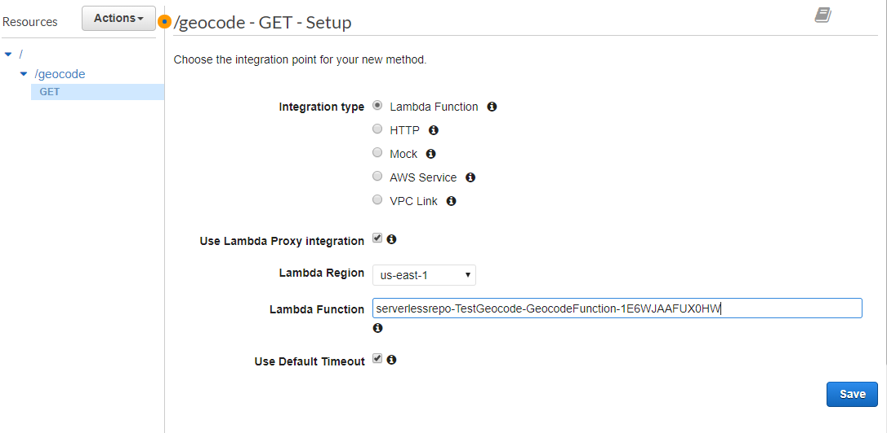

# Module #5 Serverless Data Processing on AWS
**Stream Processing with HERE Location Services**

This module is an extension to the popular [AWS Workshop Series](https://github.com/aws-samples/aws-serverless-workshops/tree/master/WebApplication) for building web applications. Here we will extend the [DataProcessing](https://github.com/aws-samples/aws-serverless-workshops/tree/master/DataProcessing) module. We pick up directly after the 4th module in the series.

We are going to illustrate how to use AWS services to process real-time data streams with serverless applications. We will augment the data stream by inserting the street address of each unicorn in the fleet using HERE’s Geocode API.

## Overview

In the previous [AWS Serverless Modules](https://dataprocessing.wildrydes.com) you have created and configured a Lambda function to read from the Amazon Kinesis stream and write records to an Amazon DynamoDB table as they arrive. This table will contain the following columns "Name, StatusTime, Distance, MinMagicPoints, MaxMagicPoints, MinHealthPoints and MaxHealthPoints".

In this module, you’ll use the Amazon Kinesis stream which you have created in the previous modules to collect and store sensor data from our unicorn fleet. You will then deploy the HERE Geocode API SAR function to obtain the address for a particular Latitude and Longitude.

Using a Lambda function, from the Kinesis stream you will fetch the latitude and longitude of a unicorn and you will pass values to the Geocode API. The Geocode API returns with a response containing the Address for the particular Latitude & Longitude.
Finally, you will persist the response using an Amazon DynamoDB table. This table will contain the following columns "Name, StatusTime, Address, Distance, HealthPoints, Latitude, Longitude and MagicPoints". We are using HERE’s Geocode Serverless function which is already available on the AWS SAR.

In this module you will learn how to create HERE account and How to deploy the Here Geocode API SAR function.

**Note:** HERE Location Suite provides access to mapping, geocoding, places, routing, traffic, transit, positioning, and geo-visualization functionality. Additionally, it provides out-of-box solutions to solve complex location problems such as geofencing, calculating the toll costs for a route and route customization.

To learn more see below.

[Rest API](https://saas.awsmarketplace.here.com/rest-api)

[JavaScript API](https://saas.awsmarketplace.here.com/javascript-api)

## Implementation

### 1. Deploy the HERE Geocode Function

In this step you are going to deploy the HERE Geocode function using the AWS console. Use this link to deploy   
[https://serverlessrepo.aws.amazon.com/applications/arn:aws:serverlessrepo:us-east-1:760301537001:applications~Geocode](https://serverlessrepo.aws.amazon.com/applications/arn:aws:serverlessrepo:us-east-1:760301537001:applications~Geocode)

<strong>Step-by-step instructions (expand for details)</strong>

1. Click on below URL link, it leads to AWS Geocode SAR function 
[https://serverlessrepo.aws.amazon.com/applications/arn:aws:serverlessrepo:us-east-1:760301537001:applications~Geocode](https://serverlessrepo.aws.amazon.com/applications/arn:aws:serverlessrepo:us-east-1:760301537001:applications~Geocode)
     
     
     
1. For deployment of this function you need to have HERE Account

3. Sign up for an account here

	https://aws.amazon.com/marketplace/pp/B07JPLG9SR/?ref=_ptnr_aws_sar
	
	 

1. Click the **“Continue to Subscribe”** button in the top-right corner of the page.

1. On the next page you can select the subscription type

1. Provide your basic details and register your HERE account.

1. After successful registration, the HERE portal will generate your **app_id and app_code**. It may take few minutes to generate credentials.
        
1. When the credentials have been created the portal will look like this

    

1. Save your HERE Location Services API **app_id & app_code** and to use in the AWS Lambda function.

1. Go back to the function deployment page.

3. Find the “Deploy” button on the right corner of the page, click on “Deploy” button. It provides the environmental set up for the function.

4. In the next page, find the Application settings on the bottom right corner of the page.

     

5. Use the Default Application name.

6. Enter your HERE **app_id and app_code** which you have created earlier.

7. Click “Deploy” to deploy SAR function.

8. It may take few minutes to create and deploy the function. Once deployed you will get a message ‘Your application has been deployed’.

     
9. After success message, click on “Test app” button.

  	

1. In next page find “Resources” tab at the bottom of the page. Click on “GeocodeFunction”.

1. Copy the function name from this page for later use (Step-5), function name looks like "serverlessrepo-Geocode-GeocodeFunction-E8ODE3KJNEROF"

	

1. Scroll down the page to “Function code” section, In the text editor you need to replace the existing code in ‘geocode.js’ with the code available at the [URL](https://github.com/heremaps/devrel-workshops/blob/master/aws-serverless/DataProcessing/5_HERE_DataProcessing_Extension/ReverseGeoCode/index.js).
     
     

### Implementation Validation

You can test the Geocode function that you deployed in the AWS Lambda console

<strong>Step-by-step instructions (expand for details)</strong>

1. From the main AWS Lambda console screen of your function, select “Configure Test Event” from the dropdown menu and select “Test Event” dropdown.

	

1. Ensure that “Create New Test Event” is selected.

1. Enter 'TestRequestEvent' in the 'Event name' field.

1. Copy and paste the following test event into the editor:

    	 	{
     
			"pathParameters": {
    
    				"prox": "37.37634,-122.03405",
          
		    		"mode": "retrieveAddresses",
          
    				"maxresults": "1",
          
	    			"gen": "9"
          
  				}
        
			}	
    
     
2. Click the 'Create' button. 

3. On the main function edit screen, click Test with 'TestRequestEvent' selected in the dropdown.

4. Scroll to the top of the page and expand the details section of the 'Execution result' section.

5. Verify that the execution succeeded and that the function result with " Status code:200 "  

	

### 2. Create and Deploy the API

We need to create an API Endpoint to invoke and access the Lambda function which we deployed in the previous step. 

<strong>Step-by-step instructions (expand for details)</strong>

1. Go to the AWS Management Console, choose Services then select API Gateway under Networking & Content Delivery.

1. Choose Create API.

	

1. Under Choose the protocol, choose REST.

1. Under Create new API, choose New API.

1. Under Settings: For API name, enter GeocodeTest.

1. If desired, enter a description in the Description field; otherwise, leave it empty.

1. Leave Endpoint Type set to Regional.

1. Choose Create API.

	
     

1. Choose the root resource (/) in the Resources tree.

1. Choose Create Resource from the Actions dropdown menu.

	

1. Leave Configure as proxy resource unchecked.

1. For Resource Name, enter geocode.

1. Leave Resource Path set to / geocode.

1. Leave Enable API Gateway CORS unchecked.

1. Choose Create Resource

     
     
     

1. In the Resources list, choose / geocode.

1. In the Actions menu, choose Create method.

1. Choose GET from the dropdown menu, and choose the checkmark icon

     
      

1. Leave the Integration type set to Lambda Function.

1. Choose Use Lambda Proxy integration

1. From the Lambda Region dropdown menu, choose the region where you created the serverlessrepo-Geocode-GeocodeFunction Lambda function.

1. In the Lambda Function field, type any character and choose serverlessrepo-Geocode-GeocodeFunction from the dropdown menu.

1. Leave Use Default Timeout checked.

1. Choose Save.

     
     
1. Choose OK when prompted with Add Permission to Lambda Function.

1. Choose Deploy API from the Actions dropdown menu to Deploy your API.

1. For Deployment stage, choose [new stage].

1. For Stage name, enter Test.

1. If desired, enter a Stage description & Deployment description.

1. Choose Deploy.

     
     
1. Click on the GET and note the API's Invoke URL. Note down the URL to invoke the lambda function.

 	
     

### 3. Create an Amazon DynamoDB table

We need to create a Dynamo DB table to store the WildRydes Kinesis stream data along with address for the corresponding Latitude & Longitude. 

<strong>Step-by-step instructions (expand for details)</strong>

1. Go to the AWS Management Console, choose Services then select DynamoDB under Database.

1. Click Create table.

1. Enter table name as "UnicornLocation".

1. Enter Name for the Partition key and select String for the key type.

1. Tick the Add sort key checkbox. Enter StatusTime for the Sort key and select String for the key type.

1. Leave the 'Use default settings' box checked and choose Create.

     
     

### 4. Create an IAM role for your Lambda function

Use the IAM console to create a new role. Name it "WildRydesStreamProcessorRole_Location" and select Lambda for the role type. Attach the managed policy called AWSLambdaKinesisExecutionRole to this role in order to grant permissions for your function to read from Amazon Kinesis streams and to log to Amazon CloudWatch Logs. Create a policy that allows dynamodb:BatchWriteItem access to the DynamoDB table created in the last section and attach it to the new role.

<strong>Step-by-step instructions (expand for details)</strong>

1. From the AWS Console, click on Services and then select IAM in the Security, Identity & Compliance section.

1. Select Policies from the left navigation and then click Create policy.

1. Using the Visual editor, we’re going to create an IAM policy to allow our Lambda function access to the DynamoDB table created in the previous section. To begin, click Service, begin typing DynamoDB in Find a service, and click DynamoDB.

1. Click Action, begin typing 'BatchWriteItem' in Filter actions, and tick the 'BatchWriteItem' checkbox.

1. Click Resources, click Add ARN in table, and construct the ARN of the DynamoDB table you created in the previous section by specifying the Region, Account, and Table Name. In Region, enter the AWS Region in which you have created the DynamoDB table in the previous section, e.g.: us-east-1. 
In Account, enter your AWS Account ID which is a twelve-digit number, e.g.: 123456789012. To find your AWS account ID number in the AWS Management Console, click on Support in the navigation bar in the upper-right, and then click Support Center. Your currently signed in account ID appears in the upper-right corner below the Support menu.

1. In Table Name, enter UnicornLocation and you should see your ARN in the Specify ARN for table field and it should look similar to:

      
      
1. Click Add.

1. Click Review policy.

1. Enter "WildRydesDynamoDBWritePolicy_Location" in the Name field.

1. Click Create policy.

1. Select Roles from the left navigation and then click Create role.

1. Click Lambda for the role type from the AWS service section.

1. Click Next: Permissions.

1. Begin typing AWSLambdaKinesisExecutionRole in the Filter text box and check the box next to that role.

1. Begin typing AWSLambdaFullAccess in the Filter text box and check the box next to that role.

1. Begin typing WildRydesDynamoDBWritePolicy_Location in the Filter text box and check the box next to that role.

1. Click Next: Review.

1. Enter "WildRydesStreamProcessorRole_Location" for the Role name.

1. Click Create role.
 
     

### 5. Create your Lambda function

We will create a Lambda function called WildRydesStreamProcessor_Location that will be triggered whenever a new record is available in the WildRydes stream. Use the provided [link to download zip file](https://github.com/heremaps/devrel-workshops/aws-serverless/DataProcessing/5_HERE_DataProcessing_Extension/Kineses2DynamoDB/KinessesDB.zip) to implement for your function code. Create an environment variable with the key TABLE_NAME and the value UnicornLocation. Configure the function to use the WildRydesStreamProcessor_Location role created in the previous section

<strong>Step-by-step instructions (expand for details)</strong>

1. Go to the AWS Management Console, choose Services then select Lambda under Compute.

1. Click Create a function.

1. Enter "WildRydesStreamProcessor_Location" in the Name field.

1. Select WildRydesStreamProcessorRole_Location from the Existing role dropdown.

      

1. Click Create function.

1. Scroll down to the Function code section.

1. Click the [Link/URL](https://github.com/heremaps/devrel-workshops/aws-serverless/DataProcessing/5_HERE_DataProcessing_Extension/Kineses2DynamoDB/KinessesDB.zip) to download the Zip file which contains Lambda function along with dependency modules 

1. In Code entry type dropdown Upload a .ZIP file option. Browse and select to upload the zip file which we downloaded in the previous step

	
	
	

1. Click on Save button in the Right Top corner of the page. It extracts the files internally

1. Scroll down to the Function code section to replace the existing code in the index.js.

1. In “index.js” file find the “url” variable in line number 30 and paste the API endpoint which you created and copied in Step-2.

      
		
		let url = ‘https://xx22yyxwe9.execute-api.eu-west-1.amazonaws.com/Test/geocoder’

1. In the Environment variables section, enter an environment variable with Key as TABLE_NAME and Value as UnicornLocation.

1. In the Basic settings section. Set the Timeout to 1 minute.

      
      
1. Scroll up and select Kinesis from the Designer section.

      

1. In the Configure triggers section, select 'wildrydes' from Kinesis Stream.

1. Leave Batch size set to 100 and Starting position set to Latest.

1. Click Add.

1. Click Enabled to enable the trigger.

1. Click Save.

      
    

## Implementation Validation

Verify that the trigger is properly executing the Lambda function. View the metrics emitted by the function and inspect the output from the Lambda function. Initially Dynamo DB will contain only the Name and StatusTime field in the Table.

  

As we saw earlier, WildRydes Kinesis Data stream will have the scheme without Address Column. (Which you created in the Module-2). Ensure that the default schema includes:

  

     
1. Run the producer to start emitting sensor data to the stream with a unique unicorn name.

          ./producer -name Rocinante

    

1. Click on the Monitoring tab and explore the metrics available to monitor the function. Click on Jump to Logs to explore the function’s log output.

## Query the DynamoDB table

1. Click on Services then select DynamoDB in the Database section.

     
1. Click Tables from the left-hand navigation.

1. Click on UnicornLocation.

1. Click on the Items tab. Here you should see each per-minute data point for each Unicorn for which you’re running a producer.

     
     
1. Congratulations, you have completed the **Stream Processing with HERE Location Services Module!**.

For further documentation please see the below links:
     
   https://saas.awsmarketplace.here.com/rest-api 
     
   https://saas.awsmarketplace.here.com/javascript-api

