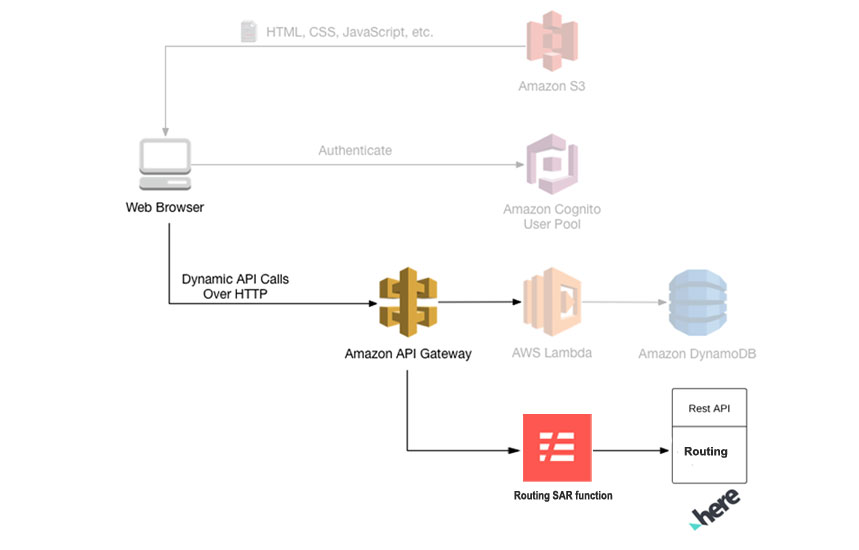
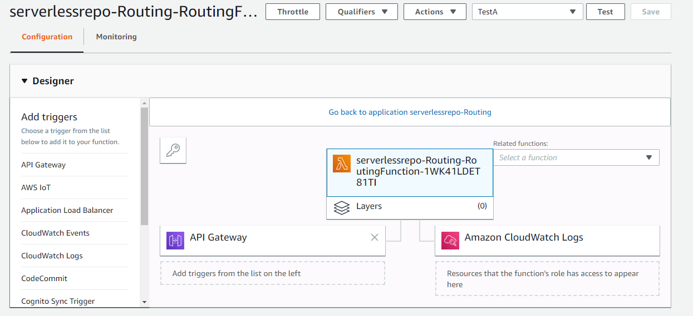
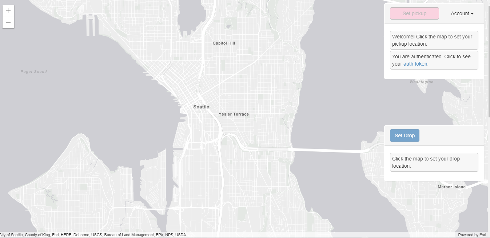
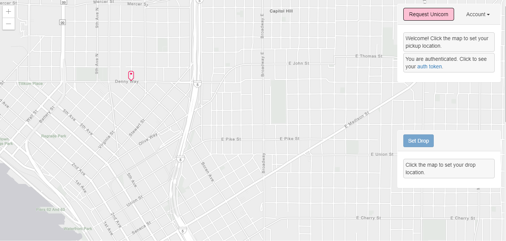
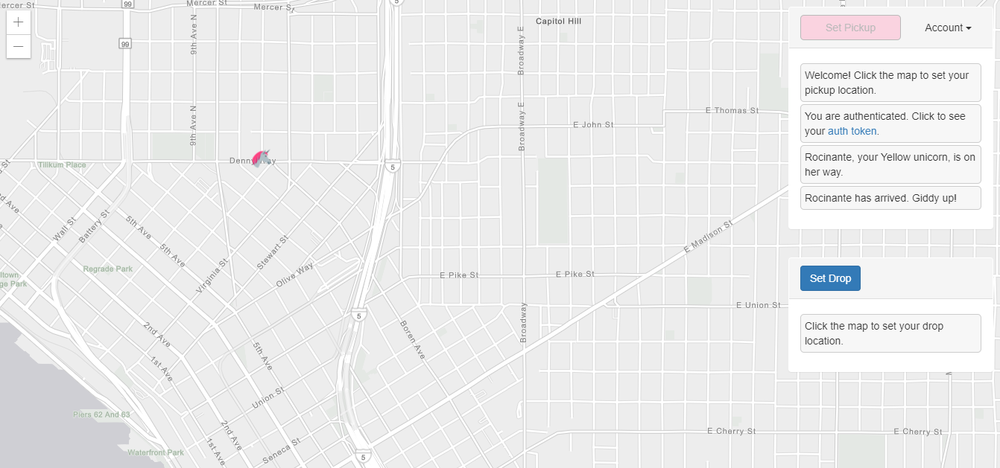
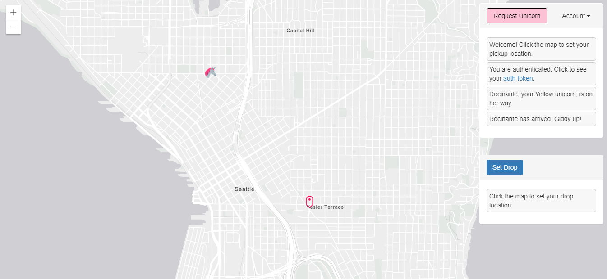
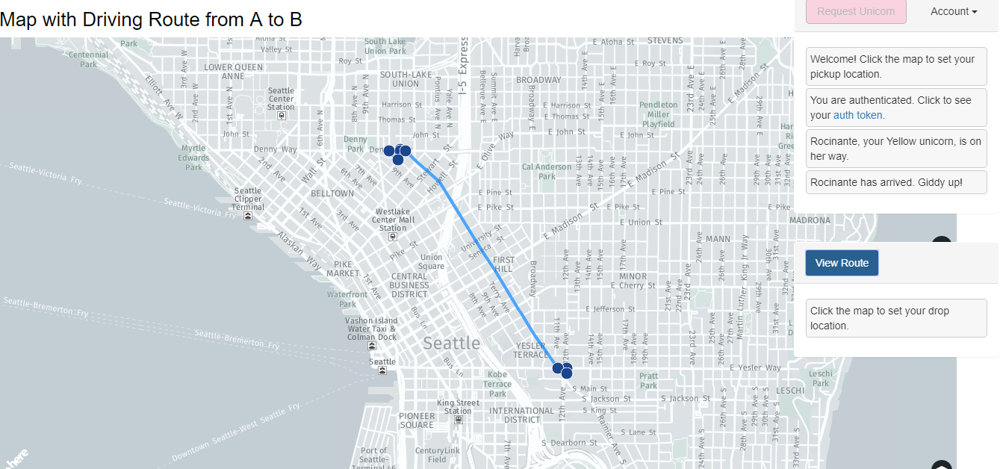

# Module 6: Location Services with AWS Lambda for Web Applications

This module is an optional extension to the popular [AWS Workshop Series for building web applications](https://github.com/aws-samples/aws-serverless-workshops/tree/master/WebApplication). This module picks up directly after the 5th module in the series and requires completion of modules 1 through 4.

In this 6th module you are going to learn about extending your web applications with serverless applications from the AWS Serverless Application Repository (SAR).

## Architecture Overview

After completion of the previous modules (1-4), you should now be able to select the pickup location of a Unicorn on the map. 

In this module we are going to add the ability to set a drop off location for the Unicorn and draw the Route map (Directions). This route map will span the pickup location to the drop off location of the Unicorn. For this, we are using the HERE Routing Serverless function (available on the AWS SAR). You will learn how to deploy and use AWS SAR Functions and how to use the location services of HERE.



The diagram above shows how the SAR function is deployed and integrates with the Amazon API Gateway component. This module integrates with the existing resources you built in the previous modules. 

The greyed-out items are pieces you have already implemented in previous modules. The static website you deployed in the first module already has a page configured to interact with the API you'll build in this module. 

The page at /ride.html has a simple map-based interface for requesting a unicorn ride. After authenticating using the /signin.html page, you will be able to select your pickup location by clicking a point on the map and then requesting a ride by choosing the "Request Unicorn" button in the upper right corner. After that you will get the option to set a drop location. 

Once you select the drop location you will get the button called view route. Using view route button, you will be able to see the route between pickup and drop point on the Map.

In this module you will focus on the steps required to deploy the SAR function and integrate with previous modules.

If you're interested in how the browser code works that calls this API, you can inspect the ride.js file of the website. In this case the application uses jQuery's ajax () method to make the remote request.

<strong>Note:</strong> The “HERE Location Suite” provides access to mapping, geocoding, places, routing, traffic, transit, positioning, and geo-visualization functionality. Out-of-the-box it provides solutions to solve complex location problems such as geofencing, calculating the toll costs for a route, and customizing a route. 

For details on HERE’s : [Rest API](https://saas.awsmarketplace.here.com/rest-api)

For details on HERE’s : [JavaScript API](https://saas.awsmarketplace.here.com/javascript-api)

### 1. Deploy HERE Routing Function

In this step you are going to deploy HERE Routing function in AWS console. Use this link to deploy 

https://serverlessrepo.aws.amazon.com/applications/arn:aws:serverlessrepo:us-east-1:760301537001:applications~Routing

<details>
<summary><strong>Step-by-step instructions (expand for details)</strong></summary><p>

1. Click on below URL link, it leads to AWS Routing SAR function 
     https://serverlessrepo.aws.amazon.com/applications/arn:aws:serverlessrepo:us-east-1:760301537001:applications~Routing
     
     

1. For deployment of this function you need to have HERE Account, so first sign up for HERE account

1. Sign up for a free or paid plan on
     https://aws.amazon.com/marketplace/pp/B07JPLG9SR/?ref=_ptnr_aws_sar
     

     
     
1. Provide your basic details and Register for your HERE account

1. After successful registration, the HERE Portal will generate your **app_id and app_code**. It may take few minutes to generate your credentials

1. Once complete you should see a screen like this containing your **app_id & app_code**.

   

1. Save your HERE Location Services API app_id & app_code. Next, we will use these credentials to deploy the function.

1. Go back to the function deployment page.

3. Find the “Deploy” button on the right corner of the page, click on “Deploy” button. It provides the environmental set up for the function.

4. On the next page, find the Application settings in the bottom right corner of the page.

     

5. Use the Default Application name.

6. Enter your HERE **app_id and app_code** which you created earlier.

7. Click “Deploy” to deploy your function.

8. It may take few minutes of your time to create and deploy the function, once it has been successfully deployed you will get a message ‘Your application has been deployed’.

     

9. Once you see a success message, click on the “Test app” button, it will open your Lambda function which you have deployed.

1. Click on the API Gateway, to generate an endpoint to access your function.

1. Note down the complete API endpoint to configure with your bucket.

     
</p></details>

### 2. Upload content to your Website Bucket

To view the changes on your website, you need to upload the content to your S3 Bucket with new and modified files. You need to add functions and API endpoints to invoke the Routing function.

<details>
<summary><strong>Step-by-step instructions (expand for details)</strong></summary><p>


From your Cloud9 development environment(or local environment)
1. Make sure your working directory is `wildrydes-site` where you cloned your website repository in the main workshop.
1. Download the new content archive locally.
    ```
     curl https://raw.githubusercontent.com/heremaps/devrel-workshops/master/aws-serverless/web-application/6_HERE_Lambda_Extension/website_files.zip -o /tmp/website_files.zip
    ```

   Alternatively, you can download the files using your browser if you are developing locally.

1. Unzip the archive and overwrite the existing version of the files.
    ```
    unzip -o website_files.zip
    ```

1. Clean up the downloaded archive.
   ```
   rm website_files.zip
   ```

1. Edit the js/ride.js file with a text editor.

1. Update line 175, and set the value of the `url` setting to the API endpoint you created in the previous section.

1. Save the file.

1. From the root directory of your repository, commit and push the new files.
   ```
   git add .
   git commit -m "Adding HERE routing functionality"
   git push
   ```

  [Amplify Console](https://console.aws.amazon.com/amplify/home) should pick up the changes and begin building and deploying your web application. Watch it to verify the completion of the deployment.

</p></details>

## Implementation Validation

After completing all the above implementation steps, you should be able to access your static website by visiting the website endpoint URL for your S3 bucket.

<p>
     
1. Visit /ride.html under your website domain

1. If you are redirected to the “Sign In” page, sign in with the user you created in the previous module.

1. You should be able to see "set drop" button on the right-side corner.

     

1. After the map has loaded, click anywhere on the map to set a pickup location. 

1. Choose Request Unicorn. You should see a notification in the right sidebar that a unicorn is on its way and then see a unicorn icon fly to your pickup location.

1. After the Unicorn has arrived, select the Drop Point in the map and click the “Set Drop” button on the right-side page corner.

1. Now it should automatically load the map and show the route map from the Pickup Point to the Drop Point

     
     
     
     
     
     
     

1. Congratulations, you have completed the **Location Services with AWS Lambda for Web Applications module!**.

</p>

For further documentation please see the below links:
     
   https://saas.awsmarketplace.here.com/rest-api 
     
   https://saas.awsmarketplace.here.com/javascript-api


