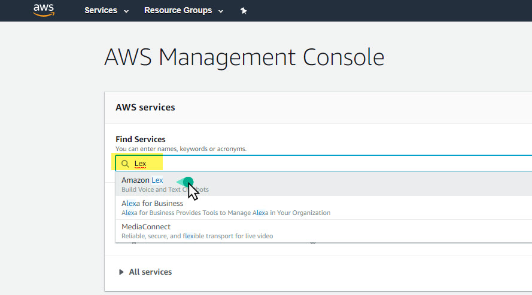
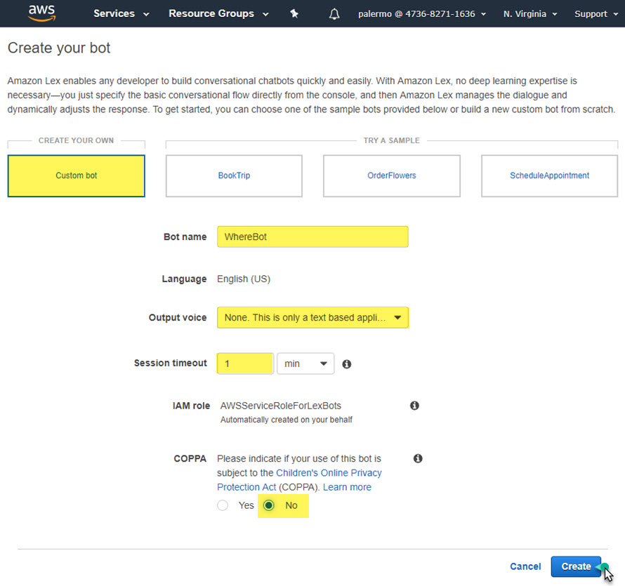
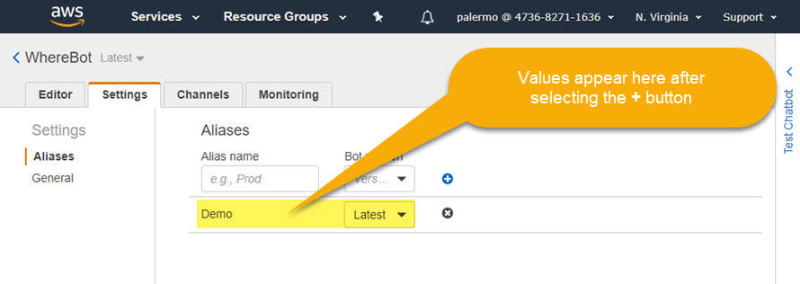
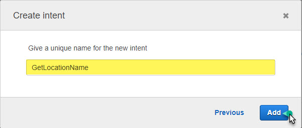
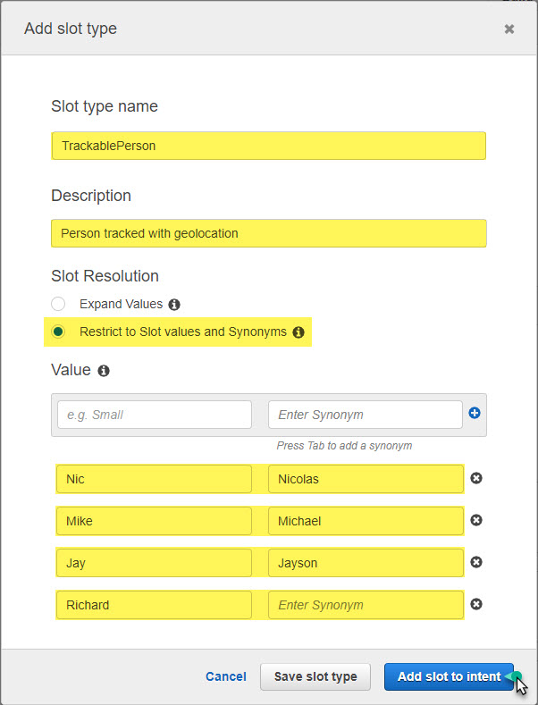
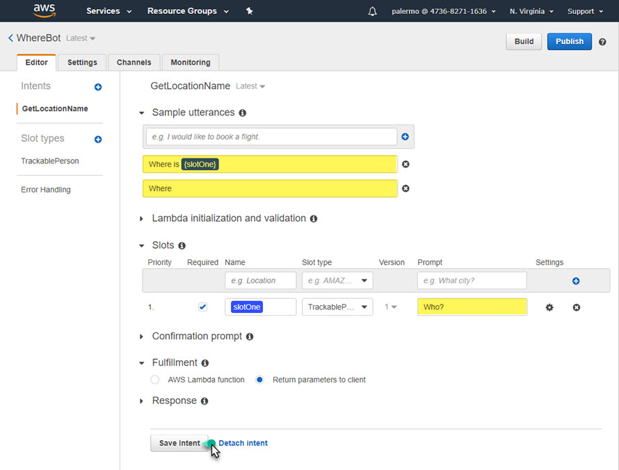
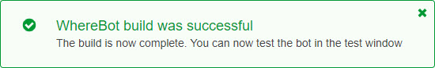
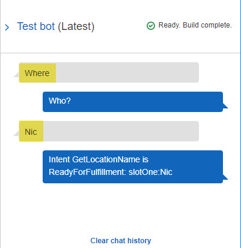
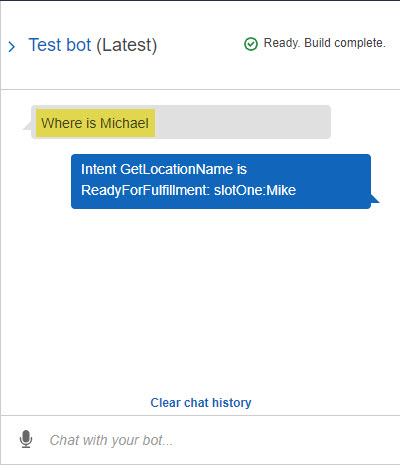
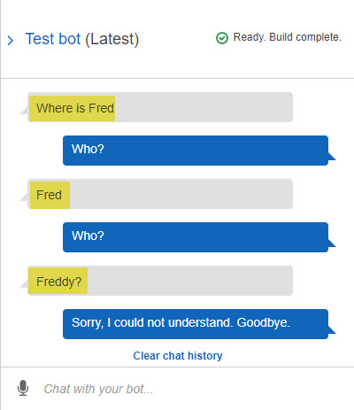

| [ Overview](./README.md) | [ Prerequisites](./02.md) |  Design | [ Development](./04.md) | [ Optional](./05.md)
| :---: | :---: | :---: | :---: | :---: |

# Lex Workhsop

## Design

In this section you will create a Lex chatbot and then design the conversational user experience (UX). You will test the conversation UX before adding any business logic.

___

### 1. Create Lex Chatbot

**Task:** You will sign in to AWS console, access the Amazon Lex service, and create a new custom bot named "WhereBot". You will configure your bot to be a text-based chat bot. You will assign the bot to auto versioning.

<strong>Step-by-step instructions</strong> (expand for details)

1. Sign in with your AWS developer account at https://console.aws.amazon.com. Under AWS services, type "Lex", then select **Amazon Lex**:

     

1. If this is your first time, select the **Get Started** button

1. On the **Create your bot** screen, select **Custom bot** and apply the following values:
   * **Bot name:**           *WhereBot*
   * **Output voice:**       *None. This is only a text based application*
   * **Session timeout:**    *1 min*
   * **COPPA:**              *No*

     

    > After selecting the **Create** button, you should now be in the **WhereBot** Lex service with **Editor** as the active tab.

1. Select the **Settings** tab and confirm **Aliases** is the selected option. Apply the following values and then select the **+** button:
   * **Alias name:**        *Demo*
   * **Bot Version:**      *Latest*

     

   > Switch back to **Editor** tab. You have successfully created your Lex custom bot. Now it is time to design it.

___

### 2. Design the Conversational UX

**Task:** You will create a new Intent named GetLocationName and design it to answer a question such as: *Where is Nic?* You will test intent for conversational accuracy. 

<strong>Step-by-step instructions</strong> (expand for details)

1. In the **Editor** tab, select the **+ Create Intent** button. In the pop-up dialogue box, select **+ Create intent** option. Type "GetLocationName" and select **Add** button.

     

   > After selecting the **Add** button, you should now see **GetLocationName** at the top of the main panel.

1. Select the **Slot types +** option from left panel. In the pop-up dialogue box, select **+ Create slot type** option. Type in the following for each field:
   * **Slot type name:**    *TrackablePerson*
   * **Description:**       *Person tracked with geolocation*
   * **Slot Resolution:**   *Restrict to Slot values and Synonyms*
   * **Value:** 
      * Nic: Nicolas
      * Mike: Michael
      * Jay: Jayson
      * Richard *(no synonym)* 

   

    > After selecting the **Add slot to intent** button, you should now see a new line in the **Slots** section with the name of **slotOne** and a type of **TrackablePerson**. 

1.  Type "Who?" for the **Prompt** value for **slotOne**

    > Because the **Required** setting is checked, a prompt is needed if the user does not initially provide it.

1.  Add the following values for **Sample utterances** (select **+** to add each value):
   * *Where*
   * *Where is {slotOne}*

   

   > Sample utterances are how your bot will be invoked.

1.  Select the **Save Intent** button.

1.  Select the **Build** button at top of page and wait for success.

   

1.  Expand the **Test bot** panel on righ side of screen and type "Where" in the textbox with the watermark of *Chat with your bot...* When prompted for **Who?**, type "Nic".

   

   > The final response generated only returns the values of which Intent was invoked (*GetLocationName*) and what parameter (*slotOne:Nic*) was provided. This behavior is due to **Fulfillment** option for intent set to **Return parameters to client**. We will keep it at this setting for now to confirm testing of conversational UX.
   > When the bot was invoked by typing "Where", it prompted for additional information because **slotOne** is required.

1.  Select **Clear chat history** and type "Where is Michael"

   

   > The bot was invoked by typing "Where is Michael" - which used the **Where is {slotOne}** utterance. Because the value for **slotOne** was provided, no additional prompts were needed. Also note that although "Michael" was typed in, the parameter type returned is "Mike", because of the synonym relationship.

1.  Select **Clear chat history** and type "Where is Fred". When prompted, type "Fred" again. When prompted again, type "Freddy"

   

   > The bot was invoked by typing "Where is Fred". However, because an unknown value was provided for **slotOne**, the bot repeatedly prompted **Who?** for a known value until the third failed attempt.

1.  Select **Clear chat history** and type "Howdy". When prompted, type "where is jayson" (all lower case)

   

   > The bot was did not successfully invoke an intent because "Howdy" is not a recognized utterance. The bot kindly asked for another attempt. When entering the values in lower case, the bot still invokes the intent properly. Again, providing the value of "Jayson" returned "Jay" as slot value due to synonym relationship.

   > You have successfully tested the conversation UX.

You are now ready to [proceed to the next step](./04.md).