| [<br>Overview](./README.md) | [<br>Prerequisites](./02.md) | [<br>Design](./03.md) | <br>Development | [<br>Optional](./05.md)
| :---: | :---: | :---: | :---: | :---: |

# Lex Workhsop

## Development

In this section you will create a Lambda function to execute the business logic of the WhereBot. The code will call the reverse geocode API to provide a description of the general area of the person being tracked.

___

### Create AWS Lambda Function to Host Lex Processing

**Task:**  You will create and upload a zip file to populate a new Lambda function named "lex-wherebot" using Node.js 8.10. You will enter your APP ID and APP Code from your HERE developer account as environment variables. You will test the function.

<details>
<summary><strong>Step-by-step instructions</strong> (expand for details)</summary><p>

1. On your computer, create the following text files with provided content in a new, empty folder:
* **package.json**
   <details><summary>(expand for content)</summary><p>

   ``` json
   {
       "name": "demo",
       "version": "1.0.0",
       "dependencies": {
           "request": "^2.0.0"
        }
    }
   ```
   </p></details>

* **index.js** 
   
   <details><summary>(expand for content)</summary><p>
   
   ``` javascript
   'use strict';

    const request = require('request');

    function formatResponse(sessionAttributes, fulfillmentState, location) {
        var chatReply = "Not able to locate!";
        if (location) {
            chatReply = location;
        }
        var message = {'contentType': 'PlainText', 'content': chatReply};
        return {
            sessionAttributes,
            dialogAction: {
                type: 'Close',
                fulfillmentState,
                message,
            },
        };
    }

    // Get the coordinates for a person by name
    // Coordinates are hard-coded for demo purposes
    function getTrackablePersonLocation(name) {
        var coords = null;
        switch(name) {
        case 'mike':
            coords = '33.448,-112.074';  // Phoenix
            break;
        case 'nic':
            coords = '37.866,-122.275';  // Berkeley
            break;
        case 'jay':
            coords = '47.612,-122.332';  // Seattle
            break;
            case 'richard':
            coords = '52.520,13.404';  // Berlin
            break;
        default:
            coords = null;  // for demo purposes we only, no error handling
        }
        return coords;
    }

    // --------------- Events -----------------------

    function dispatch(intentRequest, callback) {
        console.log(`dispatch userId=${intentRequest.userId}, intentName=${intentRequest.currentIntent.name}`);
        const APP_ID = process.env.APP_ID; // HERE APP ID stored in environment variables
        const APP_CODE = process.env.APP_CODE; // HERE APP Code stored in environment variables
        const sessionAttributes = intentRequest.sessionAttributes;
        const slots = intentRequest.currentIntent.slots;
        const trackablePerson = slots.slotOne.toLowerCase();
        var formattedResponse = null;
        var prox = getTrackablePersonLocation(trackablePerson);
        if (prox) {
            const url = 'https://reverse.geocoder.api.here.com/6.2/reversegeocode.json' +
                '?app_id=' + APP_ID +
                '&app_code=' + APP_CODE +
                '&prox=' + prox +
                '&mode=retrieveAreas&maxresults=1&gen=9';
            request(url, { json: true }, (err, res, body) => {
                if (err) { return console.log('err: ', err); }
                console.log('statusCode:', res && res.statusCode);
                console.log('body: ', JSON.stringify(body));
                var location = body.Response.View[0].Result[0].Location.Address.Label;
                formattedResponse = formatResponse(sessionAttributes, 'Fulfilled', location);
                callback(formattedResponse);
            });
        } else {
            formattedResponse = formatResponse(sessionAttributes, 'Fulfilled', null);
        }
    }

    // --------------- Main handler -----------------------
    exports.handler = (event, context, callback) => {
        try {
            dispatch(event,
                (response) => {
                    callback(null, response);
                });
        } catch (err) {
            callback(err);
        }
    };

   ```
   
    </p></details>

   > Be sure to review the code of **index.js**. It contains the call to the reverse geocoder API from HERE. 

1. In a console, in the same directory of the new files, execute an **npm** install command

   ``` console
   npm install
   ```

1. Zip the *contents* of the folder (index.js, package.json, node_modules) for use in a later step.

1. Sign in to the AWS console with your developer account at https://console.aws.amazon.com. Under AWS services, type "Lambda", then select **Lambda**:

    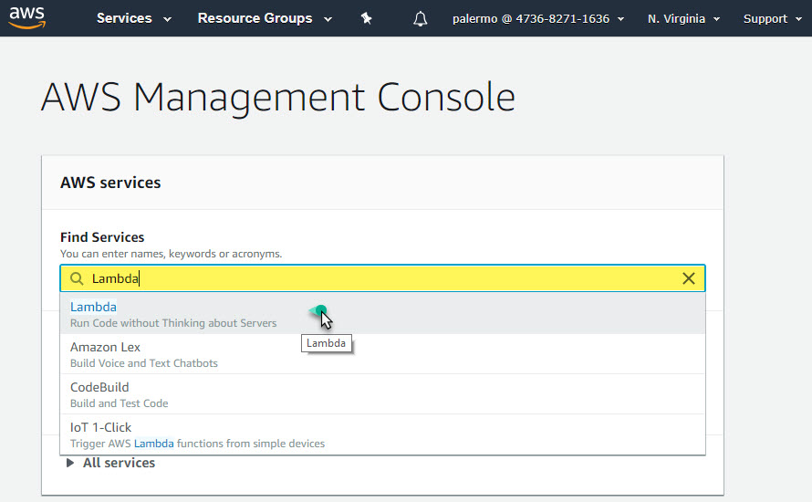

1. Select the **Create function** button, choose **Author from scratch**, and then apply the following values:
   * **Function name:**      *lex-wherebot*
   * **Runtime:**            *Node.js 8.10*

    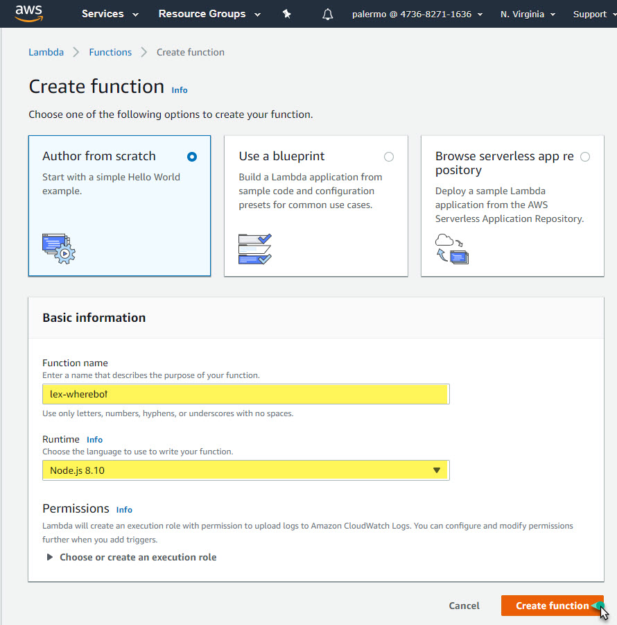 

   > After selecting the **Create function** you are now ready to configure the function.

1. In the **Configuration** tab, in the **Function code** section, under **Code entry type**, choose **Upload a .zip file**. When prompted, select the zip file you created.

    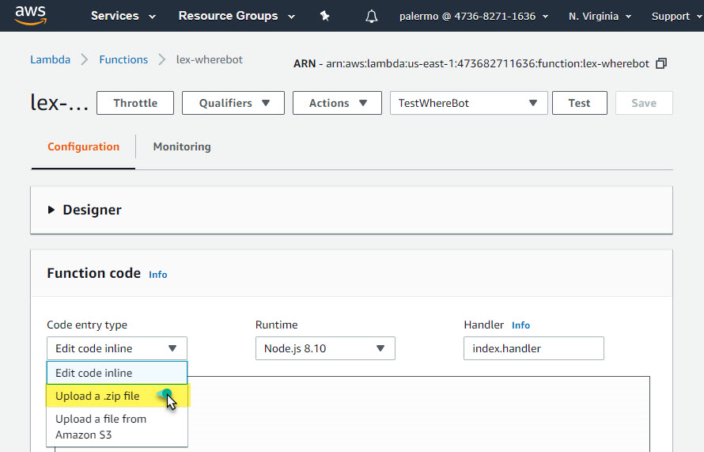

   > After the zip has loaded, you should now see the code.

    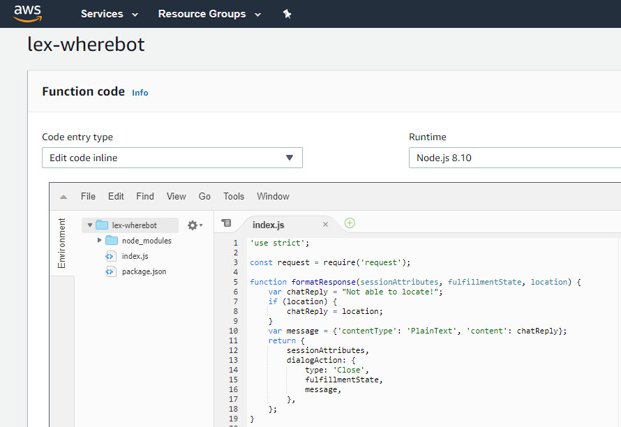

1. In the **Environment variables** section, add "APP_CODE" and "APP_ID" (exactly as shown) keys corresponding with values from your HERE developer account ([prereqs](./03.md)). 

    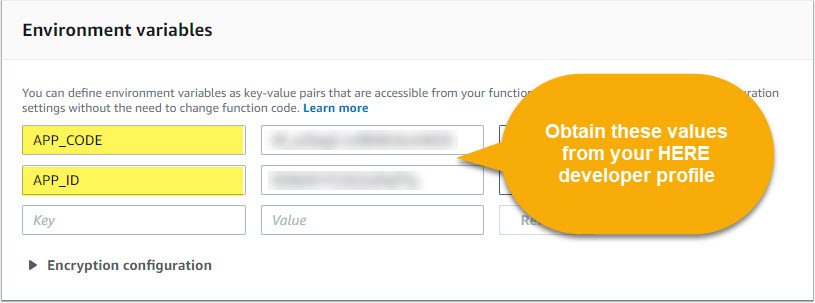

1. Select **Save** button in upper right of screen. 

1. To the left of the **Test** button, select **Configure test events** from the dropdown menu. Select **Create new test event**, type "TestWhereBot" for **Event name**, and add the following JSON:

    ``` json
    {
        "messageVersion": "1.0",
        "invocationSource": "FulfillmentCodeHook",
        "userId": "user-1",
        "sessionAttributes": {},
        "bot": {
            "name": "WhereBot",
            "alias": "$LATEST",
            "version": "$LATEST"
        },
        "outputDialogMode": "Text",
        "currentIntent": {
            "name": "assetlocaion",
            "slots": {
            "slotOne": "Nic"
            },
            "confirmationStatus": "None"
        }
    }
    ```
   > The structure of the JSON is suited for mock input from your Lex WhereBot. It provides the value of "Nic" for **slotOne** for testing.  

    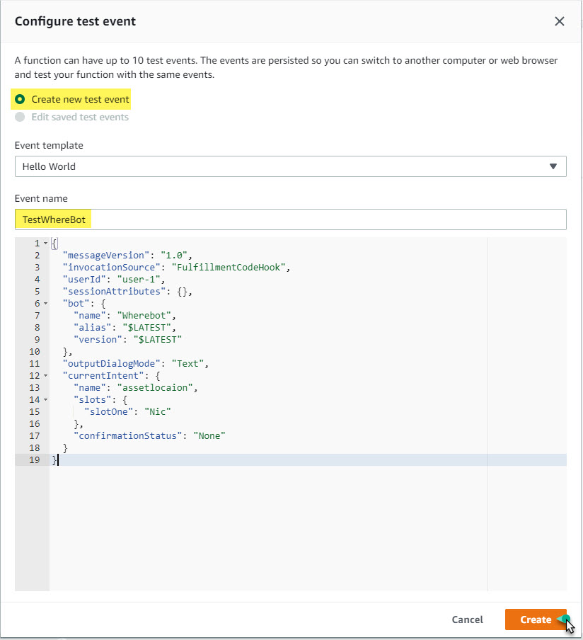

   > After selecting **Create** button, you are ready to test!

1. Select the **Test** button with **TestWhereBot** selected in the dropdown menu.

    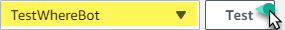

    > You should see results similar to this output:

    

    > You have successfully created and tested your lambda function.

</p></details>

___

### Integrate Lambda Function with Lex

**Task:** You will return to the Amazon Lex service and modify "WhereBot" to use the lambda function you created. You will test your bot to confirm it is successfully using the lambda function.

<details>
<summary><strong>Step-by-step instructions</strong> (expand for details)</summary><p>

1. Return to the "WhereBot" you created in the Amazon Lex service. If you don't know how to navigate there, just access AWS console at https://console.aws.amazon.com. Under AWS services, type "Lex", then select **Amazon Lex**:

     

1. Select "WhereBot"

    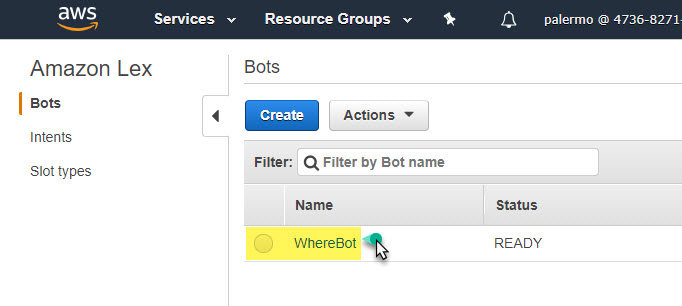

1. In the **Fulfillment** section, select **AWS Lambda function** and select **lex-wherebot** from dropdown menu

    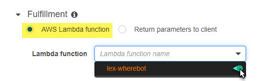 

   > If you see a dialogue box appear requesting to give permission to Amazon Lex to invoke your function, select **OK**

    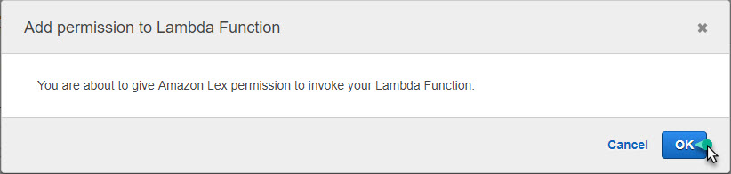

1. Select the **Build** button at top of page and wait for success.

1.  Expand the **Test bot** panel on righ side of screen and type "Where" in the textbox with the watermark of *Chat with your bot...* When prompted for **Who?**, type "Michael".

    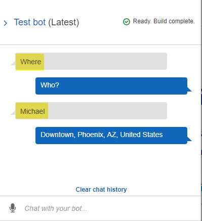

    > The values returned are processed from the lambda function. 

1.  Select **Clear chat history** and type "Where is Richard"

    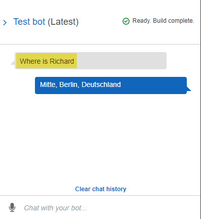

    > The values returned are processed from the lambda function.

    > You have successfully completed integration and testing of the lambda function in your Lex service.

</p></details>

You are have completed the required sections of this workshop! 

You are now ready to [proceed to the next step](./05.md). 