# 1. Deploying your first ARM Template

## Introduction

The [HERE Maps & Location Services Data Streams Template](https://azuremarketplace.microsoft.com/en-us/marketplace/apps/heretechnologies.locationdatastream) deploys HERE's Serverless Maps & Location Services, an EventHub and a CosmosDB for all your this application. In this first step you will sign up for the HERE Services (API's), deploy your first ARM template and finally configure your web application.

# What is an ARM Template?

Azure Resource Manager templates or ARM templates ([learn more](https://docs.microsoft.com/en-us/azure/azure-resource-manager/)) is a way to quickly deploy services and dependencies depending on your use case. Simply put, it is a description of what your web application needs to run. HERE Technologies has created a number of ARM templates for you to use depending on the use case.  To learn more, visit our [blog]( https://developer.here.com/blog/here-powers-new-serverless-location-based-functions-for-microsoft-azure-developers) post discussing these in depth.

In this module, you will deploy HERE Maps and Location Services Data Streams ARM Template. Azure ARM templates allows us to deploy various resources as a group, rather than handling these resources individually. As part of HERE Maps and Location Services Data Streams ARM Template, we will deploy Azure Event Hub, Azure Cosmos DB and HERE Azure Serverless functions as a group.

## Solution Template Overview

HERE Maps & Location Services Data Streams Template deploys HERE's enterprise class SLA backed Maps & Location Services, an EventHub and a CosmosDB for all your Azure Applications.

These services address a range of use cases like Fleet Utilization, Supply Chain Optimization, Urban Movement, etc., and open up new location intelligence opportunities in diverse industries like Automotive, Insurance, Internet and Media, Mobile Payments, Public Sector and Infrastructure, Telecom and Utilities, and Transportation and Logistics.

The function app in this ARM Template consists of the following HERE Location Service APIs:

  -	Geocoder: Forward and Reverse
  -	Batch Geocoder
  -	Geocoder Autocomplete
  -	Places
  -	Map Image
  -	Map Tile
  - Routing - Mode (car, truck, public transit, bicycle) and algorithm (matrix, isoline routing)
  - Positioning - Provides positioning estimates based on global Wi-Fi and Cell coverage, which includes the latitude and longitude of the position with accuracy.

## Deployment Guide

  1.  Acquiring HERE App ID and HERE App Code
  2.  Deploying Solution Template on Azure Portal
  3.  Begin configuring your web application

## 1. Acquiring HERE App ID and HERE App Code

All users of HERE APIs must obtain authentication and authorization credentials and provide them as values for the parameters HERE App ID and HERE App Code in the HERE Credentials section in Azure’s template deployment page.

To obtain the credentials for the deployment of HERE Maps & Location Services Data Streams, please visit [here](https://developer.here.com/?create=Freemium-Basic&keepState=true&step=account) to register for FREE with HERE.

<strong>Step-by-step instructions (expand for details)</strong>

1. Go to this [link](https://developer.here.com/?create=Freemium-Basic&keepState=true&step=account) to register for FREE with HERE.

1. Provide your basic details and register your HERE account

1. After successful registration, It opens up the home page

	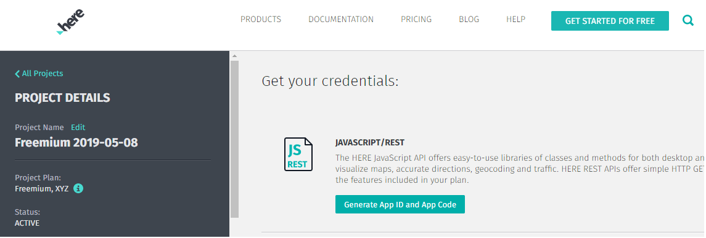

1. Go to => Get your credentials: click on **Generate App ID & App Code**

	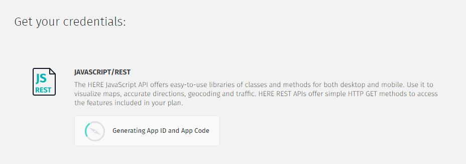

1. It will generate your **App ID & App Code**. It may take few seconds to generate your credentials

	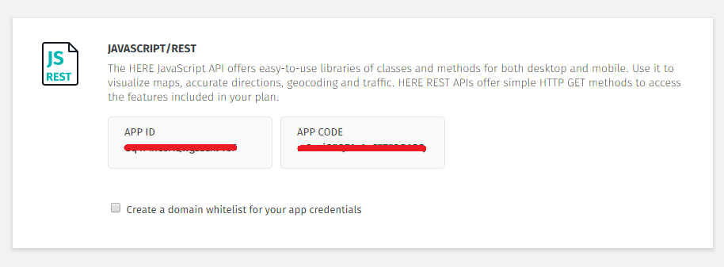

1. Note/save your **APP ID & APP CODE** to use in upcoming modules

## 2. Deploying Azure HERE ARM Template

The below steps help you deploy HERE Maps & Locations Services Data Streams Template in your Azure resource group.Use this [link](https://azuremarketplace.microsoft.com/en-us) to deploy

<strong>Step-by-step instructions (expand for details)</strong>

1. Go to this [link](https://azuremarketplace.microsoft.com/en-us) and type in the search bar **HERE Maps & Locations Services Data Streams**. In search result select **HERE Maps & Locations Services Data Streams** and the Click on **Get it Now** button to start the deployment process.

	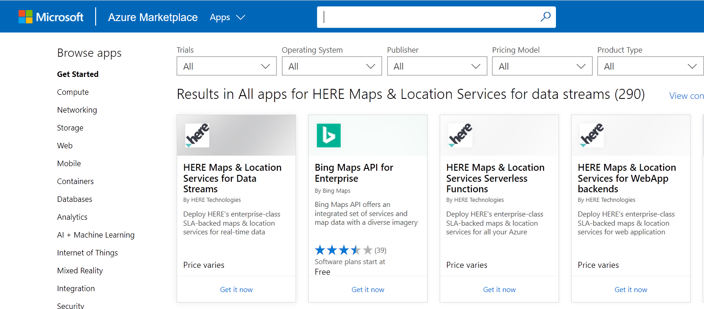

1. Click on **Get it Now** button to start the deployment process.

	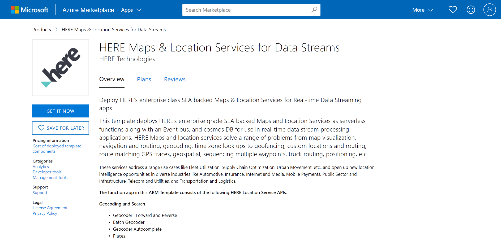

1. Read through the Microsoft agreement and click on **Continue** when you are ready.

	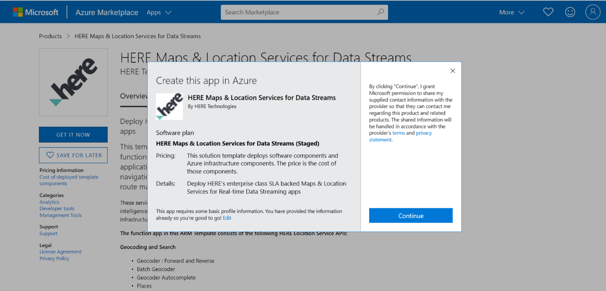

1. You will be re-directed to template deployment home screen. Click on **Create** button to continue.

	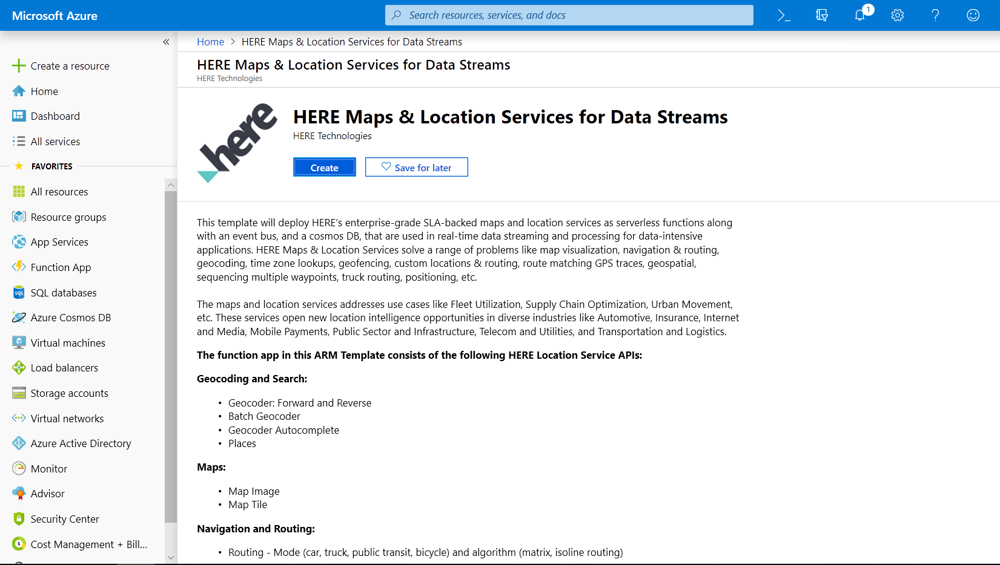

1. You will now be prompted to provide details specific to deployment. In the **Basics** use any existing resource group you might have or click on **create new** button to create a new resource group. Select your Subscription details and location and click **OK** to continue.

	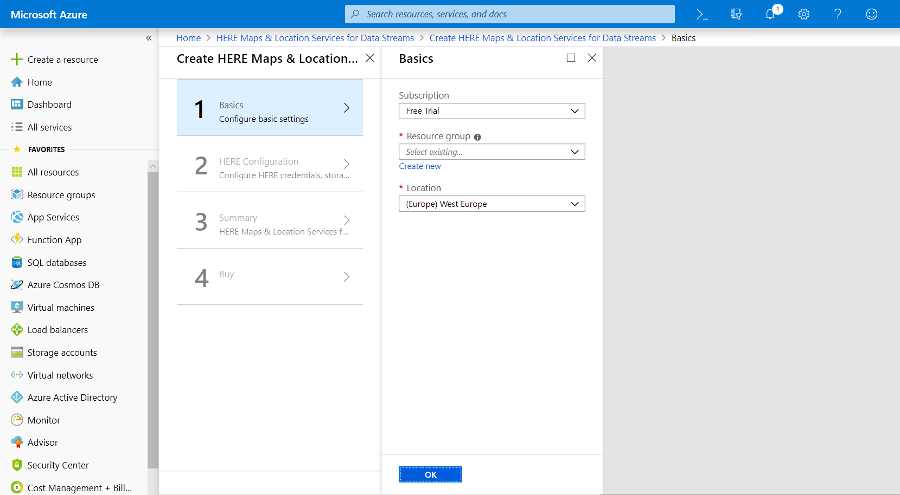

	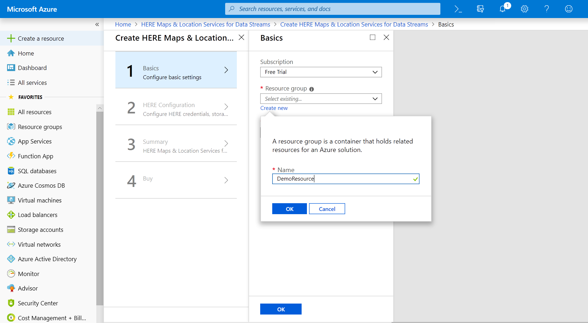

1. You now need to provide HERE credentials (HERE App ID and HERE App Code) which are pre-requisite to access HERE resources. If you already have HERE credentials available with you, provide the same and click **OK**. If you don’t have HERE credentials, please visit here(https://developer.here.com) to register for FREE with HERE. You also need to select a Storage option, you can either select any existing Storage or continue with a newly created one.

	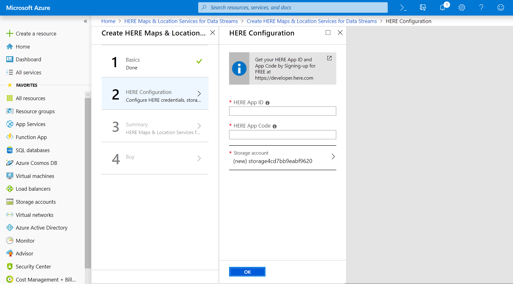

	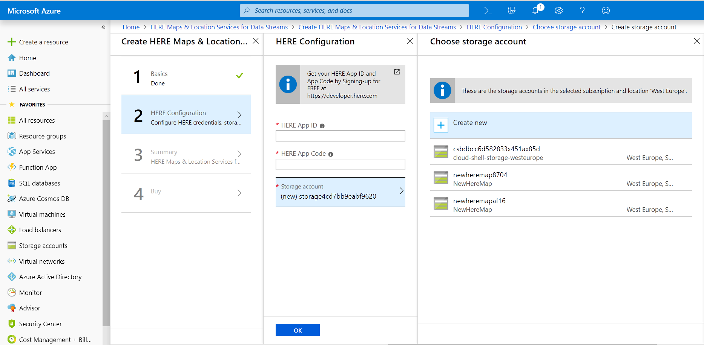

1. You will see the summary of details, which were provided during the previous steps. Review the values and click **OK** once you are satisfied with all values.

	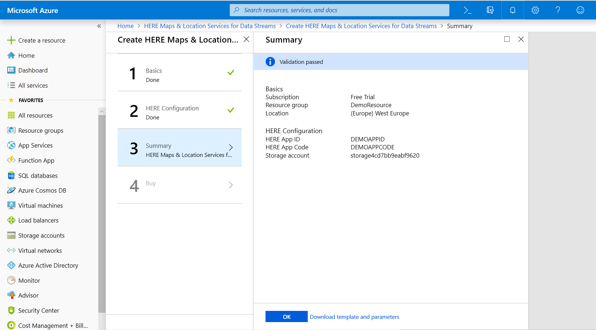

1. Review the master agreement and click the check box at the bottom of agreement. You are now ready for template deployment. Click on **Create** to start template deployment.

	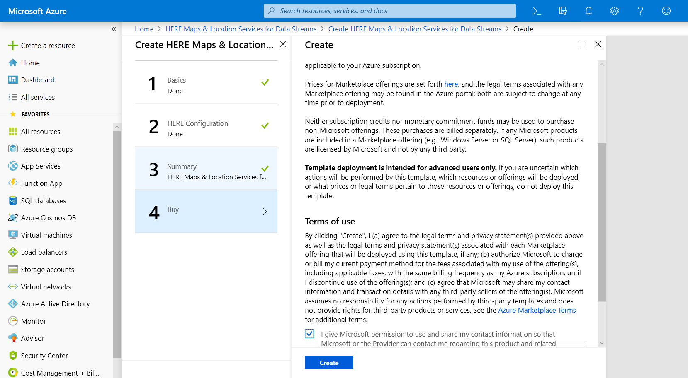

1. Deployment should have started, and you will be able to see in the notification tabs deployment in progress. Once deployment is complete, you should receive the notification of the same and be able to see new resources in the resources section of your account.

	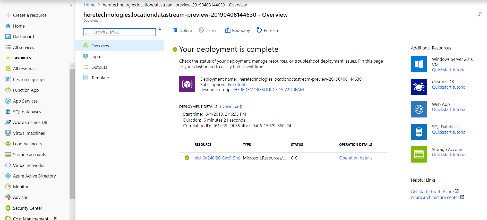

## 3. Get Configuration Details

In this step you will find the connection string details of Event Hub & Cosmos DB to configure in the upcoming modules.  

<strong>Step-by-step instructions (expand for details)</strong>

1. Open the Azure portal home page.

2. Select the **Resource groups** from the left hand navigational menu.

1. Select the **Resource group** which you used to deploy the **ARM Template** in the previous step.

	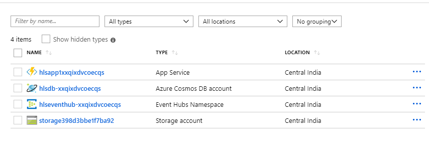

1. You will be able to see the list of resources which were created as part of deployment of **ARM template**.

	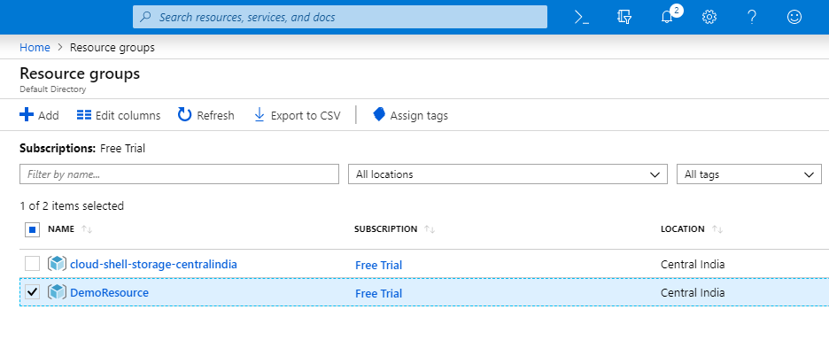

1. Select the Azure **Cosmos DB** from the list.

	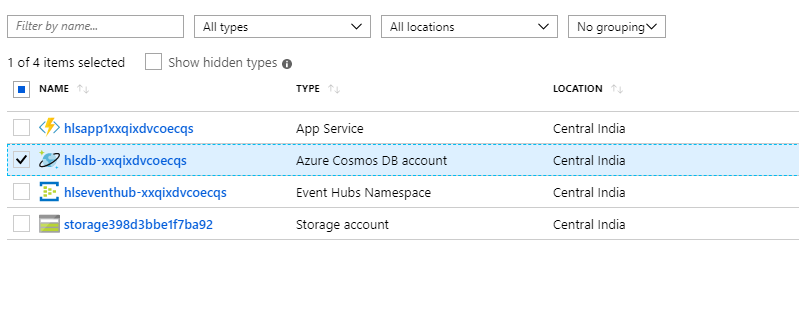

1. In the selected **Azure Cosmos DB account** page select **Keys** from left hand menu under **Settings**.

	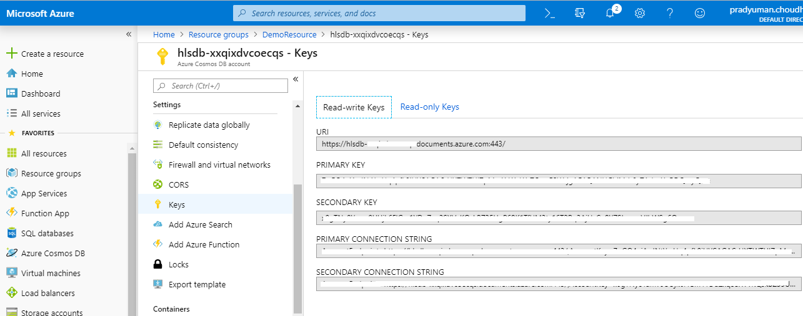

1. Copy the **URI** & **Primary Key** and note that in a text editor. These values will be used in configuration in upcoming modules.

1. Now go back to the **Resource groups** on the left hand navigational menu to get **Event Hub** Connection String details.

1. Select the **Resource group** which you used to deploy the **ARM Template** in the previous step .

	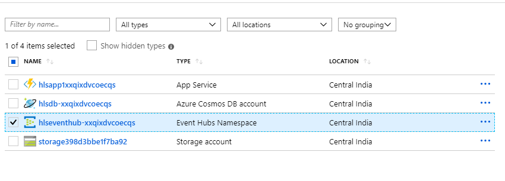

1. Select **Event Hubs** from the list.

1. On the **Event Hubs Namespace** page, select **Shared Access Policies** from the left hand menu.

	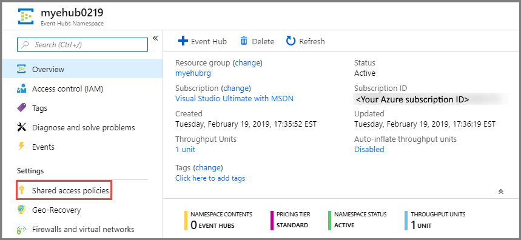

1. Select a **shared access policy** in the list of policies. The default one is named: **RootManageSharedAccessPolicy**. You can add a policy with appropriate permissions (read, write), and use that policy as well.

	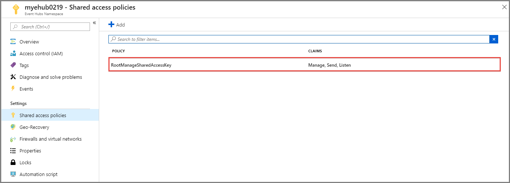

1. Select the **copy** button next to the **Connection string-primary key** field. Copy this key and note that in a text editor.This value will be used in configuration in upcoming modules.

	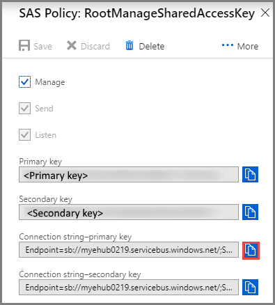

