# 2. Data Setup Producer

## Introduction

Fleet providers use various IoT devices to capture data from their fleets. Typically this data includes real time positioning data in the form of latitude and longitude. These devices are also capable to monitor various vehicle health parameters and send them to a central system as a near real time feed.

In this module, you’ll a script to generate data simulating these IoT devices. The data will be generated and sent in a near real time feed to the Azure Event Hub.

You will use the provided command-line producer script to simulate latitude, longitude, engine temperature, RPM, load and coolant temperature.

You will then configure the Azure Event Hub and Azure Cosmos DB to receive the data.

Finally, you will send the data stream to the EventHub via which HERE Reverse Geocode function that will be invoked to fetch the nearest address against each latitude and longitude combination generated by the producer script. The response along with the stream parameters will be persisted in the Azure Cosmos DB.

## Overview

The Event Hub receives the data from our producer script and facilitates the data being inserted into the CosmosdB. In this module we will deploy the producer script and make the connections between the Event Hub and the producer script.

## Prerequisite

In our previous module we configured the Event hub and Cosmos DB. We assume that you have completed the previous module successfully, in this module we are going to FTP the producer script to generate the data every Five seconds.

## Implementation

## 1. Data Setup for Producer

In this step you will download the script files from the link below and then we will walk you through the configuration to connect producer script with Azure Event Hub and Azure Cosmos DB.

<strong>Step-by-step instructions (expand for details)</strong>

 1. Download the zip file (Producer.zip) and save it on your local machine.

1. Open **Azure Portal** home page and login with your credentials.

1. Click on **Cloud Shell** to open the Azure PowerShell command-line.

	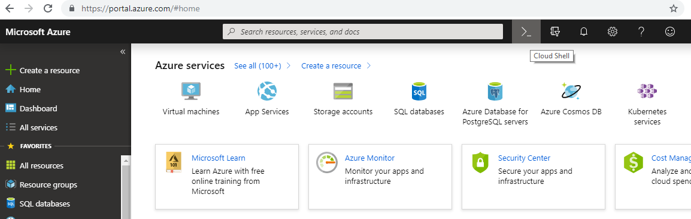

1. It may take few second for **PowerShell command-line** to be configured for your account.

	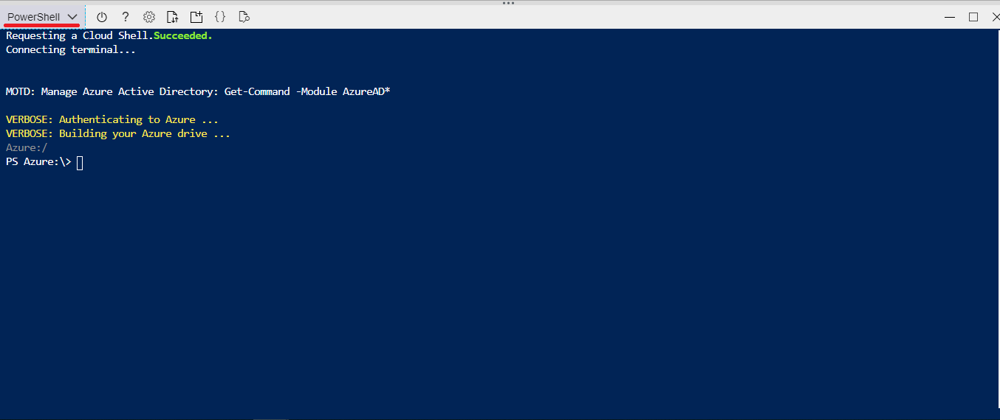

1. By default, the path of **PowerShell** will be in the Azure directory. We need to set location to our home directory to execute our Producer script. Execute the below command to set location to your home path.

                >Set-Location $home

6. Above command would have changed the current path and it should be set as your home path.

1. In menu tab click on **Upload/Download** files icon, then click on upload to upload the zip file.

	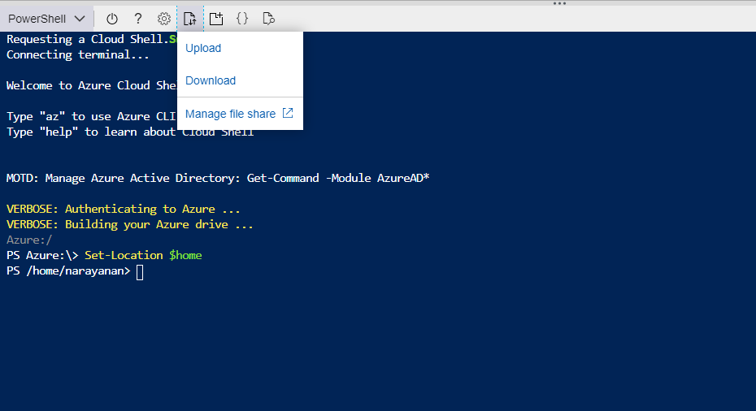

1. Browse to the directory where you saved the Zip file locally which you have downloaded in step-1. Choose the file and click **Upload**.

	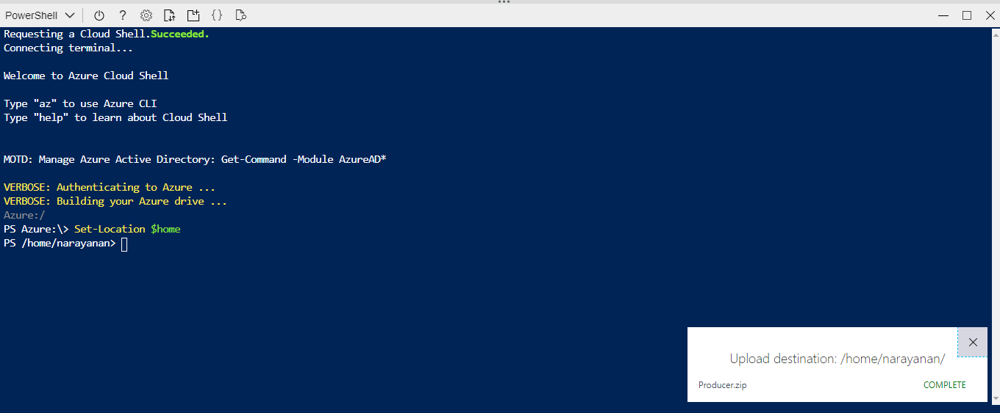

1. Once the upload is completed successfully, you need to extract the file. For extracting the files, use the below command.

	            >Expand-Archive “Producer.zip”

     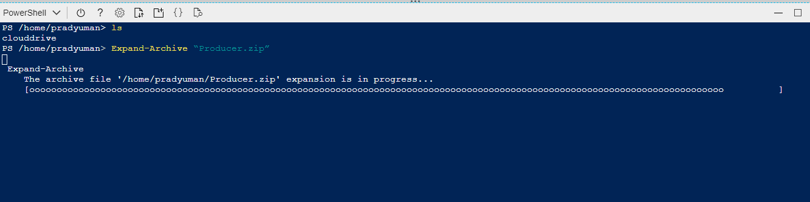

1. It may take few seconds to extract, after successful extraction you can verify the file by using the below command.

              >ls

1. It lists the files and directories available in the current directory. You should be able to see new files now as the output of above command.

## 2. CosmosDB & Event Hub Configuration

In this step you will configure the Azure Event Hub and Azure Cosmos DB connection details in the Producer script. The producer will produce the data and send it to the Azure Event Hub which in turn invokes HERE Reverse GeoCode function and stores the response in the Azure Cosmos DB. The producer script will produce the current location, Engine Temperature, Engine RPM, Engine Load & Coolant Temperature details of the Truck.

<strong>Step-by-step instructions (expand for details)</strong>

1. Navigate to the **Producer** directory by executing the below command.

		>cd Producer

1. In menu tab click on **Open editor** icon, it will open the VS code text editor online.

	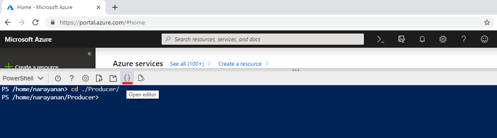

1. In the left panel of text editor, select the **Producer** folder and under this folder find & open **config.json**

	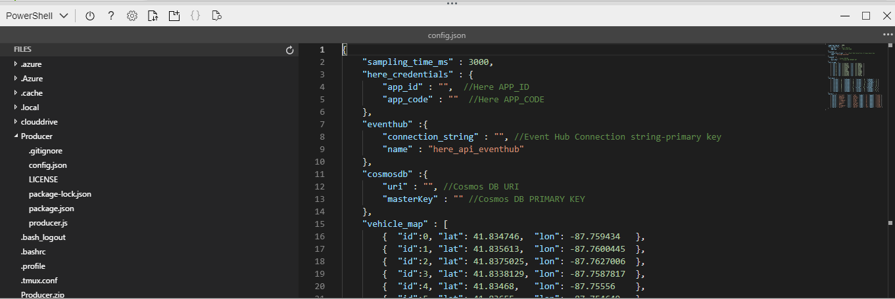

1. In **config.json** find the key **here_credentials** and replace the **app_id** & **app_code** with **HERE APP_ID** & **APP_CODE** value which you have copied in the module 1.

1. In **config.json** Find the key **eventhub** and replace the **connection_string** with **Event Hub Connection string-primary key** value which you have copied in the module 1.

1. In **config.json** Find the key **cosmosdb** and replace the **uri** & **masterKey** with **Cosmos DB URI** & **Cosmos DB PRIMARY KEY** value which you have copied in the module 1.

1. After making the changes, click on more tab to save the file. Click on more tab on the right corner, click **save** to save the file. Then click on **close editor** to close the window.

	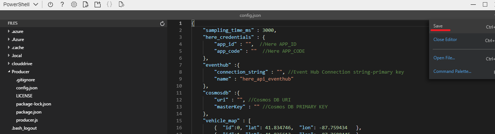

1. Now back in to **PowerShell** execute the below command in the command window to install the dependencies.

		>npm install

	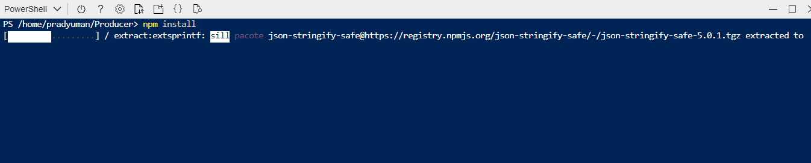

1. Your Data setup for the Producer script has been completed successfully.

		

## Producer Validation

In this step you can execute the producer script and validate whether the producer is emitting data or not.

1. On the Azure PowerShell window, execute the below command to validate the producer script. You will see the data generated by the producer script. By default, it produces data for 5 trucks.

		>node producer.js

	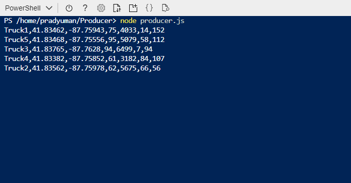

1. You can simulate up to 10 Trucks from producer script. You can mention the number of trucks to be simulated at run time by mentioning it as an arugment on the command line. You can mention any value between 1 to 10.

		>node producer.js 8

	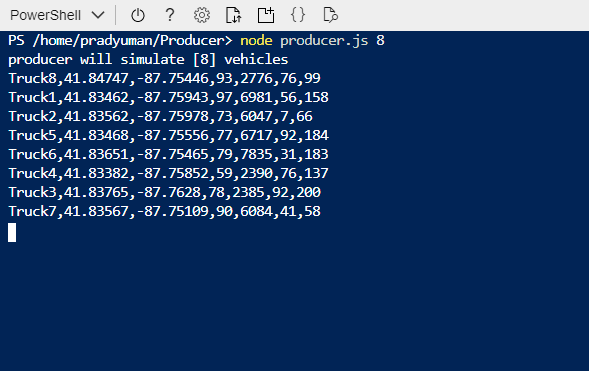

1. Press **ctrl+c** on the keyboard to stop the producer.

You have completed this module successfully.
