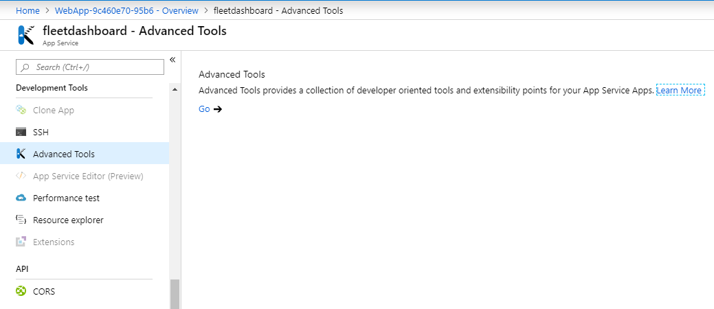
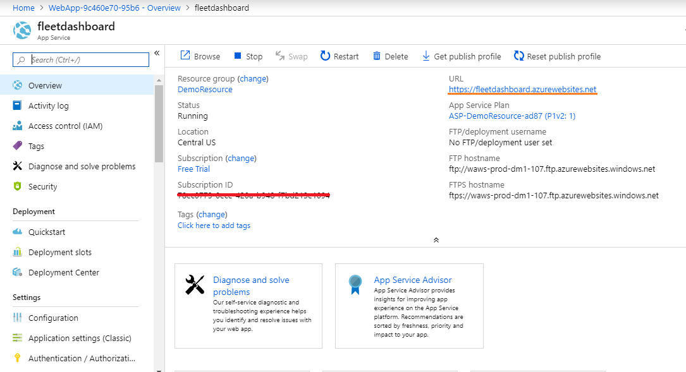

# 3. Data Setup Web App

## Introduction

In this module, you’ll deploy a dashboard to plot trucks on a map and watch their status in real-time. You will create a line-graph dashboard to analyze the various parameters of the trucks in real-time; temperature, RPM, load and coolant temperature.

## Overview

In this module you will deploy an Azure Web App that creates a dashboard to monitor your virtual fleet of trucks in real time. In our previous module we deployed a producer script, which sends data to the Azure Cosmos DB. Using this web application we will fetch and interpret the data from the Cosmos DB and then we will plot a map with realtime updates.

## Prerequisite

In our previous modules we have created and configured the Azure Event Hub and Cosmos DB to process our realtime information. We assume that you have completed the previous modules successfully. In this module you are going to create a Web App and deploy (FTP) the dashboard script to fetch the records from the Cosmos DB.

## Implementation

## 1. Data Setup for Web App

Download the script files from the link below. Next we will walk you through configuring the script to connect the dashboards to Cosmos DB. This web application code will plot the dashboard for the trucks in near real time and it will also plot the line graph dashboard for the engine details.

<strong>Step-by-step instructions (expand for details)</strong>

1. Download the zip file (fleetdashboard.zip) files.

1. Save it in to your local machine.

## 2. Create Azure Web App

Now, we will upload the dashboard script files to Azure. Then we will walk you through configuring the scripts to connect to the Cosmos DB.

<strong>Step-by-step instructions (expand for details)</strong>

1. Go to **Azure Portal** home page.

1. Click **Create a Resource** on the top left. Enter **web app** in the search box to get the required resource type and hit Enter.

	  

1. Select **Web App** from the search results and click **Create** button.

	  

1. You need to provide some basic information for this App:
    1. Project details tab, select your **subscription** and the use the same **resource group** which you used in the previous modules.

    2. In the Instance details, the first box is the **name** of your app. Use unique and qualified name like **fleetdashboard**.

    3. Select **Run-Time Stack** as **Node 8.0** and select **Runtime** as **windows**

    4. Leave the other parameters as default.

1. Click on **Review & Create**, it will validate the details.

	  

1. Click on **Create**, it may take more than a minute for deployment to complete.

1. After successful deployment, Click on **Go to resource**.

	  

1. In App service search bar type “Advanced Tools”.

	  

1. Click on **Advanced Tool** under **Development Tools** section.

	 

1. Click on **Go** -> it will open in a new tab.

1. In menu select **Zip Push Deploy** under **Tools**

	

1. Browse to the directory where you have saved the downloaded zip file (fleetdashboard.zip) in step-1.

1. Select the file and “drag and drop” into the “Kudu console” under /wwwroot path.

	

1. Files will be extracted automatically, wait till extraction is 100% complete.

	

1. Once extraction is completed, you will be able to see all the files and on the console you will see a log message **"Deployment Successful”**.

  	

## 3. Configure Azure Web App

In this step you will configure your Azure Web App with Azure cosmos DB to run the webapp.

<strong>Step-by-step instructions (expand for details)</strong>

1. Now we are going to make configuration changes. We need to configure Azure Cosmos DB so that the dashboard is able to fetch the data.

1. Select the file **config.js** click the **Edit** icon (pen icon)

	

1. In **config.js** file find the variable **config.endpoint** & **config.primaryKey** and replace the value with **Cosmos DB URI & Cosmos DB PRIMARY KEY** value which you copied in the **module 1**.

1. Click on the **Save** button to save the file.

	

1. Click on the **Script** to open the folder in the list.

	

1. Now go to the file **truck_dashboard.js** click the **Edit** icon (pen icon).

	

1. In **truck_dashboard.js** file find the variable **app_id** & **app_code** and replace the value with **HERE APP_ID** & **APP_CODE** value which you copied in the **module 1**.

  	

1. Click on **Save** button to save the file & Close the tab

1. Go back to your Web App

1. In App service search bar type “Configuration” on the left hand navigation menu.

1. Click on **Configuration** under **Settings** section.

	

1. Click on **New application setting**.

	

1. In “Add/Edit application setting” add in **Name** as “**WEBSITE_NODE_DEFAULT_VERSION**” and Value as “**8.9.0**”, then click “**update**”. Click on “**save**” button to save the changes.

            Name: WEBSITE_NODE_DEFAULT_VERSION
            Value: 8.9.0

	

1. Click on overview tab, find **URL** to access your web app.

	

1. Save the **URL** to access the dashboard, we will use the same in the next module.

		Eg: https://fleetdashboard.azurewebsites.net

