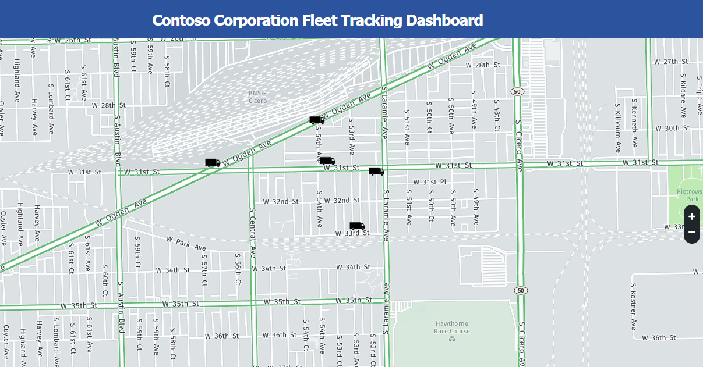
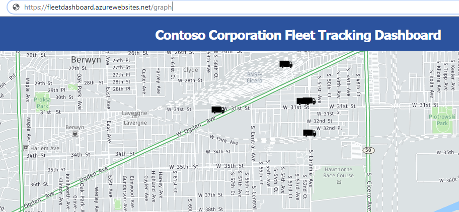
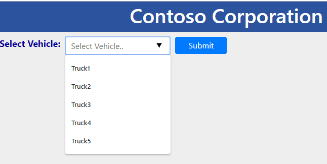
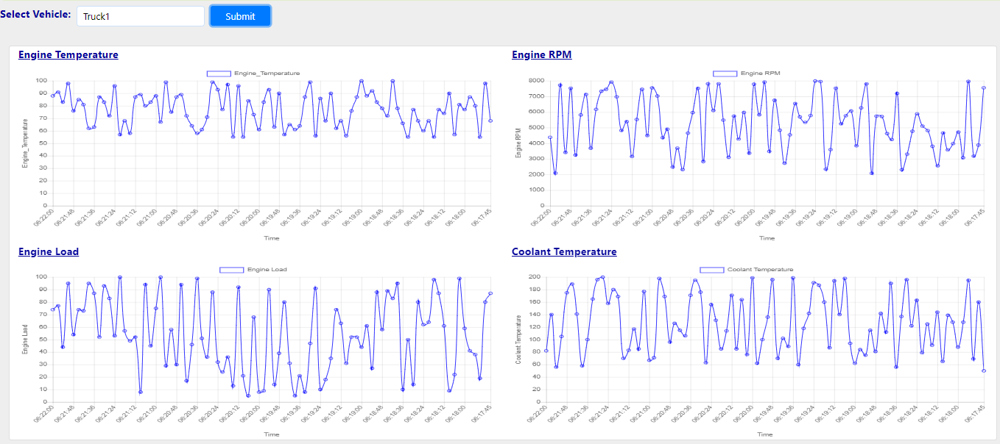
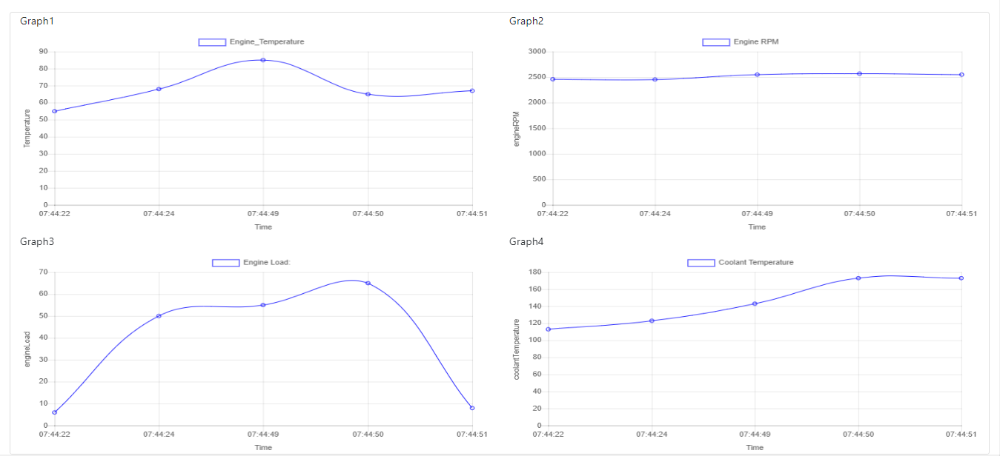

# Implementation Validation

In this module, you are going to access the Azure Web App to view the dashboard which we have created in the previous module. You will be able to access two seperate Dashboards, one to track the Fleet movement and another one to view the engine health parameters.

## Prerequisite

In our previous modules we have created a Web App. We assume that you have completed all the previous modules successfully. In this module you are going to execute the producer script to generate the data. You will then view the fleet movement of the vehicles on the dashboard by running the Azure web app.

### Implementation

## 1. Steps to Execute the Producer Script

<strong>Step-by-step instructions (expand for details)</strong>

1. Open Azure Portal home page.

1. Click on **Cloud shell** to open the Azure PowerShell command-line.

  	

1. It may take few seconds for **PowerShell command-line** to be configured for your account.

	

1. By default, the path of the PowerShell will be in the Azure directory. We need to set location to our home directory to execute our Producer script. Execute the below command to set location to your home path.

                >Set-Location $home

6. Above command would have changed the current path and it should be set as your home path.

1. Navigate to the **Producer** directory by executing the below command.

                >cd Producer

1. You can simulate up to 10 Trucks to generate the data with this script. You specify the number of trucks by defining it as an argument in the command line. You can specify any value between 1-10.

              	>node producer.js 8

	

 1. Keep this window open so that the Producer script can keep generating the data for the Dashboards.

## 2. Steps to Execute Web App

<strong>Step-by-step instructions (expand for details)</strong>

1. Open the browser tab and enter the **Web App URL** which you copied/saved in the previous module. It will be similar to the below format.

 		Eg: https://fleetdashboard.azurewebsites.net

1. You should now be able to see the **Map dashboard**. Based on your truck count defined for the Producer script, the Truck icons will be displayed on the Map.

1. You should be able to see simulated movement of the vehicles on the dashboard.

  	

1. To access the **Line Graph dashboard**, change your web browser's path by adding "/graph" to the URL.

              Eg: https://fleetdashboard.azurewebsites.net/graph

    

1. It will open a web page where you can select any vehicle from the dropdown.

    

1. Click on the text box to select the vehicle.

    

1. Select a truck and click on the Submit button, it will plot the Line graph of the engine's temperature, RPM, load and coolant temperature.

    

    

**Congratulations** you have successfully completed the workshop!

After you have completed the workshop you can delete all of the resources that were created by following the [cleanup guide][cleanup].

After you have completed this workshop, be sure you delete all of the resources that were created by following the [cleanup guide][cleanup].

[cleanup]: ../5_CleanUp/
