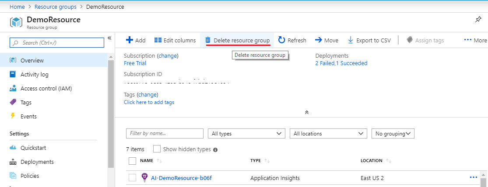
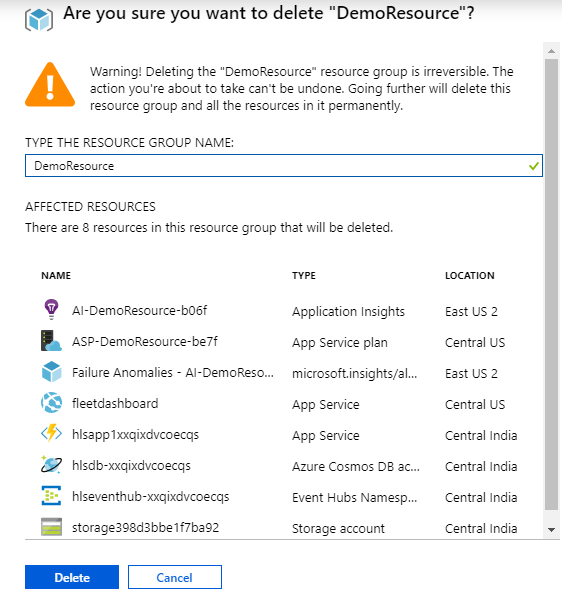
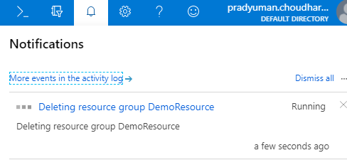
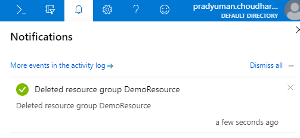

# Workshop Cleanup

This module provides instructions for cleaning up of the resources created during the workshop.

### 1. Resource Group Cleanup Instructions

**:white_check_mark: Step-by-step directions**

1. Open the Azure portal home page.

1. Select Resource groups on the left navigational menu.

1. Select the Resource group which you used to deploy the ARM Template and you used in the previous modules.

    

1. You will be able to see the list of resources part of this resource group.

1. Click on “Delete resource group” to delete all the resources.

    

1. You will receive a prompt to confirm deletion of resources. Enter the Resource group name in the text box then click the delete button.

    

1. It may take a few minutes to complete the delete operation.

    

1. Once the delete operation is completed you will receive the notification that **Deleted resource group DemoResource**

    

### 2. Producer Script Cleanup
Delete the AWS Producer files in Powershell.

**:white_check_mark: Step-by-step directions**

1. Go to Azure Portal home page.

1. Click on Cloud shell to open the Azure PowerShell command-line.

1. Enter the below command to clean-up the Producer folder.

           >rm -r Producer

1. Enter the below command to clean-up the Producer ZIP file

           >rm Producer.zip
