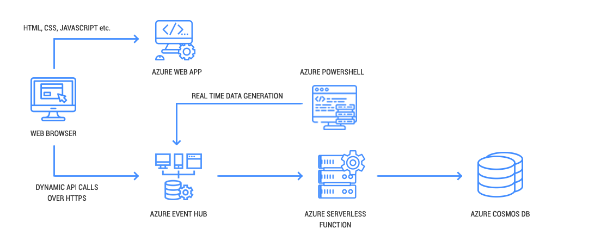

# Workshop - Build your own real time fleet tracking system using Azure and HERE Technologies Location Services

Fleet Management is a core use case for HERE Technologies. Pair our API’s with Microsoft Azure’s real time data processing capabilities and you get real time information about your fleet.  In this workshop we will walk you through the simple process of deploying your own management website. You will set up a virtual fleet of vehicles driving around Chicago. Finally, we will also show you how to insert real-time vehicle parameters to track the health of the vehicles.

The application architecture uses [Azure ARM templates](https://docs.microsoft.com/en-us/azure/azure-resource-manager/resource-manager-quickstart-create-templates-use-the-portal), [Azure Event Hub](https://docs.microsoft.com/en-us/azure/event-hubs/), [Azure Serverless Functions](https://azure.microsoft.com/en-in/services/functions/), [Azure PowerShell](https://docs.microsoft.com/en-us/powershell/azure/overview?view=azps-1.8.0), [Azure Cosmos DB](https://azure.microsoft.com/en-in/services/cosmos-db/) and [Azure Web App](https://azure.microsoft.com/en-in/services/app-service/web). You will be deploying your very own web application based on node.js to view the results in a web browser. The node.js based application is a “producer” script that simulates your own virtual fleet of vehicles. It also calls the HERE Geocoder serverless function to fetch the address corresponding to a latitude and longitude combination, that is stored in Cosmos DB. The Geocoder function receives the longitude and latitude, then finds the nearest physical street address.

See the diagram below for an overview of the complete architecture.

  

### Modules

This workshop is divided into four modules. Each module describes a scenario of what we're going to build and step-by-step directions to help you implement the architecture and verify your work.

| Module        | Description |
|---------------|-------------|
| [1. ARM Template Deployment][ARM Template Deploy] | The HERE Location Services Data Streams Template is a Solution Template on Azure  |
| [2. Data Setup Producer][Data_Setup_Producer] | Uploading the Producer setup data to the Azure PowerShell  |
| [3. Data Setup WebApp][Data_Setup_WebApp] | Creating an Azure web-app and uploading the setup data  |
| [4. Validation][Validation] | Launch the web application URL via the browser to see the dashboard on a real-time map  |

:warning: These modules are intended to be executed linearly.

After you have completed the workshop, we recommend you delete all of the resources that were created by following the [cleanup guide][cleanup].

[ARM Template Deploy]:1_ARM_Template_Deploy/
[Data_Setup_Producer]:2_Data_Setup_Producer/
[Data_Setup_WebApp]:3_Data_Setup_WebApp/
[Validation]:4_Validation/
[cleanup]: 5_CleanUp/
