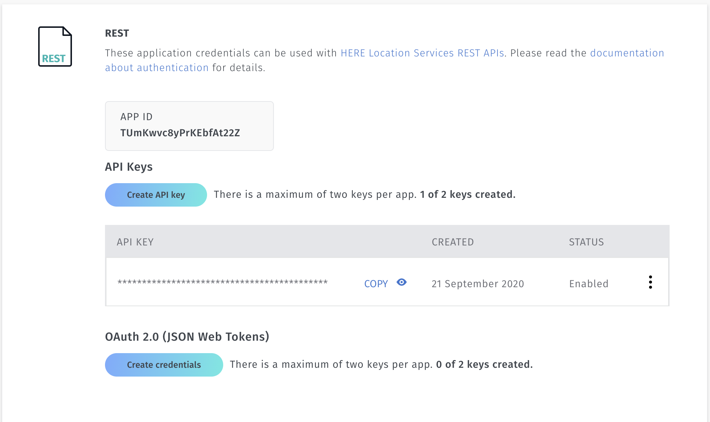
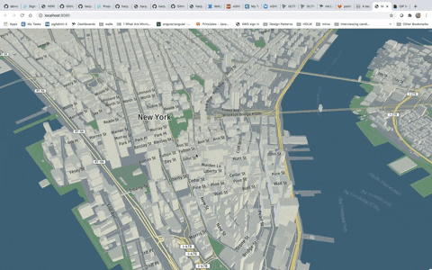

# Welcome to the Virtual Grace Hopper Celebration 2020!

## Workshop Topic
### Sensor (LiDAR) To HD Maps For Driverless Cars: Visualize The Transformation In 3D

Understanding the steps involved in HD map-making and seeing them come alive by visualizing them using a 3D-map rendering engine is like hitting two targets with one arrow.

Walk away with visualization of LiDAR point-clouds collected by HERE cars, raw features extracted from LiDAR (Light Detection & Ranging) imagery and the final HD-map. 

This will be achieved using an open-source 3D web-map rendering engine – [harp.gl](https://www.harp.gl/)


### Workshop Prerequisites

#### Install node and npm

Download and install Node on your machine: https://nodejs.org/en/download/
Use the latest LTS Version: 12.18.3

Add the NPM registry to your config with the following command:

````
npm config set registry http://registry.npmjs.org
````

#### Checkout workshop repository
URL:  https://github.com/heremaps/devrel-workshops/tree/master/

The repository we would be working on is placed within the folder structure harp.gl/grace-hopper-2020. 
Follow the instructions to set up the application after navigating to this path.

#### Section 1: Initial App Setup
The initial app set up for all three steps has already been done for you. 
The workshop is divided into three steps under the folders: 
1. point-clouds
2. intermediate
3. hdmap

You will be working off of the 'initial' folder during the workshop.

#### Register for a free HERE Account

Go to https://developer.here.com/sign-up?create=Freemium-Basic&keepState=true&step=account

1. Create an account using your details
2. Generate an app under the 'REST' section
3. Create an API Key
4. Replace the new api key in the file: ./apikey.ts



#### Section 2: Initial setup

##### Prepare workshop steps
Run this command in each of the three sub-folders mentioned below

````
npm install
````

1. ./point-clouds/initial 
2. ./intermediate/initial
3. ./hdmap/initial

##### Run the app
Go to ./point-clouds/initial folder and run the app using the command below:

````
npm start
````

You should be able to see a map as shown below:


