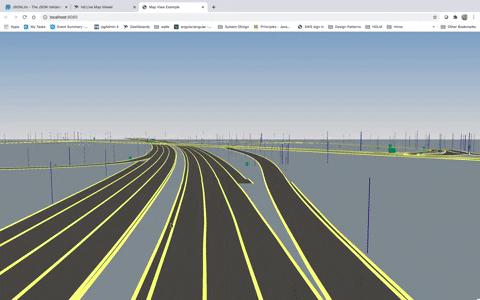

# Rendering the final HDMAP with lanes, signs and poles
This will be achieved by loading GLTF files.

Graphics Library Transmission Format or GL Transmission Format is a file format for 3D scenes and models using the JSON standard.
It's also called as the JPEG of 3D. It's used widely as a 3D format that could be used to transfer 3D models and scene data.

## Add GLTF Loader
````
// Instantiate a loader
var loader = new GLTFLoader();

var dracoLoader = new DRACOLoader();
dracoLoader.setDecoderPath( 'three/examples/js/libs/draco/' );
loader.setDRACOLoader( dracoLoader );
````
## Create a MapAnchor
Create a 3D object to which the GLTF scene will be added to
Position it on the Map View
````
const anchor = new THREE.Object3D() as MapAnchor<THREE.Object3D>;
anchor.anchor = new GeoCoordinates(48.32886, 11.70044);
mapView.mapAnchors.add(anchor);
````
## 3D Lane Model
### Load the Lanes GLTF file
Load the Lanes GLTF file and parse them
Add the scene to the map anchor

````
// Load the Lanes 
loader.load(
    // resource URL
    'https://ghc2020.s3.amazonaws.com/lanes.gltf',
    // called when the resource is loaded
    function ( gltf ) {
        anchor.add(gltf.scene);
        mapView.update();
    },
    // called while loading is progressing
    function ( xhr ) {
        console.log( ( xhr.loaded / xhr.total * 100 ) + '% loaded' );
    },
    // called when loading has errors
    function ( error ) {
        console.log( 'An error happened' + error );
    }
);
````
## 3D Localization Model
### Load signs and poles data
````
// Load the signs
loader.load(
    // resource URL
    'https://ghc2020.s3.amazonaws.com/signs.gltf',
    function ( gltf ) {
        anchor.add(gltf.scene);
        mapView.update();
    },
    // called while loading is progressing
    function ( xhr ) {
        console.log( ( xhr.loaded / xhr.total * 100 ) + '% loaded' );
    },
    // called when loading has errors
    function ( error ) {
        console.log( 'An error happened' + error);
    }
);

// Load the poles
loader.load(
    // resource URL
    'https://ghc2020.s3.amazonaws.com/poles.gltf',
    function ( gltf ) {
        anchor.add(gltf.scene);
        mapView.update();
    },
    // called while loading is progressing
    function ( xhr ) {
        console.log( ( xhr.loaded / xhr.total * 100 ) + '% loaded' );
    },
    // called when loading has errors
    function ( error ) {
        console.log( 'An error happened' + error);
    }
);
````
## Check the HD Map!


The HERE HD Live Map is a cloud-based service comprised of various tiled mapping layers that are highly accurate and continuously updated to support connected ADAS and highly automated driving solutions. 
The layers are logically structured into Road Model, HD Lane Model, and HD Localization Model. 

Refer: https://www.youtube.com/watch?v=8dyo_S3Vxlw&list=RDCMUC0m3Fy5uK4OwOf7iPNuwGVg&start_radio=1&t=67
