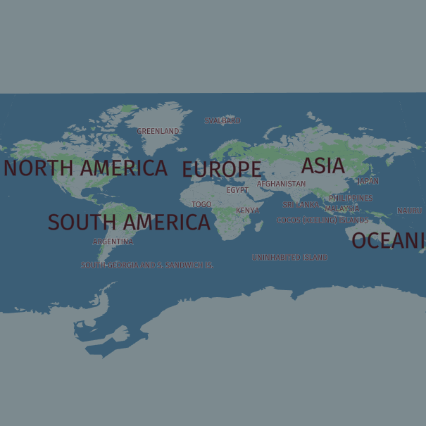
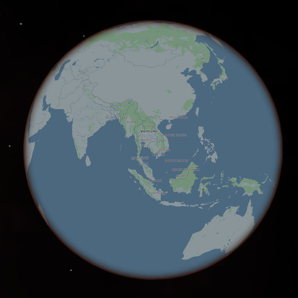
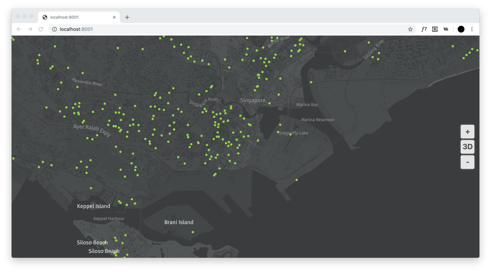

# Interactive 3D web mapping with harp.gl


Welcome to the JSConf lecture track!

This workshop will cover __harp.gl__, a new and beta 3D map rendering engine for the web.


### Workshops hosts / harp.gl experts

- Dylan Babbs ([Twitter](https://twitter.com/dbabbs) / [Github](https://github.com/dbabbs))
- Ignacio Julve Castro. ([Github](https://github.com/musculman))
- Nino Kettlitz. ([Github](https://github.com/ninok))

Throughout the workshop, feel free to raise your hand or yell at us for questions or assistance.

You can also join the HERE Developer Slack space to ask questions online. To join, follow this link: [t.her.is/slack](https://t.her.is/slack).

harp.gl is a beta product and we are always looking to improve it with your feedback. For any comments, suggestions, or bug reports, we encourage you to:
- fill out this form: [harp.gl feedback](https://forms.gle/GhTVkruwsReNi3oH7)
- or create an issue on the [harp.gl GitHub repository](https://github.com/heremaps/harp.gl)

## Prerequisites

- Laptop with a modern web browser (Chrome, Firefox, Safari, etc.)
- Node and npm installed ([installation directions here](https://nodejs.org/en/download/))


## Resources

### harp.gl resources

* [harp.gl Github repo](https://github.com/heremaps/harp.gl) (Source code for harp.gl)
* [harp.gl documentation](http://harp.gl.s3-website-us-east-1.amazonaws.com/docs/master/doc/)
* [harp.gl examples](http://harp.gl.s3-website-us-east-1.amazonaws.com/docs/master/examples/) (curated list of examples)
* [harp.gl modules on npm](https://www.npmjs.com/~heremaps)

### Other HERE resources
* [HERE Developer Portal](https://developer.here.com/events/jsconfasia19) (where to sign up for API tokens)
* [HERE XYZ Documentation](https://www.here.xyz/) (documentation for HERE XYZ, the service that will provide the map tiles)

## Acquiring credentials

harp.gl is an open-source and free software project. However, harp.gl needs to be connected to a data source in order to display a map. 

HERE XYZ, another HERE product, is a service for storing and managing geospatial data. HERE XYZ will provide the vector tile data endpoint and authentication for harp.gl.

## Key concepts

Now that you have a base setup of harp.gl, let's review some key concepts.

#### MapView

A `MapView` is the high-level main object in harp.gl. This is the object you'll add new layers to or customize the style of. 

### Data source

A data source is a source of data you'll add to the map. Generally, when working with maps, we'll be referring to two different types of data sources:

- __Static data source__: a single object, commonly in the geojson format. Think like a `.json` file or a javascript object.
- __Tiled data source__: a dynamic data source that is broken up into "tiles". These tiles, referenced by parameters `{x}`, `{y}` and `{z}`, are divided by different locations and zoom levels on the map. Tiled data sources are preferred for large data sets because the map only requests data for the current view of the renderer.

[HERE XYZ](https://here.xyz) provides a hosting and tiling service we will be using later on in this workshop. You'll be able to upload large datasets and XYZ will provide and endpoint to access this data using the `{x}`, `{y}` and `{z}` parameters. 

### GeoJSON

GeoJSON is a popular and common format for storing geo data. harp.gl accepts GeoJSON and we will be using this format throughout the workshop.

Generally speaking, there are common types of GeoJSON objects: `Point`, `LineString`, `Polygon`.

An example of a GeoJSON `Point` is:
```json
{
   "type": "Feature",
   "geometry": {
      "type": "Point",
      "coordinates": [125.6, 10.1] 
   },
   "properties": {
      "name": "Dinagat Islands"
   }
}
```
An example of a GeoJSON `LineString` is:
```json
{
   "type": "Feature",
   "geometry": {
      "type": "LineString",
      "coordinates": [
         [100.0, 0.0], [101.0, 1.0]
      ]
   },
   "properties": {
      "name": "The name of a line"
   }
}
```
An example of GeoJSON `Polygon` is:
```json
{
   "type": "Feature",
   "geometry": {
      "type": "Polygon",
      "coordinates": [
         [ [100.0, 0.0], [101.0, 0.0], [101.0, 1.0], [100.0, 1.0], [100.0, 0.0] ]
      ]
   },
   "properties": {
      "name": "a polygon for harp.gl!"
   }
}
```

Resources:
- [GeoJSON specification](https://geojson.org/) and [GeoJSON blog post](https://macwright.org/2015/03/23/geojson-second-bite.html) by Tom MacWright
- [GeoJSON Viewer tool](http://geojson.tools/)

_Note: GeoJSON uses the format [Longitude, Latitude] for the coordinate system, while harp.gl uses [Latitude, Longitude]. Be careful not to get these confused!_

### harp.gl style sheets and syntax

harp.gl has its own syntax for styling the map. The styling syntax lives inside a `json` file and contains rules for how the visuals are drawn. For example, in the style sheet, you can specify things like.

- the width for roads
- the background color for water
- the height of 3d buildings

You can take a look at a sample style sheet here: [https://unpkg.com/@here/harp-map-theme@latest/resources/berlin_tilezen_night_reduced.json](https://unpkg.com/@here/harp-map-theme@latest/resources/berlin_tilezen_night_reduced.json)

Let's take a look at some example styles. These will be helpful later on when styling data overlayed on a map.

__Style a point__

This technique will style all geometry types that are points with `#7ED321` color and `15` size.

```json
{
   "when": "$geometryType == 'point'",
   "technique": "circles",
   "renderOrder": 10000,
   "attr": {
      "color": "#7ED321",
      "size": 15
   }
}
```

__Style a line__

This technique will style all geometry types that are lines with `blue` color and `1px` width. 

`renderOrder` is the z-index value for the render order. A large number means that the object will show up first.
```json
{
   "when": "$geometryType ^= 'line'",
   "renderOrder": 1000,
   "technique": "solid-line",
   "attr": {
      "color": "blue",
      "opacity": 1,
      "metricUnit": "Pixel",
      "lineWidth": 1
   }
}
```

__Style a polygon__

This technique will style all geometry types that are lines with `#525556` color and `0.8` opacity. 
```json
{
   "when": "$geometryType ^= 'polygon'",
   "technique": "fill",
   "attr": {
      "opacity": 0.8,
      "color": "#525556"
   },
   "renderOrder": 0
}
```

### Projections

Technically, [all maps have been lying to you](https://www.iflscience.com/environment/how-maps-can-lead-you-wrong-idea/). That's because it's difficult to project the spherical earth onto a perfect rectangle.

_Side note: for some fun with mercator projections, check out [The True Size of](https://thetruesize.com/), a cool web app to explore the different sizes of country depending on where they are._

harp.gl provides two different views:

- mercator: the classic and one of the most popular flat projections
- globe: an accurate representation of earth as a sphere, as seen from space.

|Mercator|Globe|
|---|---|
|||

Now onto the fun part... making some maps! 🌍

### Become a HERE Developer 

Navigate to [developer.here.com](https://developer.here.com/events/jsconfasia19) and click __Get started for free__ in the top right. 

Create an account. __No credit card is required__.

Once you've created a HERE Devloper account, navigate to the to [HERE XYZ Token Manager](https://xyz.api.here.com/token-ui).

Sign in with the HERE account you just created.

You'll want to generate a new token. Select the checkbox under __READ DATA__ and then click __Generate Token__


Click through the next window until a token has been generated.

__Important__: Copy and paste this token somewhere. You will be using it later in the workshop.

## Section 1: Installing harp.gl

You can get started with harp.gl on the web with two different methods:
- linking a single bundle as a `<script>` tap in your html page
- installing harp.gl as a set of [TypeScript](https://www.typescriptlang.org/) modules through npm

In this workshop, you are free to choose whatever method you please, but for simplicity, __we recommend linking the single bundle to your html page (method #1)__.

### Method 1: Linking a single `script` bundle to your html (recommended)

In your command line, create a new directory and navigate into it:

```bash
mkdir harp.gl-workshop
cd harp.gl-worshop
```

Create two files: `index.html` and `index.js`:

```bash
touch index.js
touch index.html
```

Copy and paste the following code into each of the files.

__`index.html`__

```html
<html>
   <head>
      <style>
         body, html { border: 0; margin: 0; padding: 0}
         #map { height: 100vh; width: 100vw; }
      </style>
      <script src="https://unpkg.com/three/build/three.min.js"></script>
      <script src="https://unpkg.com/@here/harp.gl/dist/harp.js"></script>
   </head>
   <body>
      <canvas id="map"></div>
      <script src="index.js"></script>
   </body>
</html>
```

__`index.js`__
```javascript
const canvas = document.getElementById('map');
const map = new harp.MapView({
   canvas,
   theme: "https://unpkg.com/@here/harp-map-theme@latest/resources/berlin_tilezen_night_reduced.json",
});

map.setCameraGeolocationAndZoom(
   new harp.GeoCoordinates(1.278676, 103.850216),
   16
);

const mapControls = new harp.MapControls(map);
const ui = new harp.MapControlsUI(mapControls);
canvas.parentElement.appendChild(ui.domElement);

mapControls.maxPitchAngle = 90;
mapControls.setRotation(6.3, 50);

map.resize(window.innerWidth, window.innerHeight);
window.onresize = () => map.resize(window.innerWidth, window.innerHeight);

const omvDataSource = new harp.OmvDataSource({
   baseUrl: "https://xyz.api.here.com/tiles/herebase.02",
   apiFormat: harp.APIFormat.XYZOMV,
   styleSetName: "tilezen",
   maxZoomLevel: 17,
   authenticationCode: 'YOUR-XYZ-TOKEN HERE',
});
map.addDataSource(omvDataSource);
```

__NOTE:__ be sure to swap out `YOUR-XYZ-TOKEN-HERE` for the token you obtained from the [XYZ Token Manager](https://xyz.api.here.com/token-ui/).

Start up a local server and open your browser to `localhost:8888`:
```bash
python -m SimpleHTTPServer 8888
```

### Method 2: Install harp.gl modules through npm

_These instructions are also available on the [harp.gl github repo](https://github.com/heremaps/harp.gl/blob/master/docs/GettingStartedGuide.md)._

```bash
mkdir harp.gl-workshop
cd harp.gl-workshop
npx -p yo -p @here/generator-harp.gl yo @here/harp.gl
```

As the command executes, it will prompt you for some information:
- `package name`: what you would like to name your project
- `access token`: your HERE XYZ token (obtained in the previous step)

Next, run the following commands:

```bash
npm install
npm start
```

A local server will start and you will be able to view the project at `localhost:8081`.

## Section 2: Modifying the map

At this point, you should have a map up and running.

### Changing the map's center and zoom

You can center the map at whatever point you would like in the world with this method:

```javascript
map.setCameraGeolocationAndZoom(
   //Singapore coordinates and zoom level 16:
   new harp.GeoCoordinates(1.278676, 103.850216), 16 
);
```

Try changing the map to where you come from!

### Changing the map's pitch and rotation

Since harp.gl is a 3D engine, you can change the pitch and bearing to view the map at a different perspective.

To change the pitch and bearing with a user event:
- on a mac trackpad: two finger hold and drag
- on a mouse: right click hold and drag

To programmatically change the map's theme you can use the following methods.

```javascript
//Set the max pitch angle
mapControls.maxPitchAngle = 90;
mapControls.setRotation(6.3, 50); //rotation, pitch
```


The first parameter of `setRotation()` is the __rotation__, which can be between `0` and `360`. The second parameter is the __pitch angle__, which be between `0` and `90`.

### Changing the map's projection

The default projection is the flat mercator.

To change to the globe projection, pass the following parameters in your constructor: 

```javascript
const map = new MapView({
   /*...*/
   theme: "https://unpkg.com/@here/harp-map-theme@latest/resources/berlin_tilezen_base_globe.json",
   projection: sphereProjection,
   maxVisibleDataSourceTiles: 400
});
```

And then make sure to use `GlobeControls` instead of `MapControls`:

```javascript
const controls = new GlobeControls(map);
controls.enabled = true;
```

### Changing the map's theme

harp.gl comes with three theme variants called _Berlin_. These _Berlin_ themes were inspired by the vibrant city of [Berlin](https://en.wikipedia.org/wiki/Berlin), where most of the development for harp.gl is done.

- Berlin base: https://unpkg.com/@here/harp-map-theme@latest/resources/berlin_tilezen_base.json
- Berlin reduced day: https://unpkg.com/@here/harp-map-theme@latest/resources/berlin_tilezen_day_reduced.json
- Berlin reduced night: https://unpkg.com/@here/harp-map-theme@latest/resources/berlin_tilezen_night_reduced.json


You can set a theme in `MapView`'s constructor:

```javascript
const map = new harp.MapView({
   /*...*/
   theme: "https://unpkg.com/@here/harp-map-theme@latest/resources/berlin_tilezen_night_reduced.json"
});
```

or you can update the entire theme object at a later point:

```javascript
const themeUrl = "https://unpkg.com/@here/harp-map-theme@latest/resources/berlin_tilezen_day_reduced.json"
harp.ThemeLoader.loadAsync(themeUrl).then(theme => {
   map.theme = theme;
});
```

In these examples, we are passing an absolute url to a hosted style sheet on unpkg.com. This works fine, but if you'd like to modify the stylesheet directly (which, we'll be doing in the next section), you can simply download the stylesheet and save it in your local directory. You can then reference the local file as such:

```javascript
const map = new harp.MapView({
   /*...*/
   theme: "dark.json"
});
```

## Section 3: Styling the base map

Since harp.gl is a vector-based renderer, you can style the map on the client side to look however you like. You can style any map layer as you like to match your organization's brand guidelines, or just to have fun with your favorite colors.

harp.gl has a companion interactive map styling tool that helps with the map design prototyping process. You can access it here:

[heremaps.github.io/harp-map-editor](https://heremaps.github.io/harp-map-editor)

Play around with the editor to change the style properties of some of the layers.


When you are happy with the map style you've created, you can download the style by pressing the download icon in the center vertical toolbar.

Move the file to your project's directory, and update the style source file in the constructor:

```javascript
const map = new harp.MapView({
   /*...*/
   theme: "my-beautiful-new-style-made-with-harp-map-editor.json"
});
```


## Section 4: Adding data to the map

At this point, you should have experimented with a few cool tricks with controlling the map and maybe even added a custom style. In this section we'll learn how to add data to the map.

As mentioned in the _Key Concepts_ section of this workshop, there are two different types of datasources to add to harp.gl: static and tiled. Static data sources are non-tiled data sources that can be added to the map at once. Tiled data sources come from endpoints that return data only required based on the map's current viewport.

### Adding static GeoJSON to the map

Inside the `/data` directory, of this repo, there is a file called `wireless-hotspots.geojson` [[LINK](./data/wireless-hotspots.geojson)]. This dataset is a list of all the wireless hotspot locations throughout Singapore. The dataset is from the [Singapore Public Data Website](https://data.gov.sg/dataset/wireless-hotspots?resource_id=98971e0f-6fcd-408b-b01e-c5d75a35c796).

Download this file and save it into your project's directory. 

Let's add it to our map using this code:

```javascript
fetch('wireless-hotspots.geojson')
.then(data => data.json())
.then(data => {
   const geoJsonDataProvider = new harp.GeoJsonDataProvider("wireless-hotspots", data);
   const geoJsonDataSource = new harp.OmvDataSource({
      dataProvider: geoJsonDataProvider,
      name: "wireless-hotspots",
      //styleSetName: "wireless-hotspots" NOTE: Not necessary here. For use if you want to add your style rules in the external stylesheet.
   });

   /*
      Code from next section goes here
   */
})
```

In the above code block, what we've done so far is:
- fetch the data `wireless-hotspots.geojson` from our local directory with the `fetch` method
- create a new `GeoJsonDataProvider` with the following parameters: name of data source (`String`) and the GeoJSON data object (`Object`). The `GeoJsonDataProvider` helps parse and tile the data.
- create a new data source from the provider with `OmvDataSource`. `OmvDataSource` is the default data source type for harp.gl Within `OmvDataSource` we are setting the following parameters: 
   - `dataProvider`: the data provider object we created in the previous line
   - `name`: the name of the data source for reference
   - `styleSetName`: the style group that will be applied to the object. Only if you are referencing a style group from the main map theme. In this example, this is not necessary.


The next steps we need to do before seeing the data on the map are:
   - adding the data source to the map
   - styling the data source

```javascript
map.addDataSource(geoJsonDataSource).then(() => {
   const styles = [{
      when: "$geometryType == 'point'",
      technique: "circles",
      renderOrder: 10000,
      attr: {
         color: "#7ED321",
         size: 15
      }
   }]
   geoJsonDataSource.setStyleSet(styles);
   map.update();
});
```

With the above code, we've binded the styling rules to the datasource. Refresh your browser and take a look at the map, you should see something similar to:



### Adding tiled GeoJSON from a server

In this next step, we'll try adding a different type of data source to the map: tiled geojson from a server.

For simplicity, we'll be using a sample data source already uploaded to an XYZ Space. However, if you'd like to learn how to upload your own data to an XYZ Space in order to add tiled data to a map, please follow this tutorial: [Using the HERE XYZ CLI](https://developer.here.com/tutorials/using-the-xyz-cli/).

The data set we'll be adding will be global railroads. The data comes from the [Global Humanitarian Data Exchange](https://data.humdata.org/dataset/global-railways). You can preview the dataset using the [HERE GeoJSON Viewer](http://geojson.tools/index.html?url=https://xyz.api.here.com/hub/spaces/hUJ4ZHJR/search?limit=5000&clientId=cli&access_token=AJXABoLRYHN488wIHnxheik). (The viewer caps out at 500 features, so you won't be able to see all the railroads in this page).

To add tiled data from an XYZ Space, we'll be using the `OmvDataSource` class again. `OmwDataSource` can accept a few different types of data sources. For more information, please take a look at: [`OmvRestClient.ts`](https://github.com/heremaps/harp.gl/blob/master/%40here/harp-omv-datasource/lib/OmvRestClient.ts).

Create a new object from `OmvDataSource` called `globalRailroads`.

```javascript
const globalRailroads = new harp.OmvDataSource({
   baseUrl: "https://xyz.api.here.com/hub/spaces/hUJ4ZHJR/tile/web",
   apiFormat: harp.APIFormat.XYZSpace,
   maxZoomLevel: 17,
   authenticationCode: 'AJXABoLRYHN488wIHnxheik', //Use this token!
});
```

__NOTE:__ in earlier examples, we were using your own XYZ token within `authenticationCode`. However, in this example, we are accessing a shared dataset, so please use the access token in the example above.

The above code will create and connect to the new data source, but we still need to display it on the map:

```javascript
/* This is the same as above */
const globalRailroads = new harp.OmvDataSource({
   baseUrl: "https://xyz.api.here.com/hub/spaces/hUJ4ZHJR/tile/web",
   apiFormat: harp.APIFormat.XYZSpace,
   maxZoomLevel: 17,
   authenticationCode: 'AJXABoLRYHN488wIHnxheik', //Use this token!
});

map.addDataSource(globalRailroads).then(() => {
   const styles = [{
      "when": "$geometryType ^= 'line'",
      "renderOrder": 1000,
      "technique": "solid-line",
      "attr": {
         "color": "#D73060",
         "transparent": true,
         "opacity": 1,
         "metricUnit": "Pixel",
         "lineWidth": 1
      }
   }]

   globalRailroads.setStyleSet(styles);
   map.update();
});
```

To add the datasource, we'll use the command `map.addDataSource(source)` (just like what we did before). This function returns a promise, indicating the command has finished, so we will use the `.then()` syntax.

This is where we assign the styling rules (see the section _Key Concepts_ for more information about styling rules). Since our dataset consists only of lines, we will use the geometry type `line`.

Finally, we set the style using `.setStyleSet(styles)` and update the map with `map.update()`.

Your map should look something like: 


## Section 5: Data driven styling

The globals railroads map looks great, but every line is the same color. It might be a little more interesting to color the features by a certain property.

Let's take a look at what a sample feature looks like in the dataset:

```json
{
   "id": "06398773f63ab719ded60ab040c997b3",
   "type": "Feature",
   "properties": {
      "iso3": "SWE",
      "source": "American Digital Cartography 2004",
      "status": "Open",
      "country": "Sweden",
      "remarks": null,
      "createdate": "2008-01-07T23:00:00Z",
      "updatedate": "2008-01-07T23:00:00Z",
      "lastcheckdate": null,
      "gdb_geomattr_data": null
   },
   "geometry_name": "shape",
   "geometry": {
      "type": "MultiLineString",
      "coordinates": [[
         [13.886099999999999, 58.409133868000026],
         [13.870299999999986,58.40373386800002]
      ]]
   }
}
```
We can make this map a little bit interesting by styling railways that are open and closed. Instead of every line being the same color, we can style open railways one color and closed a different color.

This is called _data driven styling_. Styling features based on certain attributes in the dataset.

Let's slightly modify the `map.addDataSource()` block from before:

```javascript
map.addDataSource(globalRailroads).then(() => {
   const styles = [
      {
         "when": "$geometryType ^= 'line' && properties.status == 'Open'",
         "renderOrder": 1000,
         "technique": "solid-line",
         "attr": {
            "color": "#50E3C2",
            "transparent": true,
            "opacity": 1,
            "metricUnit": "Pixel",
            "lineWidth": 1
         }
      },
      {
         "when": "$geometryType ^= 'line' && properties.status == 'Closed' || properties.status == 'Unknown'",
         "renderOrder": 1000,
         "technique": "solid-line",
         "attr": {
            "color": "#D63060",
            "transparent": true,
            "opacity": 1,
            "metricUnit": "Pixel",
            "lineWidth": 1
         }
      }
   ]
   globalRailroads.setStyleSet(styles);
   map.update();
});
```

Let's take a look at the styling rules:
```json
"when": "$geometryType ^= 'line' && properties.status == 'Open'",
```
What's going on here? We are searching for the conditions:
- the geometry type is a line
- the value of `properties.status` is `Open`

When a feature hits that certain criteria, we apply the styling rules. As you can see from the code block, we've created two styling rules:
- a rule for status is open
- a rule from status is closed or unkown

This should give us a map with two different colors, depending on the feature's status. There aren't too many closed rails, but they are the ones highlighted in red.


# Section 6: 3D objects

Since harp.gl is built upon [three.js](https://threejs.org/), you can add any 3D to the map scene, just like you would with any other three.js scene.

For more information on three.js scenes and objects, please take a look at the [three.js manual](https://threejs.org/docs/#manual/en/introduction/Creating-a-scene).

## Add a simple cube

Let's take a look at how to add a basic 3d object: a cube. When the user clicks on the map, we'll add a cube to the clicked location on the map.

First, we'll create the 3D cube:

```javascript
const geometry = new THREE.BoxGeometry(100, 100, 100);
const material = new THREE.MeshStandardMaterial({ color: 0x00ff00fe });
const cube = new THREE.Mesh(geometry, material);
cube.renderOrder = 100000;
```

Next, we'll get the coordinates of the click event, assign it to the cube, and then add it to the map.

```javascript
const geoPosition = map.getGeoCoordinatesAt(evt.pageX, evt.pageY);
cube.geoPosition = geoPosition;
map.mapAnchors.add(cube);
map.update();
```

And all this code goes within an `onclick` event:

```javascript
canvas.onclick = evt => {
   //Create the three.js cube
   const geometry = new THREE.BoxGeometry(100, 100, 100);
   const material = new THREE.MeshStandardMaterial({ color: 0x00ff00fe });
   const cube = new THREE.Mesh(geometry, material);
   cube.renderOrder = 100000;

   //Get the position of the click
   const geoPosition = map.getGeoCoordinatesAt(evt.pageX, evt.pageY);
   cube.geoPosition = geoPosition;

   //Add object to the map
   map.mapAnchors.add(cube);
   map.update();
}
```

After clicking on the map a few times, you should have a result that looks like: 


## Add an animating 3D object

Let's be honest, the simple cube on the map wasn't anything special. How about an animating 3D person?


# Section 7: Interactivity