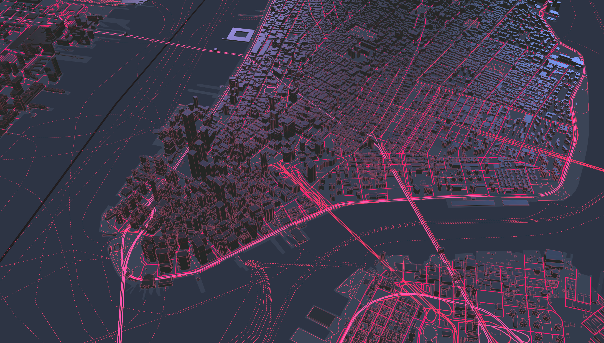
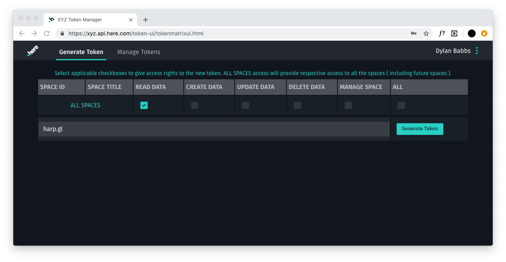
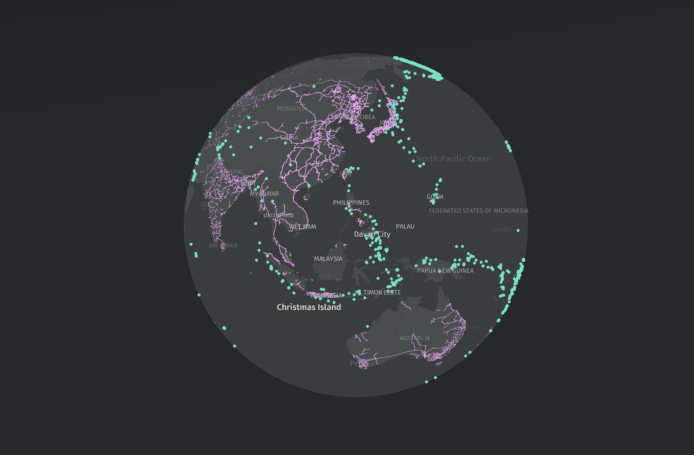

# Visualizing HERE XYZ Data with harp.gl

Welcome to the Web Summit workshop!

This workshop will cover **harp.gl**, a new and beta 3D map rendering engine for the web in combination with **xyz**, a cloud-based, real-time location data management
service that enables developers and map makers to create web maps and manage location data.



### Workshops hosts

- Dylan Babbs ([Twitter](https://twitter.com/dbabbs) / [Github](https://github.com/dbabbs)) - ask me about XYZ or harp.gl
- Nino Kettlitz. ([Github](https://github.com/ninok)) - ask me about harp.gl

### Feedback

harp.gl is a beta product and we are always looking to improve it with your feedback. For any comments, suggestions, or bug reports, we encourage you to:

- create an issue on the [harp.gl GitHub repository](https://github.com/heremaps/harp.gl/issues/new)

[HERE XYZ](https://explore.xyz.here.com/) has a set of [resources](https://explore.xyz.here.com/resources) that you can explore to get answers to the most common questions you might have, check the tutorials and provide feedback about it.

## Prerequisites

- Laptop with a modern web browser (Chrome, Firefox, Safari, etc.)
- Node and npm installed ([installation directions here](https://nodejs.org/en/download/))

## Resources

### harp.gl resources

- [harp.gl Github repo](https://github.com/heremaps/harp.gl) (Source code for harp.gl)
- [harp.gl documentation](http://harp.gl.s3-website-us-east-1.amazonaws.com/docs/master/doc/)
- [harp.gl examples](http://harp.gl.s3-website-us-east-1.amazonaws.com/docs/master/examples/) (curated list of examples)
- [harp.gl modules on npm](https://www.npmjs.com/~heremaps)

### XYZ Resources

- [HERE XYZ Documentation](https://www.here.xyz/) (documentation for HERE XYZ)
- [XYZ Token Manager](https://xyz.api.here.com/token-ui/index.html) (generate XYZ API Tokens)
- [XYZ Studio](https://explore.xyz.here.com/studio) (XYZ studio where you can manipulate the data)

### Other HERE resources

- [HERE Developer Portal](https://developer.here.com/) (where to sign up as HERE Developer to get access to the APIs)

### HERE XYZ

We will use XYZ Vector Tile Data for our base maps, by requesting tiles from `https://xyz.api.here.com/tiles/herebase.02`.

Once we have a base map, we will add more data to it by pulling different datasets in GeoJSON from [XYZ Hub](https://explore.xyz.here.com/hub).

Now onto the fun part... making some maps! 🌍

## Acquiring credentials

harp.gl is an open-source and free software project. However, harp.gl needs to be connected to a data source in order to display a map.

HERE XYZ, another HERE product, is a service for storing and managing geospatial data. HERE XYZ will provide the vector tile data endpoint and authentication for harp.gl as well as additional data to visualize.

### Become a HERE Developer

Navigate to [developer.here.com](https://developer.here.com/) and click **Get started for free** in the top right.

Create an account. **No credit card is required**.

### Get an XYZ Token

Once you've created a HERE Developer account, navigate to the to [HERE XYZ Token Manager](https://xyz.api.here.com/token-ui).

Sign in with the HERE account you just created.

You'll want to generate a new token. Select the checkbox under **READ DATA** and then click **Generate Token**



Click through the next window until a token has been generated.

**Important**: Copy and paste this token somewhere. You will be using it later in the workshop.

## Section 1: Installing harp.gl

You can get started with harp.gl on the web with two different methods:

- linking a simple bundle as a `<script>` tap in your html page
- installing harp.gl as a set of [TypeScript](https://www.typescriptlang.org/) modules through npm

In this workshop, we will be using the **simple bundle**.

In your command line, create a new directory and navigate into it:

```bash
mkdir map-workshop
cd map-worshop
```

Create two files: `index.html` and `index.js`:

```bash
touch index.js
touch index.html
```

Copy and paste the following code into each of the files.

**`index.html`**

```html
<html>
  <head>
    <style>
      body, html { border: 0; margin: 0; padding: 0; }
      #map { height: 100vh;  width: 100vw; }
    </style>
    <script src="https://unpkg.com/three/build/three.min.js"></script>
    <script src="https://unpkg.com/@here/harp.gl/dist/harp.js"></script>
  </head>
  <body>
    <canvas id="map"></canvas>
    <script src="index.js"></script>
  </body>
</html>
```

**`index.js`**

```javascript
const canvas = document.getElementById("map");
const map = new harp.MapView({
  canvas,
  theme: "https://unpkg.com/@here/harp-map-theme@latest/resources/berlin_tilezen_night_reduced.json",
  maxVisibleDataSourceTiles: 40,
  tileCacheSize: 100,
  projection: harp.sphereProjection
});

map.setCameraGeolocationAndZoom(new harp.GeoCoordinates(38.736946, -9.142685), 16);

const mapControls = new harp.MapControls(map);
const ui = new harp.MapControlsUI(mapControls);
canvas.parentElement.appendChild(ui.domElement);

window.onresize = () => map.resize(window.innerWidth, window.innerHeight);

const omvDataSource = new harp.OmvDataSource({
  baseUrl: "https://xyz.api.here.com/tiles/herebase.02",
  apiFormat: harp.APIFormat.XYZOMV,
  styleSetName: "tilezen",
  authenticationCode: "YOUR-XYZ-TOKEN HERE"
});
map.addDataSource(omvDataSource);
```

**NOTE:** be sure to swap out `YOUR-XYZ-TOKEN-HERE` for the token you obtained from the [XYZ Token Manager](https://xyz.api.here.com/token-ui/).

You can just run it with a simple server, for example in Python 2.x:

```bash
python -m SimpleHTTPServer 8888
```

and in Python 3.x

```bash
python -m http.server 8888
```

Then navigate to: `localhost:8888` and you should see a basic map!

## Section 2: Adding data to the map

**NOTE:** We will not cover modifying the map and styling it in this workshop, but if you want to learn more about it, please check it out [here](https://developer.here.com/tutorials/harpgl/).

In this section we'll learn how to add data to the map.

### 2.1 Adding Railroad data from an XYZ Space

In this, we'll be using a sample data source already uploaded to an XYZ Space.

The data set we'll be adding will be global railroads. The data comes from the [Global Humanitarian Data Exchange](https://data.humdata.org/dataset/global-railways). You can preview the dataset using the [HERE GeoJSON Viewer](http://geojson.tools/index.html?url=https://xyz.api.here.com/hub/spaces/hUJ4ZHJR/search?limit=5000&clientId=cli&access_token=AJXABoLRYHN488wIHnxheik). (The viewer caps out at 500 features, so you won't be able to see all the railroads in this page).

To add tiled data from an XYZ Space, we'll be using the `OmvDataSource` class again. `OmwDataSource` can accept a few different types of data sources. For more information, please take a look at: [`OmvRestClient.ts`](https://github.com/heremaps/harp.gl/blob/master/%40here/harp-omv-datasource/lib/OmvRestClient.ts).

Create a new object from `OmvDataSource` called `globalRailroads`.

```javascript
const globalRailroads = new harp.OmvDataSource({
  baseUrl: "https://xyz.api.here.com/hub/spaces/hUJ4ZHJR/tile/web",
  apiFormat: harp.APIFormat.XYZSpace,
  authenticationCode: "AfArIuzngG4gkdhlBZkysnc" //Use this token!
});
```

**NOTE:** in earlier examples, we were using your own XYZ token within `authenticationCode`. However, in this example, we are accessing a shared dataset, so please use the access token in the example above.

The above code will create and connect to the new data source, but we still need to display it on the map:

```javascript
/* This is the same as above */
const globalRailroads = new harp.OmvDataSource({
  baseUrl: "https://xyz.api.here.com/hub/spaces/hUJ4ZHJR/tile/web",
  apiFormat: harp.APIFormat.XYZSpace,
  authenticationCode: "AAX7b-ZLTxOfEin2AWCbHQA" //Use this token!
});

map.addDataSource(globalRailroads).then(() => {
  const styles = [
    {
      when: "$geometryType ^= 'line'",
      renderOrder: 1000,
      technique: "solid-line",
      attr: {
        color: "#FAA8FF",
        transparent: true,
        opacity: 1,
        metricUnit: "Pixel",
        lineWidth: 1
      }
    }
  ];
  globalRailroads.setStyleSet(styles);
  map.update();
});
```

To add the datasource, we'll use the command `map.addDataSource(source)` (just like what we did before). This function returns a promise, indicating the command has finished, so we will use the `.then()` syntax.

Finally, we set the style using `.setStyleSet(styles)` and update the map with `map.update()`.

### Adding 2.2 Adding Earthquake data from an XYZ Space

Copy and paste the following code:

```javascript
const earthquakes = new harp.OmvDataSource({
  baseUrl: "https://xyz.api.here.com/hub/spaces/HUIbgeLV/tile/web",
  apiFormat: harp.APIFormat.XYZSpace,
  authenticationCode: "AAX7b-ZLTxOfEin2AWCbHQA" //Use this token!
});

map.addDataSource(earthquakes).then(() => {
  const styles = [
    {
      when: "$geometryType == 'point'",
      technique: "circles",
      renderOrder: 10000,
      attr: {
        color: "#50E3C2",
        size: 10
      }
    }
  ];
  earthquakes.setStyleSet(styles);
  map.update();
});
```

Your map should look something like:



## The end

Congratulations, you've finished the workshop for harp.gl and xyz! So far, you've learned how to:

- create a new harp.gl application from scratch
- add a tiled data set from an XYZ Space to a harp.gl map

Thanks for attending the workshop. For any comments, suggestions, or bug reports, we encourage you to:

- or create an issue on the [harp.gl GitHub repository](https://github.com/heremaps/harp.gl/issues/new)
