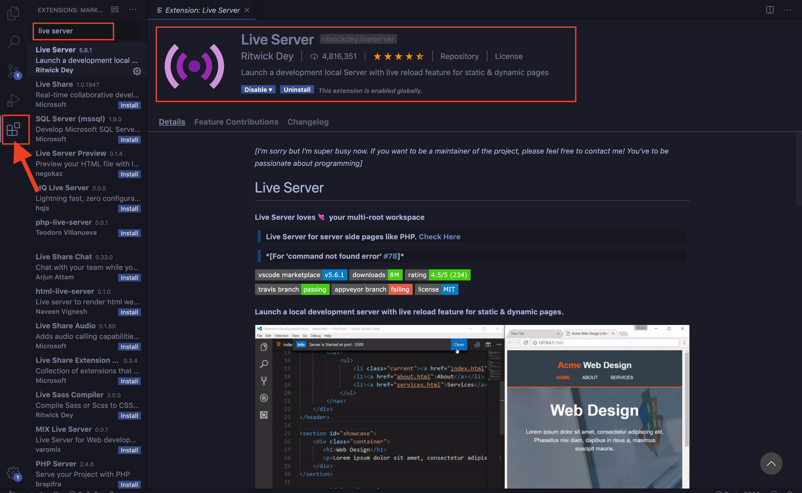

## Download the ide [VSCODE](https://code.visualstudio.com/download)
## Install the extension Live Server by Ritwick Dey
This makes it super easy to see your application on your browser.

 

## Create a folder named Workshop_With_HERE
- In VSCODE click on File > Open.. 
- Open the folder Workshop_With_HERE
- Click on File > New File and save it as 'index.html' within the folder


``` html
<!DOCTYPE html>
<html lang="en">
    <head>
        <title>Smart Cities</title>
        <!-- SCRIPTS -->
        <meta name="viewport" charset="UTF-8" content="initial-scale=1.0, width=device-width" />
        <script type="text/javascript" src="https://js.api.here.com/v3/3.1/mapsjs-core.js"></script>
        <script type="text/javascript" src="https://js.api.here.com/v3/3.1/mapsjs-service.js"></script>
        <script type="text/javascript" src="https://js.api.here.com/v3/3.1/mapsjs-ui.js"></script>
        <script type="text/javascript" src="https://js.api.here.com/v3/3.1/mapsjs-mapevents.js"></script>
        <link rel="stylesheet" type="text/css" href="https://js.api.here.com/v3/3.1/mapsjs-ui.css"/> 
    </head>
    <body>
        <div id="map" style="width: 100vw; height: 100vh; background: #39B6B3;" ></div> 
    </body>
    <script>
        var platform = new H.service.Platform({
            apikey: "YOUR_JS_APIKEY"
        });

        // Obtain the default map types from the platform object:

        var defaultLayers = platform.createDefaultLayers();
        var myPos = {lat: 48.69429, lng: 9.1866};

        // Instantiate (and display) a map object:

        var map = new H.Map(
            document.getElementById('map'),
            defaultLayers.vector.normal.map,
            {
                zoom: 11,
                center: myPos
            });

        var ui = H.ui.UI.createDefault(map, defaultLayers);

        var mapEvents = new H.mapevents.MapEvents(map);

        var behavior = new H.mapevents.Behavior(mapEvents);
    </script>
</html>
```
# Adding a position marker using map object of Interactive maps API
- Add a folder named *img* inside the folder Workshop_With_HERE
- Inside the folder *img*, save the image you want as the icon for EV charging stations and home
- You can also download the ones I used for [home](img/home.png) and [EV Charging stations](img/EV.png)
- Add the following code before </script> tag


```javascript
            // create an icon for the marker. Choose any image you want. I created mine using draw.io 
            
            var homeIcon = new H.map.Icon('img/home.png'); 

            // Create a marker object with postion and marker icon

            var posMarker = new H.map.Marker(myPos,{icon:homeIcon});
            
            // Add the marker to the map 

            map.addObject(posMarker);
```
### Click on the 'Go Live' button at the bottom right of your VSCODE application window or or press 'cmd + L cmd + O '/ 'ctrl + L ctrl + O ' and see your application open in your default browser

[](Step2.md)


