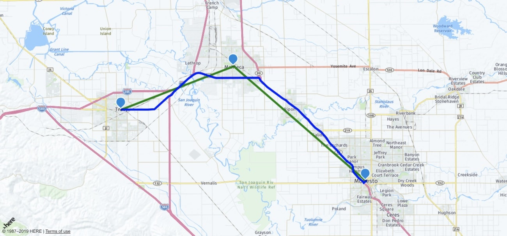

# Workshop: Maps and Location Services with JavaScript

This workshop was designed to get you familiar with displaying and interacting with HERE maps in your client facing JavaScript application.



As part of this workshop you'll learn how to display a map, add objects to it such as markers and polylines, and interact with the various HERE APIs such as geocoding and routing, using the HERE JavaScript SDK.

## Prerequisites

There are a few requirements that must be met in order to be successful with this workshop:

1. Must have at least a basic familiarity of JavaScript and web development.
2. Must have created a FREE developer account with HERE.

A [developer account](https;//developer.here.com) is necessary to create projects and obtain app id and app code tokens for use in web applications.

## Instructions

This workshop is contains a **completed** directory, an **initial** directory, and a series of steps that should get you familiar with each of the HERE development opportunities.

To get an idea of the final project, take a look at the **completed** directory. In most scenarios it can be tested by double clicking the **index.html** file within this directory, however if that doesn't work, try serving it. If Python is available the application can be served with the following:

```
python -m SimpleHTTPServer
```

With the Python server running, the project can be explored through http://localhost:8000 in the web browser. Just make sure to swap out the app id and app code values found in the **completed** project's **index.html** file.

The **initial** directory will contain boilerplate code to be filled throughout each of the steps.

### Creating a New Project in the HERE Developer Portal

To use any of the HERE components, which include maps and location APIs, a developer account must be created. It is free to create an account and there is a free tier to use.

On the [HERE](https://developer.here.com) developer website, choose to create a new account.


When prompted, enter your information and accept the terms and conditions. You'll notice that your credit card information is not required to use the HERE APIs and SDKs.


After creating your account, you may or may not be brought directly into your projects list. If you haven't been taken directly into the project's list, click on your name and then the projects tab.


To start, you'll have one project, but that list may grow as time progresses. You can have projects on a per application basis or whatever makes the most sense to you.


Select the project that you wish to use to be brought into the dashboard for that project. In the dashboard you can view metrics around your project or create new tokens for development.

For this project you'll need to create a JavaScript / REST token set.


Hold onto the app id and app code because both will be used within the JavaScript application. Without these two tokens, the map will not show and the APIs will fail with errors.

### Including the HERE JavaScript Libraries in an HTML File

To use the HERE location platform, there are numerous approaches, depending on what is being built. For web applications, it makes sense to either use the RESTful APIs, or the HERE JavaScript SDK which is even more convenient.

Including the HERE JavaScript SDK in your project is as simple as adding a few lines of HTML markup to your **index.html** file. Take the following three lines for example:

```
<script src="https://js.api.here.com/v3/3.0/mapsjs-core.js" type="text/javascript" charset="utf-8"></script>
<script src="https://js.api.here.com/v3/3.0/mapsjs-service.js" type="text/javascript" charset="utf-8"></script>
<script src="https://js.api.here.com/v3/3.0/mapsjs-mapevents.js" type="text/javascript" charset="utf-8"></script>
```

The above three lines will give access to the various HERE services as well as interactive map features. The HERE JavaScript SDK is modular so there are other libraries that could be added and even some of the above could be removed.

To prevent blocking JavaScript, all JavaScript libraries should be added before the closing `<body>` tag, not within the `<head>` tags of the application.

### Displaying a Map in the Web Browser

When using a map with HERE and JavaScript, it isn't loaded or rendered prior to the application loading. The map data needs to be downloaded through the HERE JavaScript SDK, which happens after the page loads. For this reason, a placeholder HTML element must be used to represent where the map will be displayed once everything initializes.

Within the `<body>` tags of the **initial** project's **index.html** file, add the following line:

```
<div id="map" style="width: 1280px; height: 600px"></div>
```

The above `<div>` element will represent our map. It is important it receives an id, because that is how it will be accessed through JavaScript. In this example, the id is `map`, but it doesn't really matter the name.

What comes next is up to the developer.

While all code could be added directly to the **initial** project's **index.html** file, it is cleaner to use an ES6 approach with a separate class to control all of the HERE interaction.

In the **initial** project's **here-map.js** file, add the following boilerplate code:

```
class HereMap {

    constructor(appId, appCode, mapElement) {
        this.platform = new H.service.Platform({
            "app_id": appId,
            "app_code": appCode
        });
        let defaultLayers = this.platform.createDefaultLayers();
        this.map = new H.Map(
            mapElement,
            defaultLayers.normal.map,
            {
                zoom: 10,
                center: { lat: 37.7397, lng: -121.4252 }
            }
        );
        let behavior = new H.mapevents.Behavior(new H.mapevents.MapEvents(this.map));
    }

}
```

In the `constructor` method the platform is being initialized with the passed app id and app code values, both of which are found in the HERE developer portal. The placeholder HTML element is also passed and used when creating a new map. It is centered on specific latitude and longitude coordinates.

If using the ES6 approach, open the **initial** project's **index.html** file and include the following:

```
<html>
    <head>
        <meta name="viewport" content="initial-scale=1.0, width=device-width" />
    </head>
    <body>
        <div id="map" style="width: 1280px; height: 600px"></div>
        <script src="https://js.api.here.com/v3/3.0/mapsjs-core.js" type="text/javascript" charset="utf-8"></script>
        <script src="https://js.api.here.com/v3/3.0/mapsjs-service.js" type="text/javascript" charset="utf-8"></script>
        <script src="https://js.api.here.com/v3/3.0/mapsjs-mapevents.js" type="text/javascript" charset="utf-8"></script>
        <script src="here-map.js" type="text/javascript" charset="utf-8"></script>
        <script>
            var here = new HereMap("APP-ID-HERE", "APP-CODE-HERE", document.getElementById("map"));
        </script>
    </body>
</html>
```

Notice how the class that was previously created is now being instantiated. The `constructor` method expects three pieces of data which is being passed during the instantiation.

Try running the application, it should display a map!

### Adding Markers to a Map with a Latitude and Longitude Position

The map that is displaying is interactive, but it is very basic. To bring some flair to the map, it makes sense to add map objects such as markers to the map.

To add a marker to a HERE map, the following commands would be used:

```
var marker = new H.map.Marker({ lat: 37.7397, lng: -121.4252 });
map.addObject(marker);
```

The steps to add any object to the map, would be similar to the process of adding markers to the map. To fit these commands into the current project, open the **initial** project's **here-map.js** file and include the following function:

```
dropMarker(latitude, longitude) {
    var marker = new H.map.Marker({ lat: latitude, lng: longitude });
    this.map.addObject(marker);
}
```

Every time the `dropMarker` method is executed, a new marker is created and added to the existing map. While the map objects could be iterated over, we're not specifically tracking the markers being added, just that they are being added.

In the **initial** project's **index.html** file, the `dropMarker` method can be used like so:

```
<script>
    var here = new HereMap("APP-ID-HERE", "APP-CODE-HERE", document.getElementById("map"));
    here.dropMarker(37.7397, -121.4252);
    here.dropMarker(38.7397, -122.4252);
</script>
```

When running the application, two markers should appear on the map.

As a challenge, instead of creating markers and adding them to the map, try keeping track of the markers within the class object. This will be beneficial in the next steps because the marker information will need to be known. If you get stuck, check out the project in the **completed** directory.

### Connecting Points on a Map with Polylines

Another map object that can be added to a project is a polyline. Think of a polyline as a connect the dots type object. Given two points of latitude and longitude coordinates, the line will be drawn between the two. A simple polyline should not be thought of as a navigation route because all it does is connect two points.

To add a polyline to a project, the following can be done:

```
var lineString = new H.geo.LineString();
lineString.pushPoint({ lat: 37.7397, lng: -121.4252 });
lineString.pushPoint({ lat: 38.7397, lng: -122.4252 });
map.addObject(new H.map.Polyline(
    lineString, { style: { strokeColor: "green", lineWidth: 5 }}
));
```

In the above example, the two points are defined and the object is added with certain style information. This functionality can be easily added to the the **initial** project.

Open the **initial** project's **here-map.js** file and create a method similar to the following:

```
drawLinesBetweenMarkers(start, finish) {
    let lineString = new H.geo.LineString();
    lineString.pushPoint(start);
    lineString.pushPoint(finish);
    this.map.addObject(new H.map.Polyline(
        lineString, { style: { strokeColor: "green", lineWidth: 5 }}
    ));
}
```

To use this `drawLinesBetweenMarkers` method, the following could be added to the **initial** project's **index.html** file:

```
<script>
    var here = new HereMap("APP-ID-HERE", "APP-CODE-HERE", document.getElementById("map"));
    here.dropMarker(37.7397, -121.4252);
    here.dropMarker(38.7397, -122.4252);
    here.drawLinesBetweenMarkers({ lat: 37.7397, lng: -121.4252 }, { lat: 38.7397, lng: -122.4252 });
</script>
```

The above code would still drop the two markers, but this time draw lines between them. Remembering and reusing latitude and longitude coordinates is not ideal in most circumstances. This can be improved.

If you completed the previous challenge of keeping track of your markers, you should be able to loop through them and construct polylines directly in the class, without having to manually type out coordinates for your lines. Give it a try and if you get stuck, check out the project in the **completed** directory.

### Geocoding Address into Latitude and Longitude Coordinates

Like previously mentioned, remembering latitude and longitude coordinates is not plausible at scale. It is much easier to remember an address than two numeric points.

HERE does offer an API that will geocode addresses into point coordinates. Usage of this API with JavaScript looks similar to the following:

```
geocoder.geocode({ searchText: "Tracy, CA" }, result => {
    if(result.Response.View.length > 0) {
        if(result.Response.View[0].Result.length > 0) {
            console.log(result.Response.View[0].Result);
        } else {
            console.error({ message: "no results found" });
        }
    } else {
        console.error({ message: "no results found" });
    }
}, error => {
    console.error(error);
});
```

When providing an address to the HERE Geocode API, it can be as complete as you want to make it. The more precise the query, the better results will come back. In addition to returning latitude and longitude coordinates, gaps will be filled in the address itself. For example "Tracy, CA" might return a country and postal code as well.

Geocoding addresses is an asynchronous operation, so callbacks or promises must be used with JavaScript.

In the **initial** project's **here-map.js** file, include the following function:

```
geocode(query) {
    return new Promise((resolve, reject) => {
        this.geocoder.geocode({ searchText: query }, result => {
            if(result.Response.View.length > 0) {
                if(result.Response.View[0].Result.length > 0) {
                    resolve(result.Response.View[0].Result[0].Location.DisplayPosition);
                } else {
                    reject({ message: "no results found" });
                }
            } else {
                reject({ message: "no results found" });
            }
        }, error => {
            reject(error);
        });
    });
}
```

In this particular example a promise is returned and only the latitude and longitude position is returned. To use this `geocode` function within the application, open the **intial** project's **index.html** file and include the following:

```
<script>
    var start = async () => {
        var here = new HereMap("APP-ID-HERE", "APP-CODE-HERE", document.getElementById("map"));
        var tracy = await here.geocode("Tracy, CA");
        var modesto = await here.geocode("Modesto, CA");
        here.dropMarker(tracy.Latitude, tracy.Longitude);
        here.dropMarker(modesto.Latitude, modesto.Longitude);
        here.drawLinesBetweenMarkers({ lat: tracy.Latitude, lng: tracy.Longitude }, { lat: modesto.Latitude, lng: modesto.Longitude });
    }
    start();
</script>
```

Notice that the `<script>` tag has changed a bit. The geocoding of addresses is asynchronous and we're returning a promise. While we could work with promises directly, that would result in a lot of nesting which wouldn't be attractive. Instead it makes sense to have an `async` function and make use of `await` for the asynchronous activity.

If you took advantage of the previous challenge, the `drawLinesBetweenMarkers` probably won't be accepting input any longer because it will look at the stored markers directly.

### Calculating the Fastest or Shortest Route Between Two Points

Right now only polylines are drawn between markers. This is great, but they don't demonstrate a realistic path of travel between the two or more points. Instead, it makes sense to use the HERE Routing API.

Drawing routes isn't too much different from drawing standard markers or polylines. There is however an API request that must happen prior. This request might look like the following:

```
var params = {
    "mode": "fastest;car",
    "waypoint0": "geo!37.7397,-121.4252",
    "waypoint1": "geo!38.7397,-122.4252",
    "representation": "display"
}
router.calculateRoute(params, data => {
    if(data.response) {
        data = data.response.route[0];
        let lineString = new H.geo.LineString();
        data.shape.forEach(point => {
            let parts = point.split(",");
            lineString.pushLatLngAlt(parts[0], parts[1]);
        });
        let routeLine = new H.map.Polyline(lineString, {
            style: { strokeColor: "blue", lineWidth: 5 }
        });
        this.map.addObject(routeLine);
    }
}, error => {
    console.error(error);
});
```

To calculate a route, the mode of transportation must be specified, whether that be car, walking, etc. Each of the waypoints in the route must also be specified and it isn't just limited to a start and finish.

When calculating a route, each point in the path is returned, which allows for polylines to be drawn on them.

Add the following to the **initial** project's **here-map.js** file:

```
drawRoute(start, finish) {
    let params = {
        "mode": "fastest;car",
        "waypoint0": "geo!" + start.Latitude + "," + start.Longitude,
        "waypoint1": "geo!" + finish.Latitude + "," + finish.Longitude,
        "representation": "display"
    }
    this.router.calculateRoute(params, data => {
        if(data.response) {
            data = data.response.route[0];
            let lineString = new H.geo.LineString();
            data.shape.forEach(point => {
                let parts = point.split(",");
                lineString.pushLatLngAlt(parts[0], parts[1]);
            });
            let routeLine = new H.map.Polyline(lineString, {
                style: { strokeColor: "blue", lineWidth: 5 }
            });
            this.map.addObjects([routeLine]);
        }
    }, error => {
        console.error(error);
    });
}
```

Notice in the above function, the start and finish points are passed in. For this example there is only a start and a finish. With the class method created, make use of it in the **initial** project's **index.html** file like so:

```
<script>
    var start = async () => {
        var here = new HereMap("HERE-APP-ID", "HERE-APP-CODE", document.getElementById("map"));
        var tracy = await here.geocode("Tracy, CA");
        var modesto = await here.geocode("Modesto, CA");
        here.dropMarker(tracy.Latitude, tracy.Longitude);
        here.dropMarker(modesto.Latitude, modesto.Longitude);
        here.drawLinesBetweenMarkers();
        here.drawRoute(tracy, modesto);
    }
    start();
</script>
```

As a challenge to this particular step, try allowing for multiple waypoints, or better yet, an unlimited number of waypoints. To do this you'll probably need a loop and an array, but use your own imagination.

### Getting the Location of the Web Browser

Having the map load on a static set of latitude and longitude coordinates might not be the best approach. For example, while San Francisco might be good for some, it probably doesn't benefit those living in Berlin. To get beyond this, the users location can be extracted from the web browser.

Using standard HTML5 APIs, the following is possible:

```
if(navigator.geolocation) {
    navigator.geolocation.getCurrentPosition(position => {
        console.log(position.coords);
    });
} else {
    console.error("Geolocation is not supported by this browser!");
}
```

If supported, the above code will print out the users latitude and longitude coordinates. In addition to being supported, the user has to give permission through a prompt.

The positioning logic can be applied to the `constructor` method in the class and then the `setCenter` method can be called on the map instead of printing the location.

## Resources

HERE Developer Portal - [developer.here.com](https://developer.here.com)
