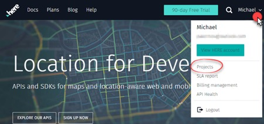
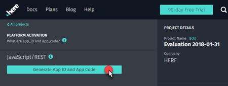
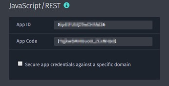

| [ Overview](./README.md) |  Prerequisites | [ HTML](./03.md) | [ JavaScript](./04.md) | [ Beyond](./05.md)
| :---: | :---: | :---: | :---: | :---: |

## Prerequisites

Be sure to have the following:

- [X] Some HTML experience (need [help](https://www.w3schools.com/html/default.asp)?) 
- [X] Some JavaScript experience (need [help](https://www.w3schools.com/js/default.asp)?)
- [X] Code|text editor (need one? [code](https://code.visualstudio.com/))
- [X] HERE Developer account (https://developer.here.com/ref/apisap_github?create=Freemium-Basic)

You will need to access your APP ID & APP CODE from your developer profile at HERE as shown below:

Copy the values for these and store for use later. You are now ready to [proceed to the next step](./03.md).
