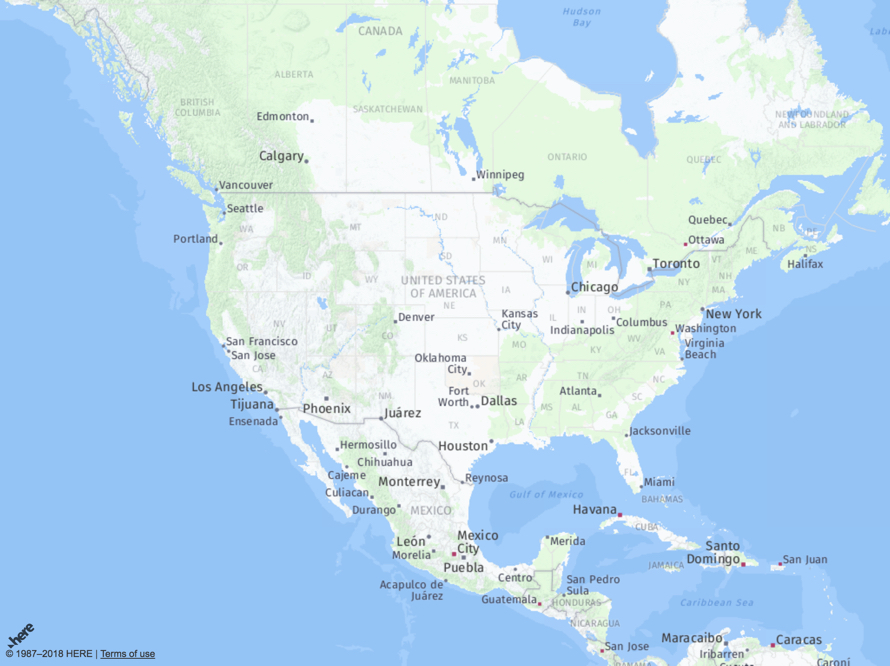
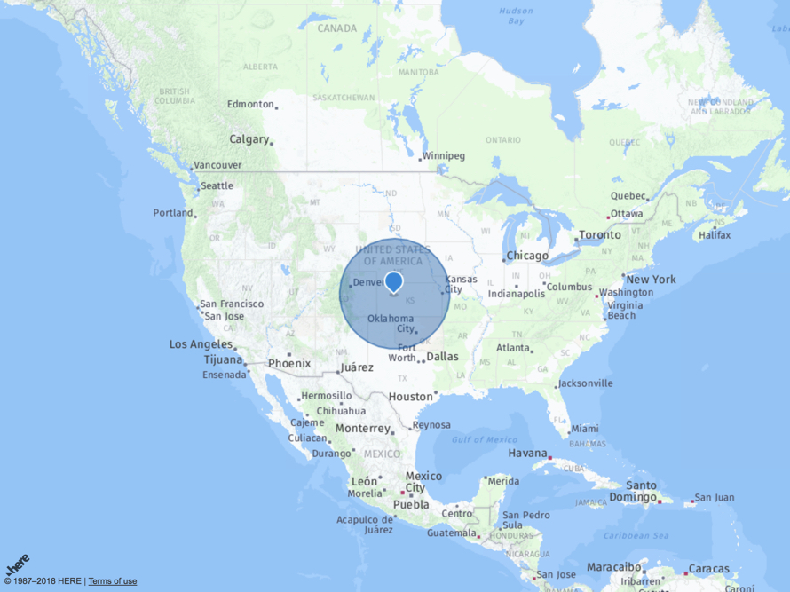
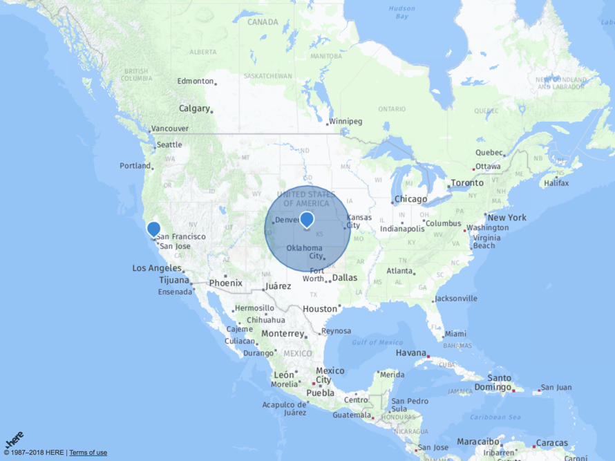

| [<br>Overview](./README.md) | [<br>Prerequisites](./02.md) | [<br>HTML](./03.md) | <br>JavaScript | [<br>Beyond](./05.md)
| :---: | :---: | :---: | :---: | :---: |

## JavaScript

Within the script tags created in the [previous step](./03.md), copy and paste the following code.

``` javascript
      // GLOBALS
      // H (from HERE API)
      // M manage common objects and settings
      
      let M = {
        'Init' : { // developer.here.com for app_id and app_code
          'app_id':   ' YOUR APP ID ',
          'app_code': ' YOUR APP CODE ',
          useHTTPS: true
        },
        'Behavior' :    {},         // Manage map behaviors
        'Container' :   {},         // Reference to DOM object containing map
        'Geo' :         {},         // Geocoder service
        'Lat' :         38.89037,   // Latitude
        'Layers' :      {},         // Map layers
        'Lng' :         -100,       // Longitude
        'Map' :         {},         // Map object
        'Platform' :    {},         // Core to HERE API
        'UI' :          {},         // User interface and interaction
        'Zoom' :        4           // 1 == global, 15 == street level
      };
```

The code above starts with commments indicating two global variables - **"H"** and **"M"**. The **"H"** variable exists by merit of the references added in the head section to the HERE JavaScript API. The **"M"** variable is just a model of data that will be used to contain data, objects, and settings. Most of the values are declared with empty objects, and will be assigned to objects from the HERE JavaScript API later. Regarding initialization settings, be sure to replace values for **"app_id"** and **"app_code"** with the values you set aside in the [prerequisites section](./02.md).

Now copy and paste the following code below the code you just added.

``` javascript
      // Obtain reference to #mapContainer in DOM 
      M.Container = document.getElementById('mapContainer');
      
      // Store initialized platform object
      M.Platform = new H.service.Platform(M.Init);
      
      // Store reference to geocoding service
      M.Geo = M.Platform.getGeocodingService();
      
      // Store reference to layers object
      M.Layers = M.Platform.createDefaultLayers();

      // Create map object initialized with container and style
      // Set map style - example M.Layers.satellite.map
      M.Map = new H.Map(M.Container, M.Layers.normal.map);
      
      // Create behavior object initialized with map object
      M.Behavior = new H.mapevents.Behavior(new H.mapevents.MapEvents(M.Map));
      
      // Store UI object associated with map object and layers object
      M.UI = H.ui.UI.createDefault(M.Map, M.Layers);
      
      // Define function to display map using values stored in xy object
      function displayMap() {
        M.Map.setCenter({lat:M.Lat, lng:M.Lng});
        M.Map.setZoom(M.Zoom);
      }
      
      displayMap();
```

The code you just added initializes map settings and displays the map on the page. Try it out. Open your HTML page (**HEREJS.HTML**) in the browser. If you do not know how to display the HTML from your code editor, just double-click the file from your file system. You should see somethng similar to this:



Try experimenting. Look at the all the code you have so far. Try changing the zoom levels, terrain, and center position on the map. After each change, save your HTML file and view in browser. After experimenting, restore the values back to what they were.

### Add a Marker

Copy and paste the following code under the code you have added so far.

``` javascript
    function addStaticMarker() {
        let americaMarker = new H.map.Marker({lat:38.890,lng:-100});
        M.Map.addObject(americaMarker);
    }

    addStaticMarker();
```

After adding the code, save and view your changes in the browser. You should see a maker centered in the USA.


### Add a Circle

Copy and paste the following code under the code you have added so far.

``` javascript
    function addStaticCircle() {
        let circle = new H.map.Circle({lat:38.890,lng:-100}, 543210);
        M.Map.addObject(circle);
    }

    addStaticCircle();
```

Once the code is added and your files is saved, please view the result in your browser. You should see a circle centered on the map. Try zooming in and out of your map. Note the circle size. Experiment with changing the "543210" radius value. 



### Use Geocode

You will now add another marker to the map, but this time using the geocoding service. Copy and paste the following below the code you have.

``` javascript
    function addGeocodedMarker(){
        M.Geo.geocode(
            {searchText: "San Francisco, CA"}, 
            function(r) {
                let first = r.Response.View[0].Result[0].Location.DisplayPosition;
                console.log(first);
                M.Map.addObject(
                    new H.map.Marker(
                        {lat:first.Latitude, lng:first.Longitude}
                    )
                )
            }, 
            function(e) {
                alert(e);
            }
        );
    }

    addGeocodedMarker();
```

After saving your file, view the changes in your browser. You should see a marker at San Francisco, CA. In the code above, a search is done based on "San Francisco, CA". Because the possibility exists of duplicate named places around the world, the geocoding service always returns a list of matches. In this example, the only result we cared about was the first result.



Experiment! Try changing the value of the search to your home town city. Save the file and view in browser.

You have completed the basics of the workshop. You are now ready to go [beyond](./05.md).
