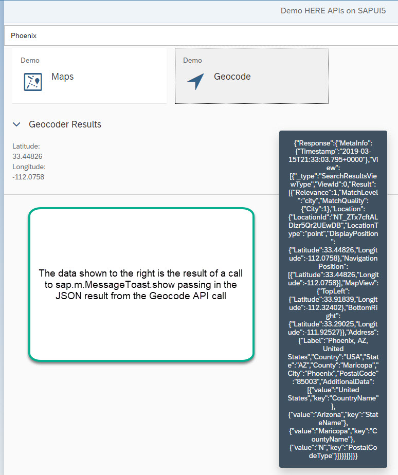

| [<br>Overview](./README.md) | [<br>Prerequisites](./02.md) | [<br>Discovery](./03.md) | [<br>Configuration](./04.md) | <br>Development
| :---: | :---: | :---: | :---: | :---: |

## Modifying the View

Locate the "View1.view.xml" file located in your workspace in the webapp folder and open it for editing. If you named the file different when creating the project, open that file instead. Find the outer page content tags and match it with the markup below. New lines or blocks of code added from base workshop are identified with XML comments:

``` xml
<!-- *** input *** -->
<Input xmlns="sap.m" id="inputPlace" value="Phoenix"/>

<sap.ui.layout:Grid xmlns:sap.ui.layout="sap.ui.layout" id="grid0">
	<sap.ui.layout:content>
    	<ObjectListItem title="Maps" intro="Demo" icon="sap-icon://map-2" id="itemMap" 
        type="Active" press=".demoMap" />
    	<!-- *** add geocode *** -->
    	<ObjectListItem title="Geocode" intro="Demo" icon="sap-icon://locate-me" id="itemGeocode" 
        type="Active" press=".demoGeocode" />
    	<!-- more to come in future workshops -->
    </sap.ui.layout:content>
</sap.ui.layout:Grid>

<Panel id="panelMap" headerText="Map Results" xmlns="sap.m" width="auto" 
  expandable="true" expanded="true" visible="false" >
    <headerToolbar>
        <Toolbar id="toolbarMap">
            <Title text="Map Results"/>
       </Toolbar>
    </headerToolbar>
    <content>
		<HBox width="100%" id="hbox0">
		<VBox id="BoxMapDefault">
	 	<Label id="labelMapDefault" xmlns="sap.m" text="Default Map" width="450px" textAlign="Center" />
		<Image id="imageDefault" densityAware="false" width="450px" height="450px" alt="map" 
		src="/map/mia/1.6/mapview?app_id={here>appId}&amp;app_code={here>appCode}" />
		</VBox>
		<VBox id="BoxMapPhoenix">
	 	<Label id="labelMapPhoenix" xmlns="sap.m" text="Map of Phoenix" width="450px" textAlign="Center" />
		<Image id="imagePhoenix" densityAware="false" width="450px" height="450px" alt="map" 
		src="/map/mia/1.6/mapview?app_id={here>appId}&amp;app_code={here>appCode}&amp;s=phoenix&amp;z=4" />
		</VBox>
		</HBox>
	</content>
</Panel>

<!-- *** add geocode panel *** -->
<Panel id="panelGeocode" headerText="Geocoder Results" xmlns="sap.m" width="auto"
   expandable="true" expanded="true"  visible="false">
    <headerToolbar>
        <Toolbar id="toolbarGeocode">
            <Title text="Geocoder Results"/>
       </Toolbar>
    </headerToolbar>
    <content>
        <Label id="labelLat" text="Latitude:" width="100%"  xmlns="sap.m" />
        <Label id="labelLngValue" width="100%" xmlns="sap.m" 
        text="{/Response/View/0/Result/0/Location/DisplayPosition/Latitude}" />
        
        <Label id="labelLng" text="Longitude:" width="100%"  xmlns="sap.m" />
        <Label id="labelLatValue" width="100%" xmlns="sap.m" 
        text="{/Response/View/0/Result/0/Location/DisplayPosition/Longitude}" />
    </content>
</Panel>
```

Three items were added: input, a new "menu" option, and a new panel. The input will allow you to test geocode with different city names. The new menu option will allow you to toggle between the Maps demo and the new Geocode demo. The new panel is what is the UI shown when selecting the Geocode menu. Take note of the label properties in the new panel. These allow you to declaritively databind to response of Geocode API. Now you are ready to add code.


### Write Code 

Locate the "View1.controller.js" file located in your workspace in the webapp folder. Make the code match the following:

``` javascript
sap.ui.define([
	"sap/ui/core/mvc/Controller"
], function (Controller) {
	"use strict";
  
  // will hold reference to current view
	var oView = null;
	return Controller.extend("demo.SAPUI5_Workshop.controller.View1", {
    
    // when user select "demo maps" in UI, this method is called
    demoMap: function() {
      oView = this.getView();  // get instance of current view 
      this._hidePanels(oView); // hide all panels in view
      oView.setBusy(true);  // set busy mode for view

      var oPanel = oView.byId("panelMap");  // get instance of map panel
      oPanel.setVisible(true);  // reveal only map panel
      oView.setBusy(false); // resume view
		},
    
    // when user selects "demo geocode" in UI, this method is called
    demoGeocode: function() {
      oView = this.getView();				
      this._hidePanels(oView);					
      oView.setBusy(true);						

      // create JSONModel
      var oAPIModel = new sap.ui.model.json.JSONModel();

      // construct API URL with /geo as base to obtain geolocation based on user input
      var url = "/geo/6.2/geocode.json?searchtext=" + this._getInputValue() + 
      "&app_id=" + this._getAppId() + "&app_code=" + this._getAppCode();	

      // invoke URL
      oAPIModel.loadData(url, null, true, "GET", null, false, this._headers);

      // attach function to handle when data load is complete
      oAPIModel.attachRequestCompleted(function(oEvent){
        
        // set view to loaded model - databinding is declarative
        oView.setModel(oAPIModel);
        // show the JSON result
        sap.m.MessageToast.show(oAPIModel.getJSON());
        
        var oPanel = oView.byId("panelGeocode");
        oPanel.setVisible(true);
        oView.setBusy(false);
      });								
		},
		
		// support functions and properties
		_hidePanels: function() {
			var oPanelMap = oView.byId("panelMap");
			oPanelMap.setVisible(false);
			var oPanelGeocoder = oView.byId("panelGeocode");
			oPanelGeocoder.setVisible(false);
		},
		_getInputValue: function() {
			var oInputValue = oView.byId("inputPlace");
			return oInputValue.getValue();
		},
		_getAppId: function() {
			var appId = oView.getModel("here").getResourceBundle().getText("appId");
			return appId;
		},
		_getAppCode: function() {
			var appCode = oView.getModel("here").getResourceBundle().getText("appCode");
			return appCode;
		},
		_headers : {"Content-Type":"application/json","Accept":"application/json, text/html;charset=utf-8"}
	});
});
```

Save the file and run the web application.



Congratulations, you have completed this workshop!
