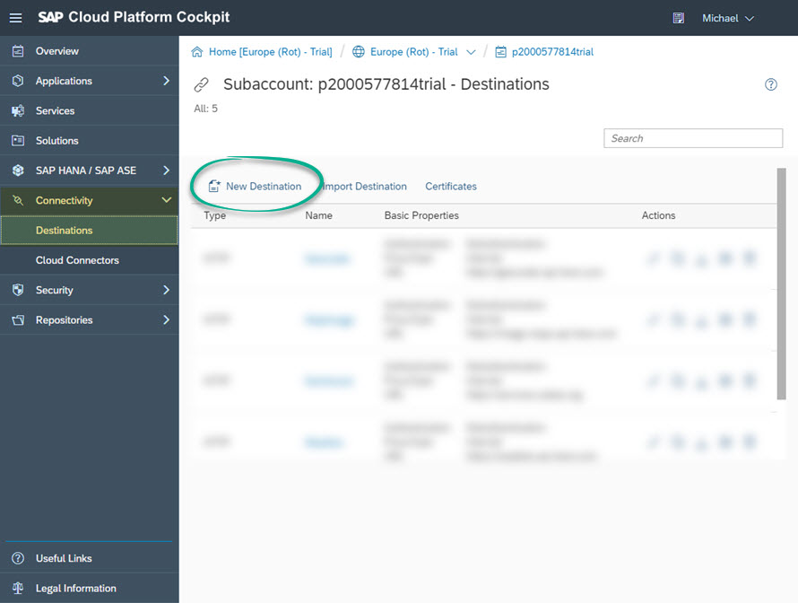
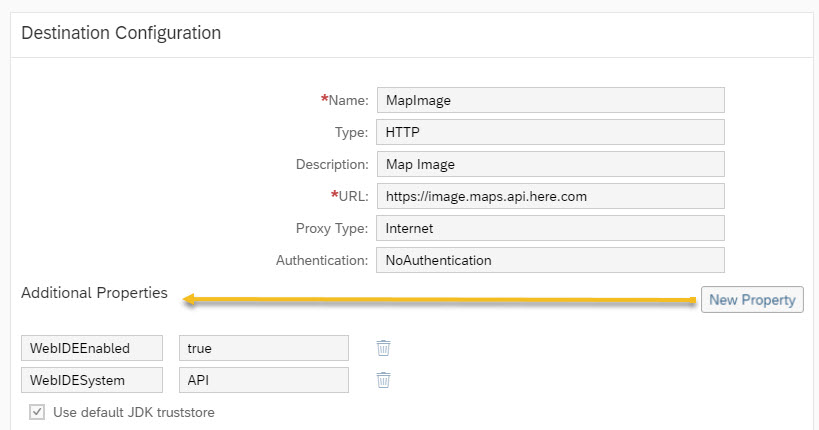
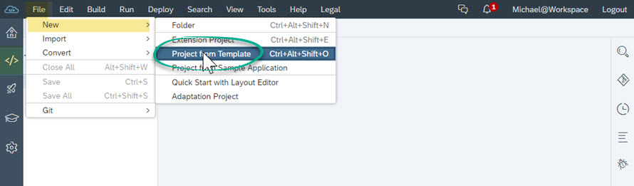
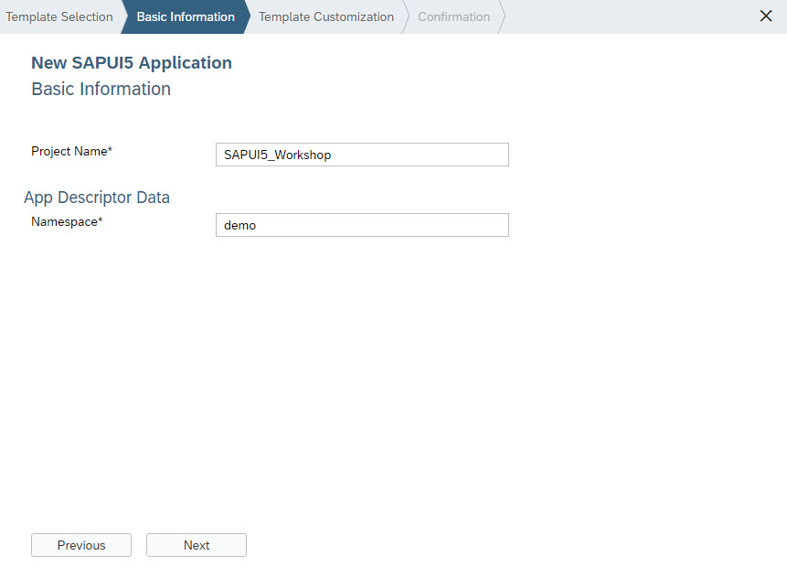
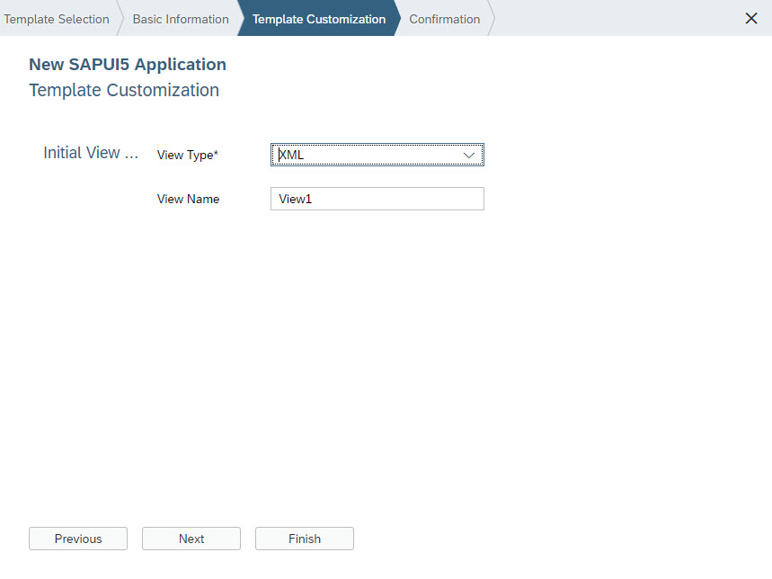
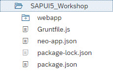
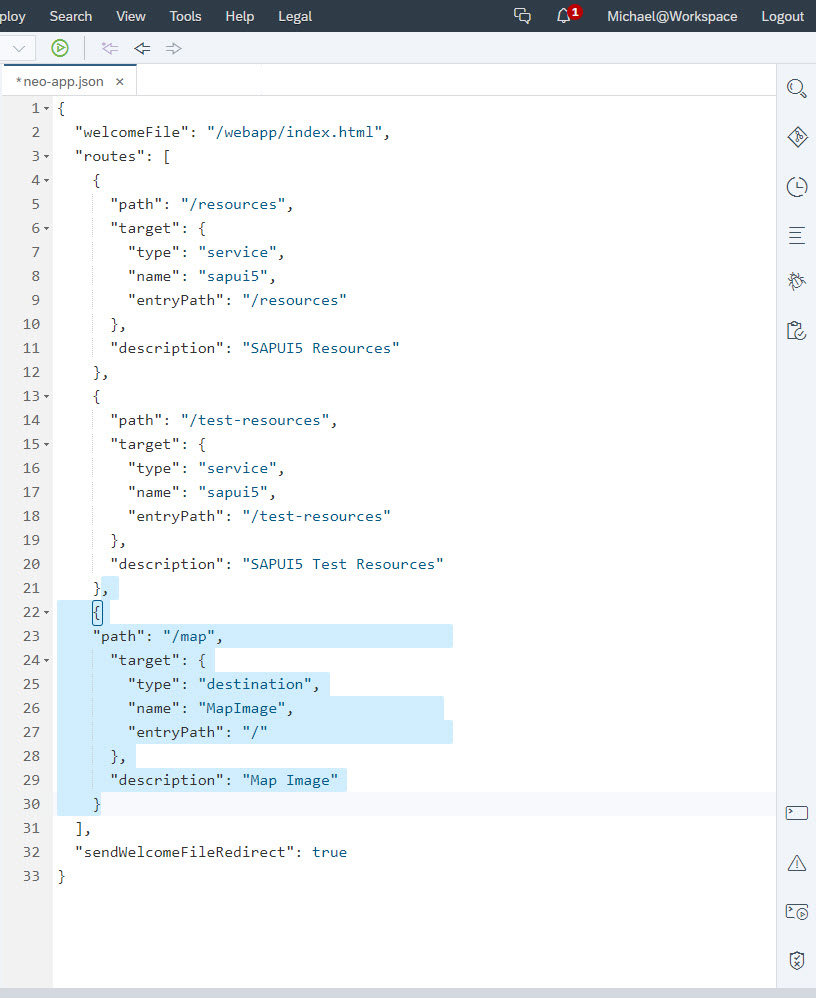
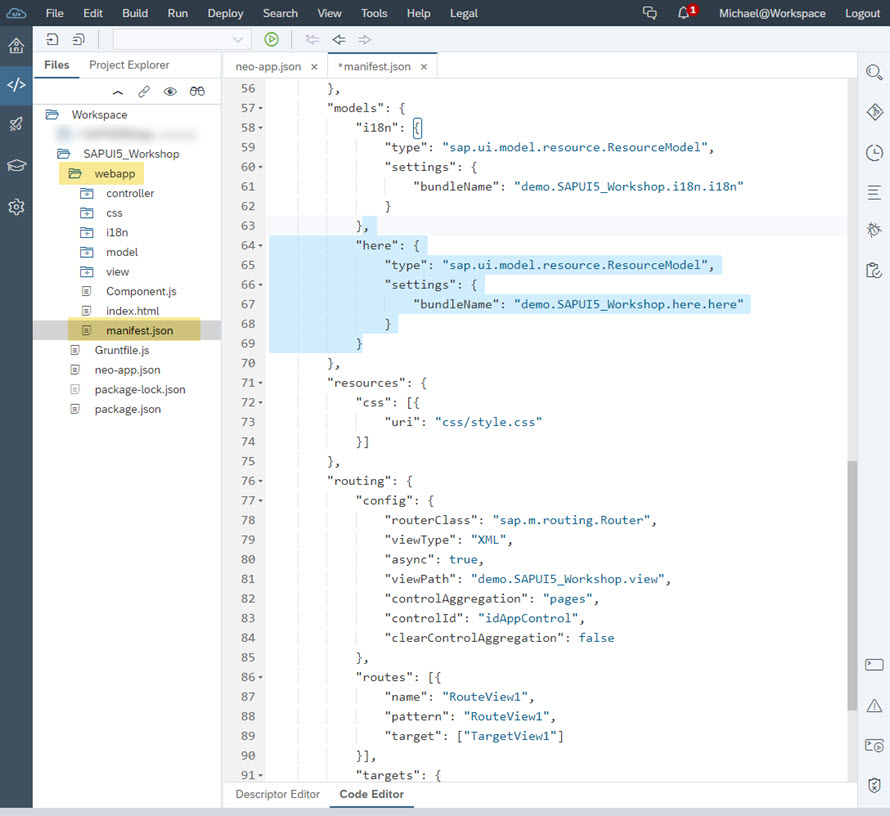
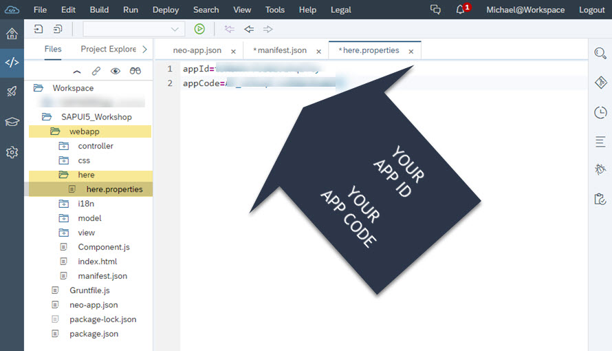

| [<br>Overview](./README.md) | [<br>Prerequisites](./02.md) | [<br>Discovery](./03.md) | <br>Configuration | [<br>Development](./05.md)
| :---: | :---: | :---: | :---: | :---: |

## Configuration

Navigate to https://account.hanatrial.ondemand.com/cockpit#/home/trialhome and log on with your SAP account. In the "Next Steps" section on the page, choose *Launch SAP Web IDE*:


Choose *SAP Cloud Platform Cockpit*


From the menu, find the "Destinations" option under "Connectivity" and choose *New Destination*:



Configure the destination as shown below. Use the "New Property" button to add the two additional fields:



Save your work. You have created a new destination to allow the HERE Map Image API to be used in an SAPUI5 project.

### Create SAPUI5 Project

Return to the SAP Web IDE (likely still open in a previous tab. If not, return to first step of this section).
Select the "*</>*" developer menu option. From the "File" menu option, select "New" then *Project from Template*:



Provide project name and namespace. FOr consistancy, use the values provided:



Keep the project view types as follows:



Finish the new project creation process. You should now have a basic file structure as shown here:



### Configure Destination

Open the "neo-app.json" file and add the following node to support the MapImage destination created in previous step:


``` javascript
    {
    "path": "/map",                         
      "target": {
        "type": "destination",
        "name": "MapImage",                
        "entryPath": "/"                    
      },
      "description": "Map Image"
    }
```

Your new node should be placed in JSON as shown here:



Save changes.

### Configure APP ID and APP CODE

In your project, expand the "webapp" folder and open the "manifest.json" file. Add the following node to the models section:

``` javascript
    "here": {
        "type": "sap.ui.model.resource.ResourceModel",
        "settings": {
            "bundleName": "demo.SAPUI5_Workshop.here.here"
        }
    }
```

Your new node should be placed in JSON as shown here:



Save changes.

Create a subfolder under "webapp" named "here" and create a new text file in that folder named "here.properties". Add two lines to this file:

``` javascript
    appId=your_app_id
    appCode=your_app_code 
```



#### Optional

In the "webapp" folder, open the "i18n.properties" file and provide values such as:

``` javascript
    title=Demo HERE APIs on SAPUI5
    appTitle=SAPUI5_Workshop
    appDescription=An intro to HERE APIs on SAPUI5
```
This is just meta data that may be displayed in visual elements of the web application.

Save changes. You are now ready to code!

[Proceed to next section](./05.md)
