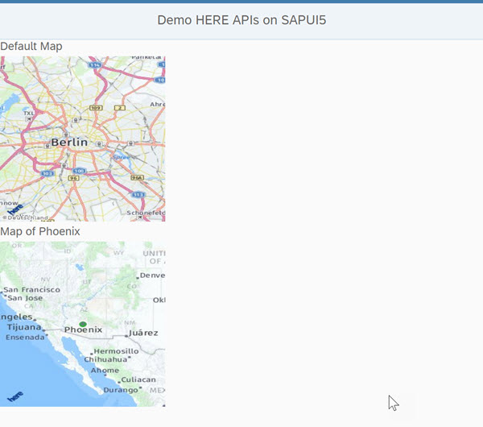

| [<br>Overview](./README.md) | [<br>Prerequisites](./02.md) | [<br>Discovery](./03.md) | [<br>Configuration](./04.md) | <br>Development
| :---: | :---: | :---: | :---: | :---: |

## Development

Locate the "View1.view.xml" file located in your workspace in the webapp folder and open it for editing. If you named the file
different when creating the project, open that file instead. Inside the file find the empty content tags:

``` xml
  <content>
  </content>
```

Inside the content tags, add the following markup:

``` xml
<VBox id="BoxMapDefault">
  <Label id="labelMapDefault" xmlns="sap.m" text="Default Map" width="220px"/>
  <Image id="imageDefault" densityAware="false" width="200px" height="200px" alt="map" 
         src="/map/mia/1.6/mapview?app_id={here>appId}&amp;app_code={here>appCode}" />
</VBox>
```

This will add a label positioned above the image of a map. Note the *src* attribute of the Image element. It starts with "/map"
which will resolve to the HERE Map API we configured in a previous step. The remainder of the value executes the API using the
values you provided from your HERE developer account - stored in the "here.properties" file. With no other parameters, this will
return the default map, which is the city of Berlin.

Save the file. From the top menu option, find the "Run" command, and select "Run as Web Application". You should see the map of Berlin.

### Adding Parameters to Change Map

Place the following markup after the closing VBox element:

``` xml
<VBox id="BoxMapPhoenix">
  <Label id="labelMapPhoenix" xmlns="sap.m" text="Map of Phoenix" width="220px"/>
  <Image id="imagePhoenix" densityAware="false" width="200px" height="200px" alt="map" 
         src="/map/mia/1.6/mapview?app_id={here>appId}&amp;app_code={here>appCode}&amp;s=phoenix&amp;z=4" />
</VBox>
```

This new addition adds another map image to the view, but this time shows the city of Phoenix with a broader zoom level. 
Upon looking at the *src* attribute of this image, the difference is the 's' and 'z' parameters. The 's' (search) parameter is
provided the value of phoenix. Try changing to another city. the 'z' (zoom) parameter changes the level of zoom 
(1=global to 15 street).

Save the file and run the web application again. You should now see two maps on the screen as shown here:




Congratulations, you have completed this workshop!
