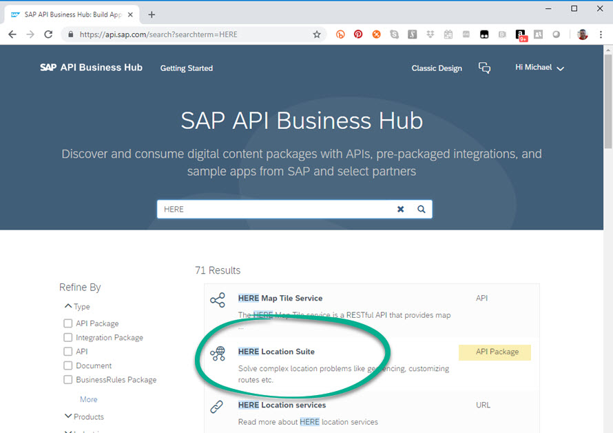
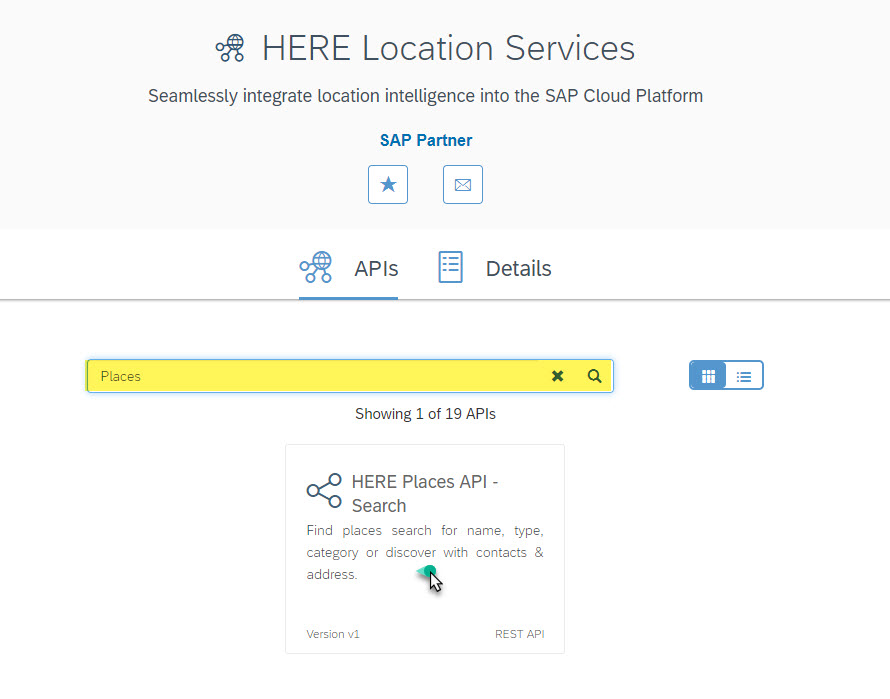
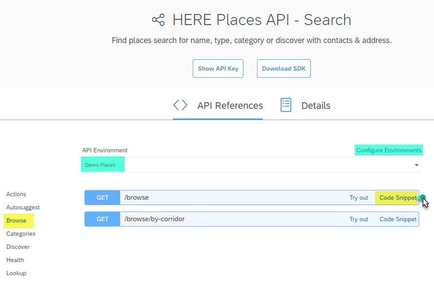

| [ Overview](./README.md) | [ Prerequisites](./02.md) |  Discovery | [ Configuration](./04.md) | [ Development](./05.md)
| :---: | :---: | :---: | :---: | :---: |

## Discovery

Navigate to http://api.sap.com and login with SAP account. In the search field, type "HERE" and select HERE Location Suite API Package in result list:

All the location services available from HERE for SAPUI5 development are shown. Type "Places" in the search bar and choose HERE Geocoder API-Forward:

On the left side of the screen, select Browse, press the GET button, and then select Code Snippet link. If you don't see a Code Snippet link, you may need to login to SAP with your developer account and configure an environment:

In the popup box, select SAPUI5 and take note of the API endpoint:

The part of the url desired is "http://places.api.here.com" which will be used in the following [section](./04.md). In the meantime, feel free to experiment with the all of the APIs HERE has to offer. If you want to try them out, be sure to provide the APP ID and APP CODE values from your HERE developer account.
