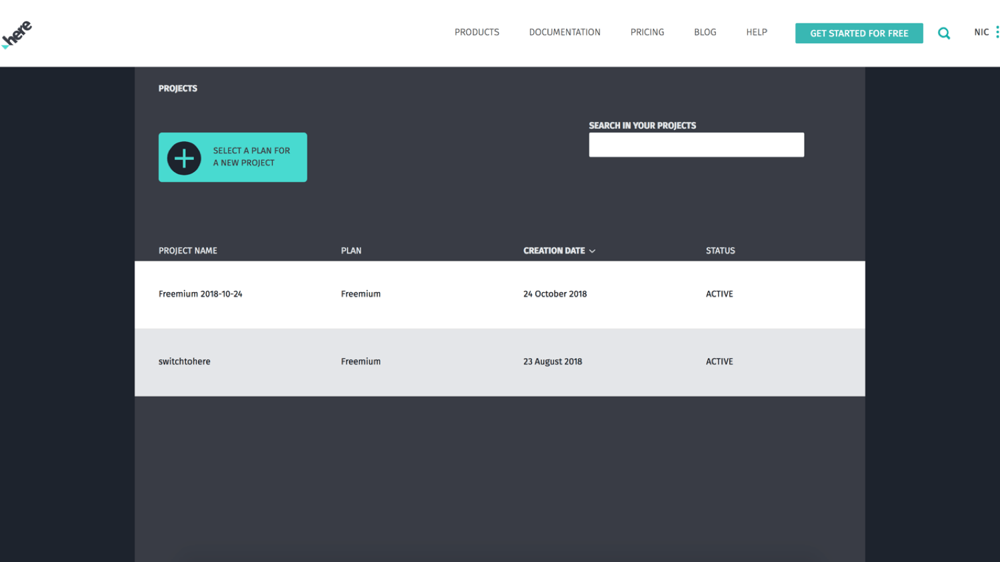

# Workshop: Maps and Location Services with Vue.js

This workshop was designed to get you familiar with displaying and interacting with HERE maps in your client facing Vue.js application.


As part of this workshop you'll learn how to display a map, add objects to it such as markers and polylines, and interact with the various HERE APIs such as geocoding and routing, using the HERE JavaScript SDK inside a Vue.js project.

## Prerequisites

There are a few requirements that must be met in order to be successful with this workshop:

1. Must have at least a basic familiarity of Vue.js and web development.
2. Must have the Vue CLI installed and configured.
3. Must have created a FREE developer account with HERE.

A [developer account](https;//developer.here.com) is necessary to create projects and obtain app id and app code tokens for use in web applications. The [Vue CLI](https://cli.vuejs.org/) can be installed with the Node Package Manager (NPM) by following the instructions in the official documentation.

## Instructions

This workshop is contains a **completed** directory, an **initial** directory, and a series of steps that should get you familiar with each of the HERE development opportunities.

To get an idea of the final project, take a look at the **completed** directory. To test this project, execute the following in the command line:

```
npm install
npm run serve
```

The above commands will download the project dependencies and serve the application for testing. The project can be explored through http://localhost:8080 in the web browser. Just make sure to swap out the app id and app code values found in the **completed** project's **src/App.vue** file.

The **initial** directory will contain boilerplate code to be filled throughout each of the steps.

### Creating a New Project in the HERE Developer Portal

To use any of the HERE components, which include maps and location APIs, a developer account must be created. It is free to create an account and there is a free tier to use.

On the [HERE](https://developer.here.com) developer website, choose to create a new account.


When prompted, enter your information and accept the terms and conditions. You'll notice that your credit card information is not required to use the HERE APIs and SDKs.


After creating your account, you may or may not be brought directly into your projects list. If you haven't been taken directly into the project's list, click on your name and then the projects tab.


To start, you'll have one project, but that list may grow as time progresses. You can have projects on a per application basis or whatever makes the most sense to you.



Select the project that you wish to use to be brought into the dashboard for that project. In the dashboard you can view metrics around your project or create new tokens for development.

For this project you'll need to create a JavaScript / REST token set.


Hold onto the app id and app code because both will be used within the Vue.js application. Without these two tokens, the map will not show and the APIs will fail with errors.

### Including the HERE JavaScript Libraries in the Project

There are two ways to make use of HERE within your web applications. You can choose to use the available REST APIs with HTTP requests, or you can use the HERE JavaScript SDK when working with a JavaScript based web technology.

When given the opportunity, the JavaScript SDK is the easier solution towards mapping and location services.

Including the HERE JavaScript SDK in a project is as easy as importing scripts in an HTML file using the `<script>` tags. Typically the scripts to include would look something like this:

```
<script src="https://js.api.here.com/v3/3.0/mapsjs-core.js" type="text/javascript" charset="utf-8"></script>
<script src="https://js.api.here.com/v3/3.0/mapsjs-service.js" type="text/javascript" charset="utf-8"></script>
<script src="https://js.api.here.com/v3/3.0/mapsjs-mapevents.js" type="text/javascript" charset="utf-8"></script>
```

The HERE JavaScript SDK is modular, so only the features that are needed would be imported. For example, the above three scripts would cover the map, the APIs, and many of the interactive features. To include other UI features on the map, other libraries might be necessary.

To include the HERE JavaScript SDK in Vue.js, open the **initial** project's **public/index.html** file and make it look like the following:

```
<!DOCTYPE html>
<html lang="en">
    <head>
        <meta charset="utf-8">
        <meta http-equiv="X-UA-Compatible" content="IE=edge">
        <meta name="viewport" content="width=device-width,initial-scale=1.0">
        <link rel="icon" href="<%= BASE_URL %>favicon.ico">
        <title>completed</title>
    </head>
    <body>
        <noscript>
            <strong>We're sorry but completed doesn't work properly without JavaScript enabled. Please enable it to continue.</strong>
        </noscript>
        <div id="app"></div>
        <script src="https://js.api.here.com/v3/3.0/mapsjs-core.js" type="text/javascript" charset="utf-8"></script>
        <script src="https://js.api.here.com/v3/3.0/mapsjs-service.js" type="text/javascript" charset="utf-8"></script>
        <script src="https://js.api.here.com/v3/3.0/mapsjs-mapevents.js" type="text/javascript" charset="utf-8"></script>
        <!-- built files will be auto injected -->
    </body>
</html>
```

During the build phase, other Vue.js related libraries will be imported on demand, not related to HERE.

### Displaying a Map in the Web Browser

HERE can be used in any page of the Vue.js application, once imported. However, to keep the project clean and future-proof, it makes sense to create a dedicated Vue.js component for the map. By creating a dedicated component, the map can be included anywhere without reproducing code.

In the **initial** project's **src/components/HereMap.vue** file, notice that there is boilerplate for functions, but most of the file has been emptied. This is where any logic will be placed.

When it comes to showing a map on the screen, in general a placeholder HTML element must be created:

```
<div ref="map" style="width: 800px; height: 600px"></div>
```

Since the map is loaded through JavaScript, it needs to be made obvious where to load it when everything is ready. Adding a simple `<div>` tag to the `<template>` block is all that is necessary. However, notice the `ref` attribute. In Vue.js, it is not recommended to try to gain access to HTML components through the `querySelector` function like with vanilla JavaScript. Instead a Vue.js reference must be placed on the component for later access. The name of the reference is not important, only that it exists.

Before trying to load a HERE map, the HERE platform must be initialized:

```
this.platform = new H.service.Platform({
    "app_id": "HERE-APP-ID",
    "app_code": "HERE-APP-CODE"
});
```

Initialization of the HERE platform should be done when the component is created. This is why the above code should be placed in the `created` lifecycle event for Vue.js. The app id and app code should be replaced with those found in your HERE developer dashboard.

With the platform initialized, the map can replace the placeholder HTML element:

```
this.map = new H.Map(
    this.$refs.map,
    this.platform.createDefaultLayers().normal.map,
    {
        zoom: 10,
        center: { lat: 37.7397, lng: -121.4252 }
    }
);
let behavior = new H.mapevents.Behavior(new H.mapevents.MapEvents(this.map));
```

Remember the `ref` attribute that was used on the `<div>` tag? That reference is used when loading the map. Just make sure the reference variable name chosen, matches the name that you're trying to use.

It is important to note that the map can only be loaded when the component has finished loading. This means that the map cannot load in the `created` lifecycle event. Instead, the map has to be loaded in the `mounted` lifecycle event.

With the dedicated map component created, it can be displayed in any page of the application. For example, it can be displayed in the **initial** project's **src/App.vue** file.

In the **initial** project's **src/App.vue** file, add the following tag to the `<template>` block:

```
<HereMap />
```

The name of the tag was defined in the **initial** project's **src/components/HereMap.vue** file as the class name.

If everything worked out, a map should show on the screen when serving the application.

As a challenge, try making the app id and app code input dynamic rather than hard coded into the map component. To do this you'll have to make use of `props` in Vue.js which act as tag attributes for your `<HereMap>` tag. If you get stuck, check out the **completed** directory for the solution.

### Adding Markers to a Map with a Latitude and Longitude Position

The HERE map can work with numerous map objects such as markers, lines, and shapes. These are easy to use and often only rely on latitude and longitude coordinates to function.

To add markers to a map, the following would be the simplest example:

```
let marker = new H.map.Marker({ lat: 37.7397, lng: -121.4252 });
map.addObject(marker);
```

Custom images can be used as markers, but in the above example, the standard pushpin type marker is used.

To give the map marker functionality, the best approach would be to create a method that can be reused as necessary. Within the **intial** project's **src/components/HereMap.vue** file, add the following `dropMarker` method to the `methods` object:

```
dropMarker(latitude, longitude) {
    let marker = new H.map.Marker({ lat: latitude, lng: longitude });
    this.map.addObject(marker);
}
```

Given a set of coordinates, a new marker will be created and added to the map as an object. To see this in action, a few adjustments need to be made where the map is currently being displayed.

Open the **initial** project's **src/App.vue** file and add a reference variable to the `<HereMap>` tag like so:

```
<HereMap ref="map" />
```

The reference variable name does not need to match what was used in the placeholder HTML element for the component. It is only a coincidence that it was used in the **src/App.vue** file.

The map needs a reference variable because we need a way to interact with functions for that instance of the map.

Inside the `mounted` method for the **initial** project's **src/App.vue** file, the `dropMarker` method can be used:

```
mounted() {
    let map = this.$refs.map;
    map.dropMarker(37.7397, -121.4252);
    map.dropMarker(38.7397, -121.4252);
}
```

The `dropMarker` doesn't need to happen in the `mounted` method. Markers can be added through a form submission, or a button press, or something else entirely. It is only an example to show markers when the map loads.

Right now markers are not being easily tracked after they've been added to the map. As a challenge, try keeping track of every marker that was created, prior to them being added to the map. For this an array should be used and accessible in each of the map component functions. If you get stuck, consult the **completed** directory for a solution.

### Connecting Points on a Map with Polylines

Now that a few markers exist on the map, why not play a game of connect the dots and connect them with lines. With HERE, lines on a map are known as polylines, and they aren't much more difficult to add than markers.

Take a look at the following simplistic code:

```
let lineString = new H.geo.LineString();
lineString.pushPoint({ lat: 37.7397, lng: -121.4252 });
lineString.pushPoint({ lat: 38.7397, lng: -121.4252 });
map.addObject(new H.map.Polyline(
    lineString, { style: { strokeColor: "green", lineWidth: 5 }}
));
```

In the above code, two points were added to the line and that line along with style information was placed on the map as a polyline. More than two points can end up on a polyline.

Let's take the above simple example into the Vue.js application. Within the **initial** project's **src/components/HereMap.vue** file, add a `drawLinesBetweenMarkers` method to the `methods` object:

```
drawLinesBetweenMarkers(start, finish) {
    let lineString = new H.geo.LineString();
    lineString.pushPoint(start);
    lineString.pushPoint(finish);
    this.map.addObject(new H.map.Polyline(
        lineString, { style: { strokeColor: "green", lineWidth: 5 }}
    ));
}
```

In the above example, two objects would be passed representing starting and finishing latitude and longitude coordinates. In the above function, it is assumed only two points will build a line.

Open the **initial** project's **src/App.vue** file and add the following to the `mounted` method:

```
mounted() {
    let map = this.$refs.map;
    map.dropMarker(37.7397, -121.4252);
    map.dropMarker(38.7397, -121.4252);
    map.drawLinesBetweenMarkers({ lat: 37.7397, lng: -121.4252 }, { lat: 38.7397, lng: -121.4252 });
}
```

Throwing around latitude and longitude coordinates everywhere is not very fun. As a challenge, why not draw lines between all the markers that currently exist on the map? Remember the previous challenge for keeping track of all the markers in an array? This challenge would make use of that array and loop through each of the markers to construct the line string.

If you get stuck with the mentioned polyline challenge, take a look at the **completed** directory for help.

### Geocoding Address into Latitude and Longitude Coordinates

Keeping track of coordinate information can still be difficult, even if it exists within already placed markers and map objects. For most people, addresses are much easier to use than a large numeric value.

HERE has a geocoding and reverse geocoding API that will take address strings and convert them to latitude and longitude coordinates or vise-versa. To make use of the API, the following can be done in JavaScript:

```
let geocoder = platform.getGeocodingService();
let geocoder.geocode({ searchText: "Tracy, CA" }, result => {
    if(result.Response.View.length > 0) {
        console.log(result.Response.View[0].Result);
    } else {
        console.error({ message: "no results found" });
    }
}, error => {
    console.error(error);
});
```

With a search string, of any completeness, zero or more results are returned. The more complete the string, the better the results. As part of the results, latitude and longitude coordinates are returned, but also missing string data. For example, "Tracy, CA" might include the country and postal code as well in the results.

Using the HERE geocoding API is an asynchronous operation and must be accounted for in development.

In the **initial** project's **src/components/HereMap.vue** file, include the following line in the `created` method:

```
this.geocoder = this.platform.getGeocodingService();
```

The geocoder can be initialized when the platform is initialized since it has no dependency on the HTML view being ready.

Within the `methods` object, a `geocode` method can be added:

```
geocode(query) {
    return new Promise((resolve, reject) => {
        this.geocoder.geocode({ searchText: query }, result => {
            if(result.Response.View.length > 0) {
                if(result.Response.View[0].Result.length > 0) {
                    resolve(result.Response.View[0].Result[0].Location.DisplayPosition);
                } else {
                    reject({ message: "no results found" });
                }
            } else {
                reject({ message: "no results found" });
            }
        }, error => {
            reject(error);
        });
    });
}
```

Notice that this example is slightly different than the basic example. In this example, the callbacks are being converted into a promise. This makes life a little easier in the long-term. Also notice, that we only care about the latitude and longitude position, not the other data that comes back in the request.

In the **initial** project's **src/App.vue** file, things change slightly in terms of the `mounted` method:

```
async mounted() {
    let map = this.$refs.map;
    let tracy = await map.geocode("Tracy, CA");
    let manteca = await map.geocode("Manteca, CA");
    let modesto = await map.geocode("Modesto, CA");
    map.dropMarker(tracy.Latitude, tracy.Longitude);
    map.dropMarker(manteca.Latitude, manteca.Longitude);
    map.dropMarker(modesto.Latitude, modesto.Longitude);
    map.drawLinesBetweenMarkers();
}
```

Rather than dealing with nested promises, a modern async / await is used for any asynchronous functions. In the above code, three addresses are geocoded for their latitude and longitude coordinates and they are added as markers on the map. Assuming the previous challenges were completed, the `drawLinesBetweenMarkers` method will connect all the dots to any markers that exist on the map.

### Calculating the Fastest or Shortest Route Between Two Points

Connecting two markers with a polyline is great, but it doesn't represent the fastest path between those two points or any path between those two points for that matter. To draw lines that represent the fastest path, a route needs to be calculated based on factors such as distance, time and traffic.

Routes can easily be calculated through the HERE routing API.

Take the following example:

```
let router = platform.getRoutingService();
let params = {
    "mode": "fastest;car",
    "waypoint0": "geo!37.7397,-121.4252",
    "waypoint1": "geo!38.7397,-121.4252",
    "representation": "display"
}
router.calculateRoute(params, data => {
    if(data.response) {
        data = data.response.route[0];
        let lineString = new H.geo.LineString();
        data.shape.forEach(point => {
            let parts = point.split(",");
            lineString.pushLatLngAlt(parts[0], parts[1]);
        });
        let routeLine = new H.map.Polyline(lineString, {
            style: { strokeColor: "blue", lineWidth: 5 }
        });
        map.addObject(routeLine);
    }
}, error => {
    console.error(error);
});
```

In the above example, routing options are defined. In this case the fastest route by car is desirable rather than walking or other. While there are two waypoints in this example, a route could contain many more.

When calculating the route, latitude and longitude points are returned. Using those points polylines can be created to establish a realistic path of travel. This is similar to standard polylines with the exception that that is now a lot more points to use.

To use routing in the workshop, open the **initial** project's **src/components/HereMap.vue** file and initialize the router in the `created` method:

```
this.router = this.platform.getRoutingService();
```

With the router initialized, a `drawRoute` method can be created:

```
drawRoute(start, finish) {
    let params = {
        "mode": "fastest;car",
        "waypoint0": "geo!" + start.Latitude + "," + start.Longitude,
        "waypoint1": "geo!" + finish.Latitude + "," + finish.Longitude,
        "representation": "display"
    }
    this.router.calculateRoute(params, data => {
        if(data.response) {
            data = data.response.route[0];
            let lineString = new H.geo.LineString();
            data.shape.forEach(point => {
                let parts = point.split(",");
                lineString.pushLatLngAlt(parts[0], parts[1]);
            });
            let routeLine = new H.map.Polyline(lineString, {
                style: { strokeColor: "blue", lineWidth: 5 }
            });
            this.map.addObjects([routeLine]);
        }
    }, error => {
        console.error(error);
    });
}
```

The above example is familiar, but this time the starting and finishing waypoints are dynamic. To make use of this method, open the **initial** project's **src/App.vue** file and include the following:

```
async mounted() {
    let map = this.$refs.map;
    let tracy = await map.geocode("Tracy, CA");
    let manteca = await map.geocode("Manteca, CA");
    let modesto = await map.geocode("Modesto, CA");
    map.dropMarker(tracy.Latitude, tracy.Longitude);
    map.dropMarker(manteca.Latitude, manteca.Longitude);
    map.dropMarker(modesto.Latitude, modesto.Longitude);
    map.drawLinesBetweenMarkers();
    map.drawRoute(tracy, modesto);
}
```

This example only used two waypoints when calculating the route. As a challenge, allow for any number of waypoints in a dynamic fashion. You'll likely have to use an array to accomplish the task.

### Getting the Location of the Web Browser

Having the map load on a static set of latitude and longitude coordinates might not be the best approach. For example, while San Francisco might be good for some, it probably doesn't benefit those living in Berlin. To get beyond this, the users location can be extracted from the web browser.

Using standard HTML5 APIs, the following is possible:

```
if(navigator.geolocation) {
    navigator.geolocation.getCurrentPosition(position => {
        console.log(position.coords);
    });
} else {
    console.error("Geolocation is not supported by this browser!");
}
```

If supported, the above code will print out the users latitude and longitude coordinates. In addition to being supported, the user has to give permission through a prompt.

The positioning logic can be applied to the `constructor` method in the class and then the `setCenter` method can be called on the map instead of printing the location.

## Resources

HERE Developer Portal - [developer.here.com](https://developer.here.com)
